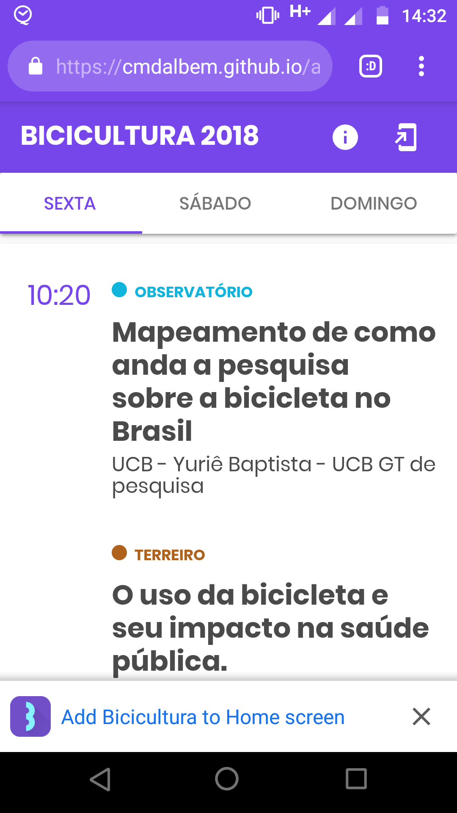
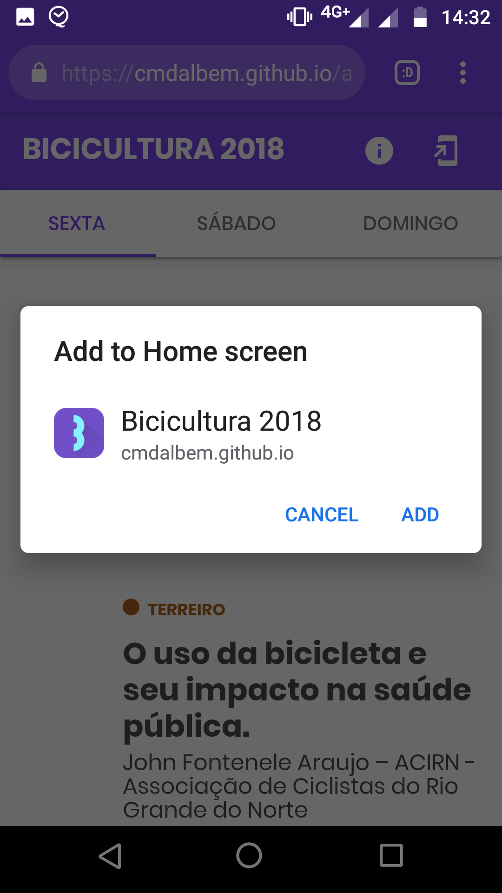
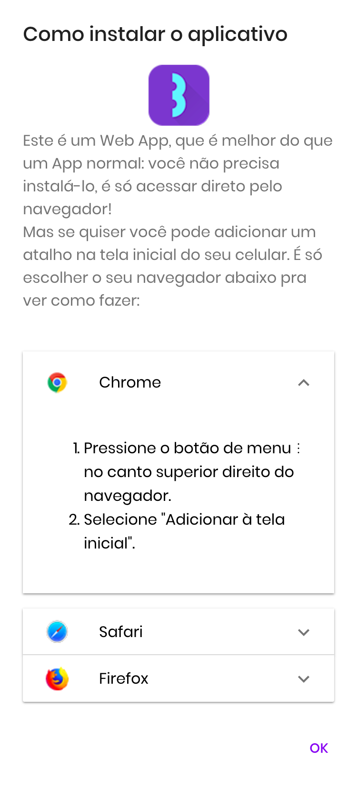
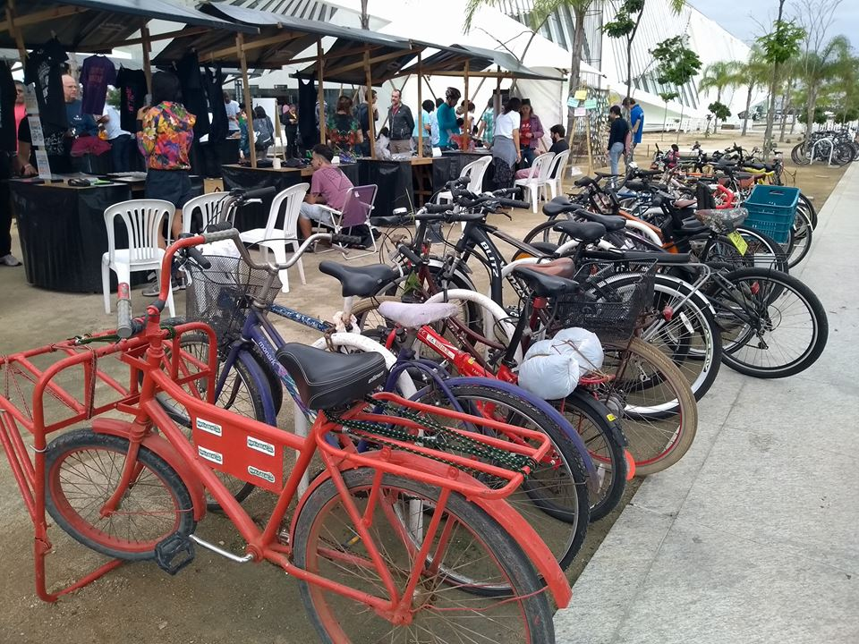
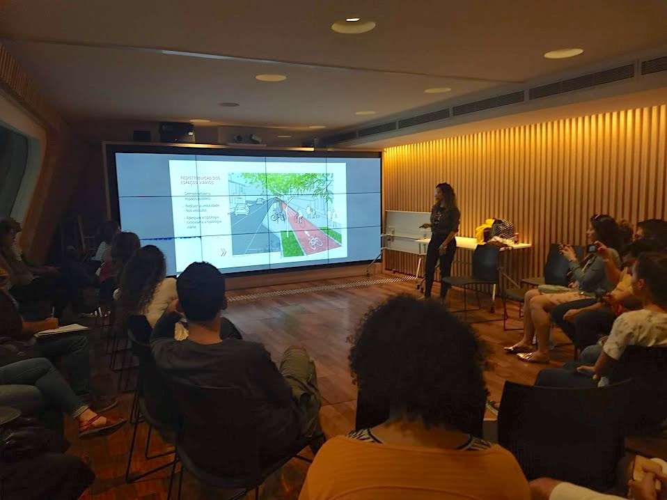

---
date: "2018"
title: "Bicicultura PWA"
description: "A simple web app for improving attendees' experience in the biggest brazilian conference on bike culture."
tags: ['activism','pwa','volunteer', 'UI/UX']
roles: "Front-end Development, UX Design"
cover: './cover.png'
--- 

* App: http://bicicultura.rio/app
* GitHub: https://github.com/cmdalbem/app-bicicultura-2018

## Context
Bicicultura is the biggest event about cycling culture in Brazil, and is hold every year in a different city. The event aims to bring together discussions and workshops on the diverse theme of urban mobility, touching the cultural, social, political, artistic, economic and environmental. It's organized by UCB, the biggest organization on ciclism in the country, and is helped by local groups. 

In the past year the event was held in Recife, which I had the pleasure to visit per invitation to present my project Bike de Boa. In 2018 the event would be held in Rio de Janeiro, the city where I just moved to, and I had a personal will to contribute not only with another presentation but also with the organization. The group Transporte Ativo and its leader Zé Lobo are highly influential in the cicloativism scene and I was fortunate to know them already from a past partnership.


## Problem
The idea of developing an app for the event appeared chatting with the organization and seemed like a great opportunity for using my skills to help them. The official website was a simple Wordpress page, and I thought the user experience of checking the event schedule was far from great.

There were budget limitations for improving the website, but the most critical part is that they wouldn't be able to afford even printing the schedule to offer the participants. Their solution was to provide a link to download a PDF of that same website version, which didn't help a lot.

<video-container>
    <video autoPlay controls loop width="100%" type="video/mp4">
        <source src="./schedule_desktop.mp4" type="video/mp4">
    </video>
</video-container>

## Development

### Planning

With the organization we decided the main objective of the app would be to improve the experience for the event participants on checking the schedule. This task would need to be supported either for users in their desktops, when they are at home planning the visit, but mainly the mobile case, for checking the schedule during the event. An offline experience would be critical as well, since the Museum didn't have wi-fi and many brazilians can't afford decent 3G plans.

In the benchmarking phase I looked for mainly two things:

* apps that are specialized in events
* how some of my favorite events made their apps

This phase highlighted some common UI patterns these apps use and inspired me with cool ideas for improving the attendees experience. Everything was logged in a simple Trello board. Most of the cool ideas unfortunately weren't implemented in time since I they weren't as important as the critical.

```grid|1

```

### Technology
Since I didn't have much time available for the project and I was the only developer and designer I needed to be very mindful of the technologic solutions, priorizing powerful frameworks and tools and reusing pre-made solutions.

The natural technology choice for me was to build PWA (Progressive Web App). Not only I'm very used to web technologies, but being a PWA I could offer everything a native app but without the need to develop the same solution multiple times. The main advantages I would be leveraging would be then:

* Offline support
* Ability to add the app to the home screen
* Full screen experience (no address bar)
* Cross-platform and cross-device with a single source code.

```grid|4




``` 

Today the easiest way to develop a simple PWA is using React. It has a vibrant community that develops open-source tools that I could reuse, like the `create-react-act` boilerplate for automating everything about the project scaffolding and build configs.

For the UI I chose to use [material-ui](https://material-ui.com/), a popular React UI lib that implements the Material Design System. An unique visual identity was not much of a priority, and users would be using this app for the first time and only for a few days, so it was interesting to employ the Material well-known patterns and visual style to reduce cognitive load of understanding the app. Still, some very basic customization was done mainly with the Typography and Color Pallete to mirror the event visual identity.

## Solution

### Mobile
<!-- ```grid|3



``` -->

<video-container> 
    <video autoPlay controls loop width="100%" type="video/mp4">
        <source src="./app_mobile1.mp4" type="video/mp4">
    </video> 
    <video autoPlay controls loop width="100%" type="video/mp4">
        <source src="./app_mobile2.mp4" type="video/mp4">
    </video>
    <video autoPlay controls loop width="100%" type="video/mp4">
        <source src="./app_mobile3.mp4" type="video/mp4">
    </video>
</video-container>


### Desktop

<video-container>
    <video autoPlay controls loop type="video/mp4" width="100%">
        <source src="./app_desktop.mp4" type="video/mp4">
        Your browser does not support the video element.
    </video>
</video-container>
 

## Results

The app was highlighted in all the major event communications, both digital and physical, which was super important for reaching the target audience. I was delighted to see people using the app on their phones all the time during the event. I even caught one or two suggesting the app to others that were still checking the old PDF schedule in their small phone screens. 

<results-banner
    data='{
        "event total visitors": "427",
        "app total users": "500",
        "pageviews": "1,636",
        "app installs": "32"
    }'>
</results-banner>

<!-- ```grid|3

")
")
``` -->

```grid|3


```

```grid|2


```

```grid|3


 
```


## Further work

