# Overview

<!-- ```grid|1
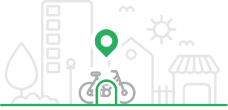
``` -->

We believe that the bicycle is the future of urban mobility, and that having better bike parkings is a great way of promoting the bike culture in our cities. This project intends to push forward the discussion of what are good bike parkings, at the same time we collect data about the presence and evolution of this kind of structure in the cities of Brazil. 

The collaborative aspect allows the active participation of citizens, fostering a positive reinforcement that encourages more people commute with their bikes. On top of that the reviews and our bike parking guide bring information about best practices in a friendly way that educates about safety and encourages better structures to be installed.

This has been a great project to put in practice so many tools and concepts I've been learning in the past years about web development, UX Design and Analytics. Working in bike de boa I've learned how important it is to go beyond aesthetics and Usability to create a great product. And, most of all, beyond just improving hard skills, this has been a project with a social purpose.

 
## How it all started

Everything started as a simple project at a local hackathon, held in Isobar IWS, the place where I worked at that time. The theme of that year was "improving people's lives with technology". A few friendly people joined me trying to make come true an old idea of creating this platform to map bike parkings. We felt in love with it and extended the project much further than those 24h.


```grid|1 
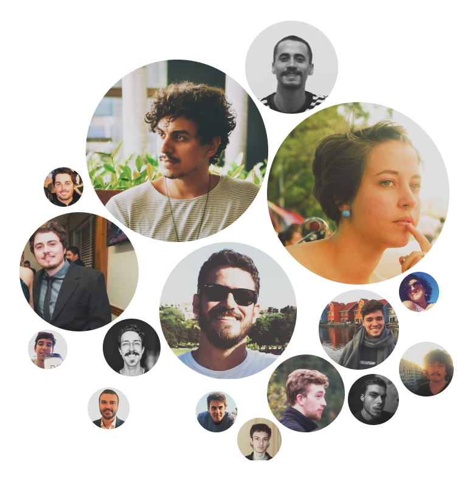
``` 
 
 
# The problem

We might we contribute to the local culture of urban biking with technology? Most cicling apps at that time seemed to focus too much on routing: how to bike from point A to point B? But how can even the most advanced pathplanning algorithms help you if you happen to live in a city with few to no cyclable paths and traffic is chaotic and dangerous? This is a cultural problem, and probably no app can fix that. Most of our western cities are car-centric by design, and drivers think they have the streets all to themselves and for their noisy, air-polluting and stress-inducing machines.

<jumbo caption="Examples of good and bad bike racks. Can you spot which is which?">
    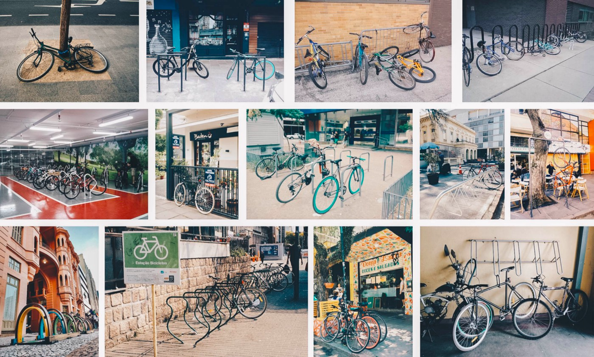
</jumbo>

Bike racks, as they call structures to park bicycles, are made to offer confort and safety to ciclists and even work as some kind of subliminar marketing for the daily ciclist. There is even research that say they can boost local economy by increasing customers and sales.

Many places already offered good structures to their clients to park their bikes, but people didn’t seem to know about them. Also there are big misconceptions on what it means to safely park a bike, so there was a big opportunity to reach people and educate them.


# Research

<jumbo caption="We made a very extensive benchmark study of collaborative maps in Brazil and abroad.">
    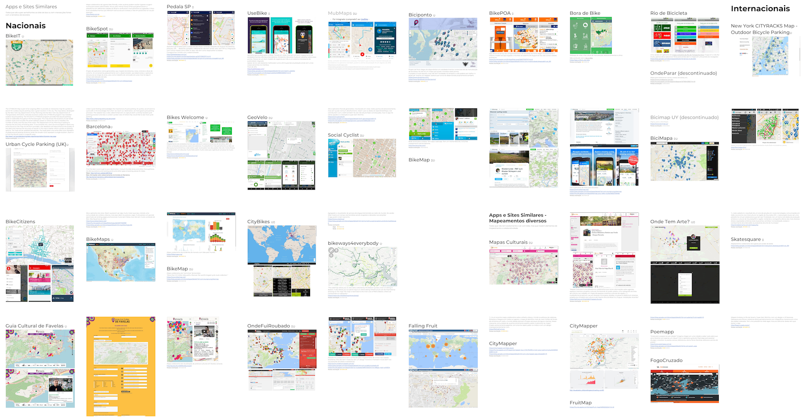
</jumbo>

We back all our decisions with user interviews and extensive Desk Research for content on bike safety and urban guidelines from around the world. We started getting really active on online biking communities to reach all kinds of opinions. With that we designed a system that gives a voice for people to say how safe they feel at places and also educates them with good practices from experts.

 

The idea of mapping safe places to park wasn't that new at all. We found out there were actually several collaborative maps throughout Brazil with this objective, which proved many others had also though it was a good idea. However as designers and developers we though we could drastically improve the experience by building a custom platform with our users needs in mind.

The main issues we found with the current collaborative maps we found were:

* **Trust:** how can I trust how good are the mapped places? None had a uniform way of ranking the pins.
* **Data consistency:** each user helping with the mapping gave focus to the attributes they were most interested in, so each pin had very different information than the others. This made really hard to detect patterns in the data, track progress, etc.
* **Ease of use:** it's expected to happen a tradeoff when you use a generic map platform for a very specific need. We though we could offer a better experience building a platform tailored for this scenario.
* **Discoverability and SEO:** native apps are not indexed by web search engines, which makes it hard to regular people _googling_ for places to park their bikes.


# Execution

## Design

<!-- ```grid|1
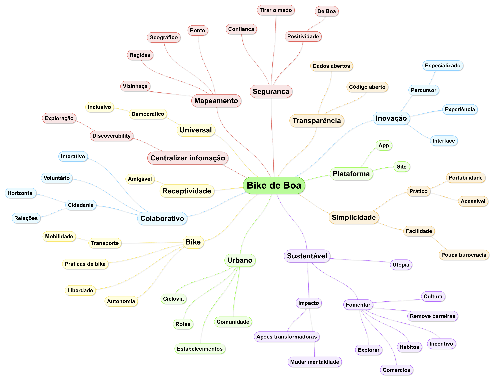
``` -->

<!-- ```grid|1
 
``` -->

<!-- ```grid|2
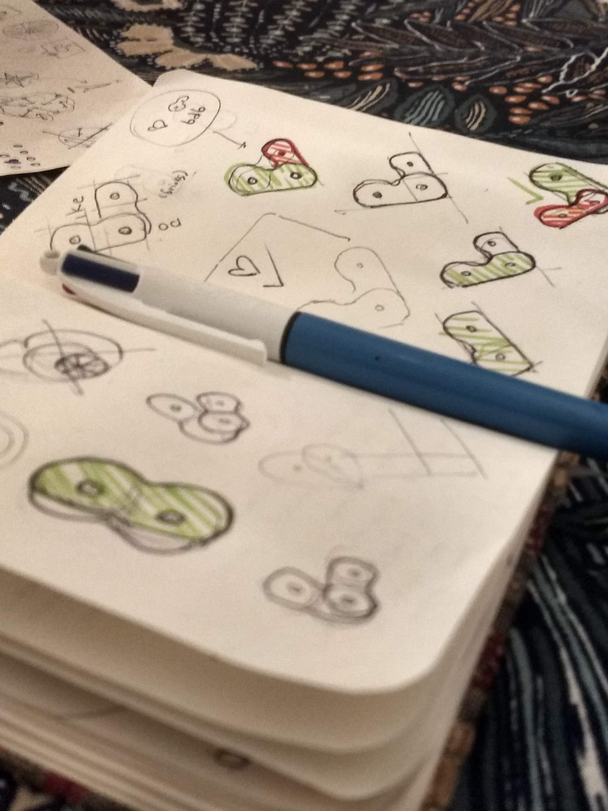
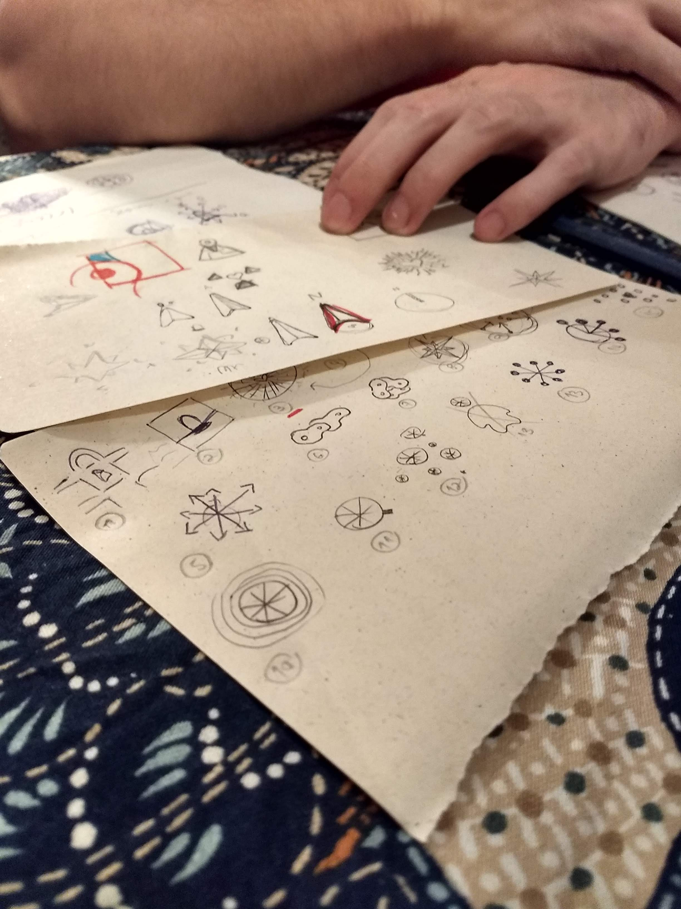 
``` -->


```grid|2
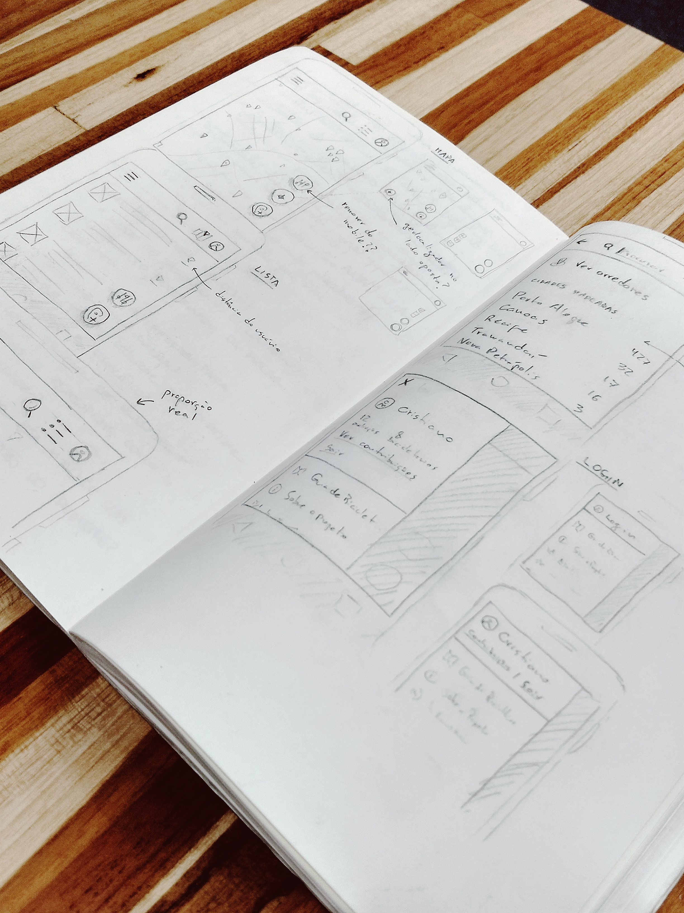
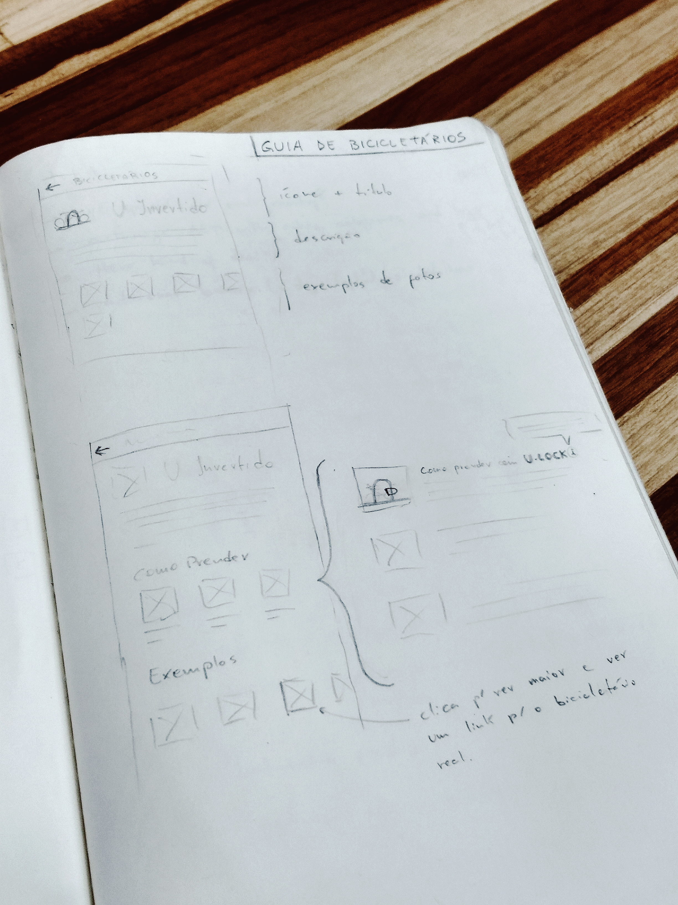
```

```grid|1
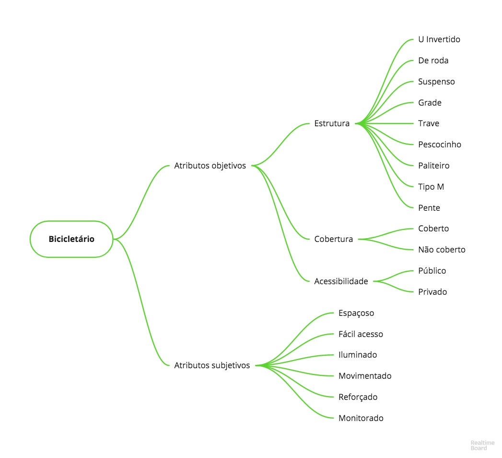
```

```grid|1

```

```grid|1
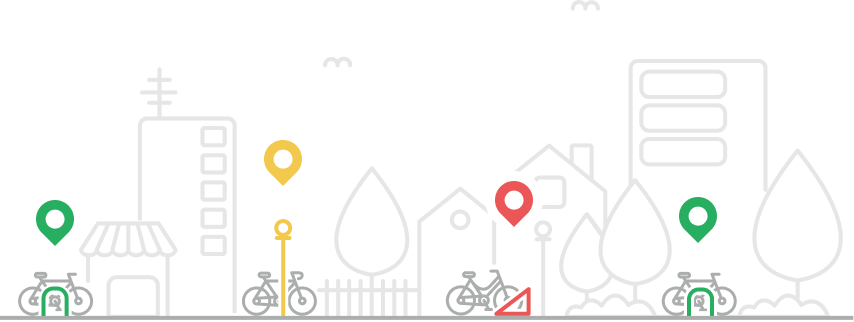
```

<!-- For even more in depth tips on bike parkings and safety we create guides. These are based on international urbanism guides, which we made an effort to simplify and make as accessible as possible. -->

<!-- ```grid|2


``` -->

We leveraged as much as possible the flexibility of Google Maps for customizing everything in the map, cutting out all information that wasn't strictly necessary and fine-tuning colors to match the visual identiy.

<jumbo caption="On the left the original Google Maps style, and on the right our customized version.">
    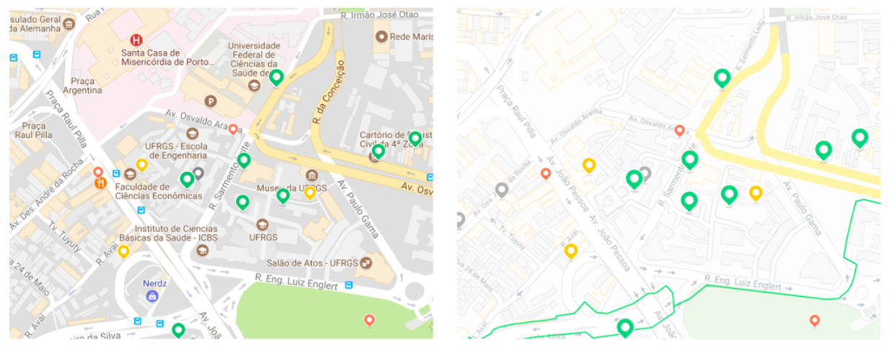
</jumbo>

Our hypothesis was that the main use of the app would be on Mobile, with the user in the streets either looking for a safe place to park or trying to map and review some place he/she found. This led us to use a mobile-first strategy, both for UX and Front-end development, making sure this was the main touchpoint we invested our energies. Although we used web technologies and PWA, ultimately we managed to get it into Google Play Store.

<jumbo caption="Google Play Store screenshots section is a great place to sell the main product's value propositions. It reads: 'Find safe places to park your bike', 'See all details of the bike racks' and 'Take a look how other cyclists rated the places'.">
    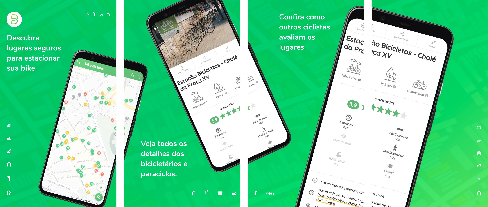
</jumbo>

<jumbo caption="'Leave your review as well', 'Help mapping places on your town', 'Learn how to lock your bike on different bike rack types', 'Available also through the website'.">
    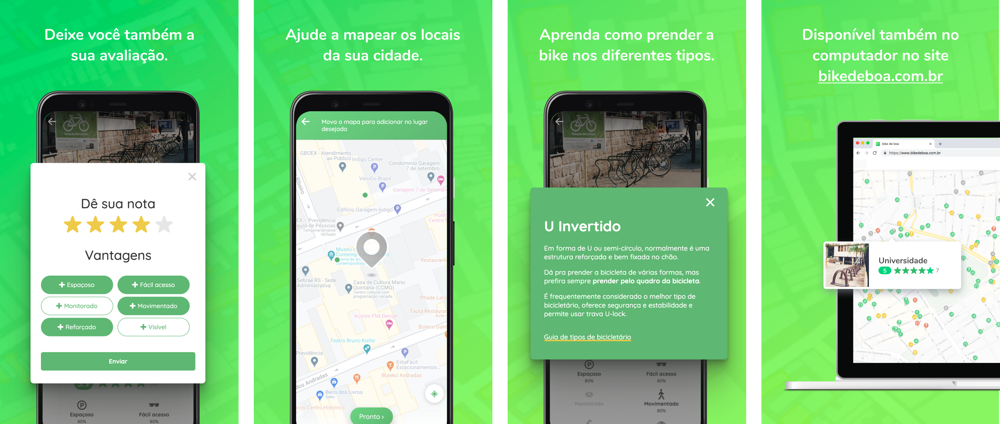
</jumbo>

<!-- ```grid|1

``` -->

<jumbo caption="Education is an important part of this project. Concepts like the types of bike racks are explained in more details with contextualized tooltips.">
    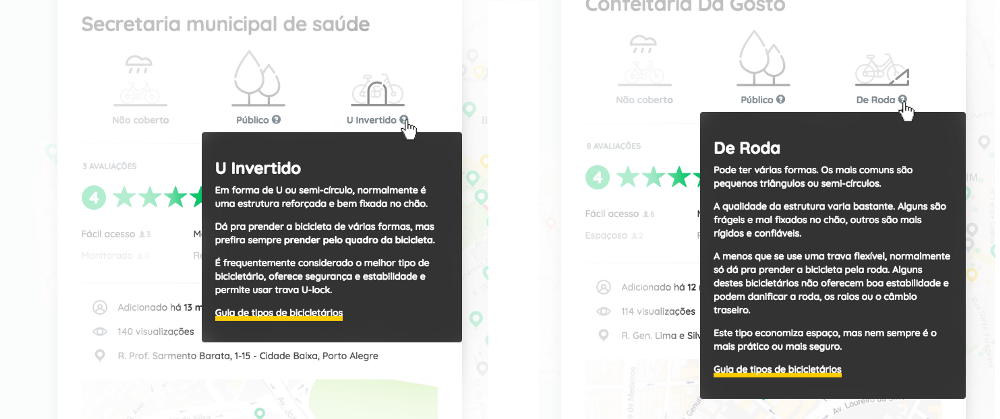
</jumbo>

## Development

Building native apps, although they offer the best performance, are very cost-intensive. Using web technologies we found a way to have one single code base while offering a cross-platform and cross-device experience. An emerging technology called PWA caught our attention as a way to bridge the native app experience with the accessibility of the Web.

We use web technology because it’s the most democratic platform ever. We’ve been using modern tools and concepts like Progressive Web Apps to offer great experiences from low-end to high-end Mobile and Desktop devices while still being free of friction.

```grid|2

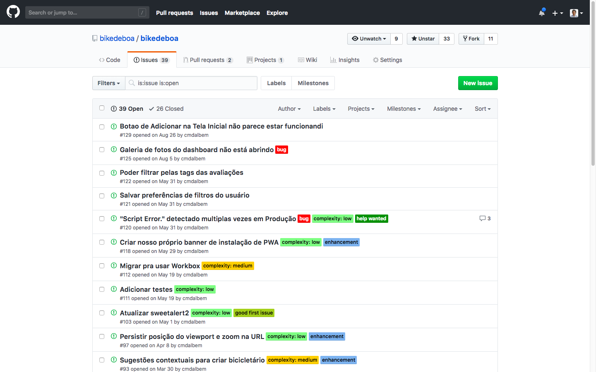
```

Since then dozens of people have passed by this project, contributing as they could. As part of a small group of contributors I was responsible for a little bit of everything. Most of the time however has been invested in the UX research and design and front-end development.
 
Using simple project management and communication tools such as Trello, GitHub and Slack proved to be essential to enable so many people to contribute asynchronously. Making this project Open Source was also a natural choice.


# Final product 

<jumbo>
    
</jumbo>

The user experience is focused on exploring the map. Colored pins show where the mapped bike racks are and how they've been rated by other users. Hovering on pins shows some basic info, while clicking on it opens a modal with the full detailed view of that place.

<video-container> 
    <video autoPlay controls loop width="100%" type="video/mp4">
        <source src="./desktop1.mp4" type="video/mp4">
    </video> 
</video-container>

Since places have attributes and tags you can use filters to chose the kind of places you prefer. Are you looking only for well reviewed, public, u-racks that are covered from the sun and rain? No problem, here are the results.

<!-- ```grid|1
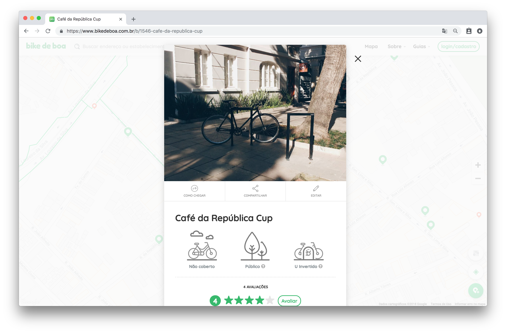
``` -->

<video-container> 
    <video autoPlay controls loop width="100%" type="video/mp4">
        <source src="./desktop2.mp4" type="video/mp4">
    </video> 
</video-container>

<!-- ```grid|2
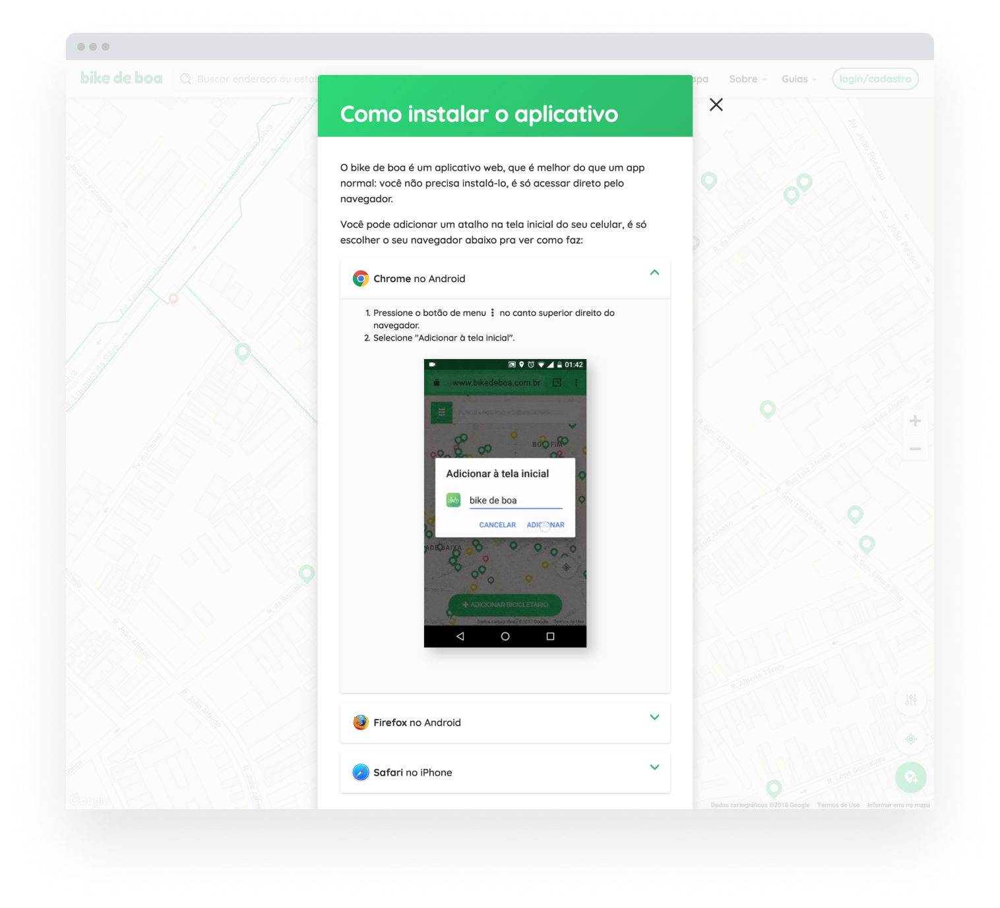 
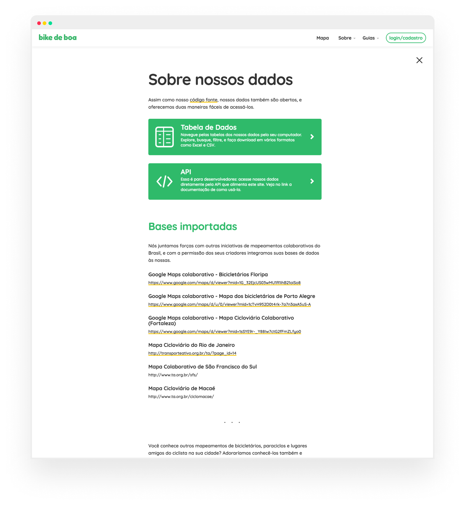
``` -->

Like our source code all the project data is also open, and we created a simple [dashboard](https://www.bikedeboa.com.br/dados) for users to easily browser, search and filter through data. Using our data for research or other applications is as easy as clicking the download button, which exports all our data in convenient file format such as CSV or XLS.

```grid|1
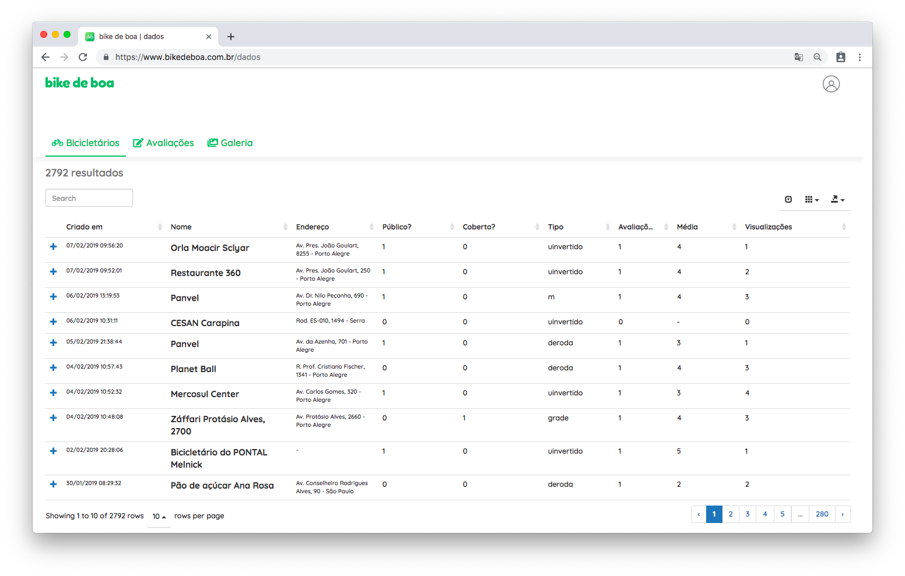
```

We designed a simple [dashboard on Google Data Studio](https://datastudio.google.com/open/1Dcx_Cq_rDgmD4cjQqumQZ2ilvl7bQDey), which is automatically synced with our Google Analytics and shows the most important data about any given month activity on the platform.
 
<jumbo caption="Data Studio dashboard with our main monthly metrics. From top left to bottom right: user acquisition (channels and devices), main landing pages, total sessions, total users, % new users, new sign ups, main cities visited, new reviews, nbr of places created, updated and viewed. On the bottom a chart of the user sessions along the month.">
    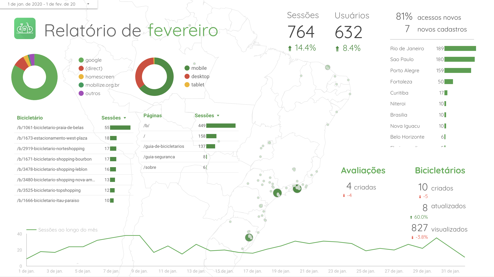
</jumbo>

 
We made some effort to have a decent social media presence as well, both on Facebook and Instagram. Digital Marketing was not the expertise of any of us in the team, so there was a steep learning curve that I'm not sure we ever conquered.

```grid|1

``` 
 
## Results 

We're very happy that all the work has had good results. We've managed to burst the bubble and expand to all the country, and the engagement numbers are quite good for a project with zero marketing budget.

<results-banner
    data='{
        "cities mapped": "60+",
        "mapped bike racks": "2,800+",
        "unique users every month": "400",
        "map pin visualizations": "180,000+"
    }'> 
</results-banner>
 
We were featured in some cool places: cicloactivist and technology conferences, blogs, podcasts, newsletters and the local press.
 
 ```grid|1
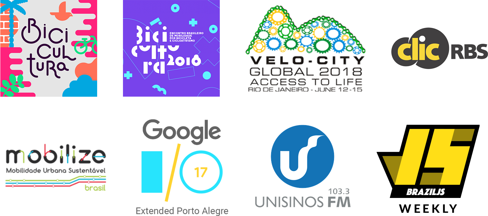
``` 


## Cool pictures of our team

```grid|1
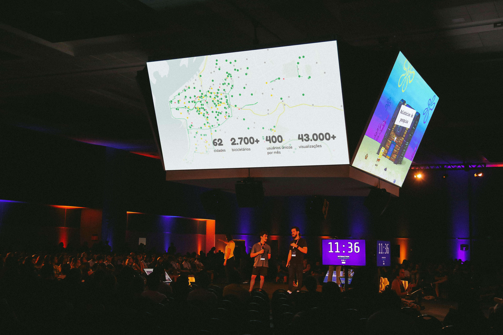
```

```grid|2


```
 
```grid|2
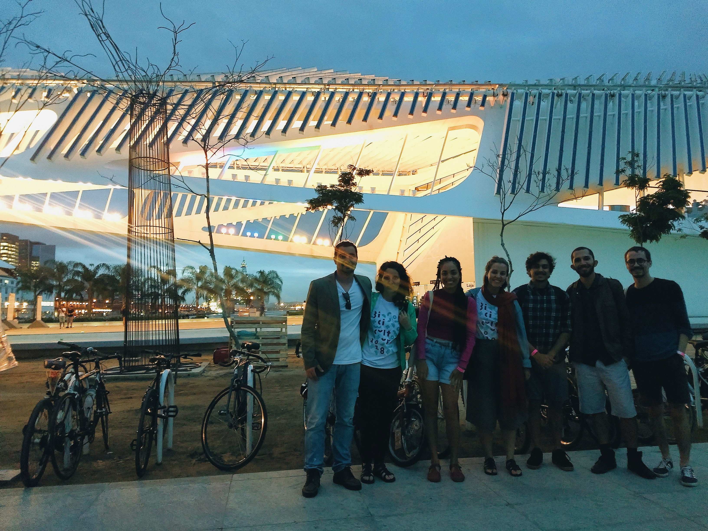
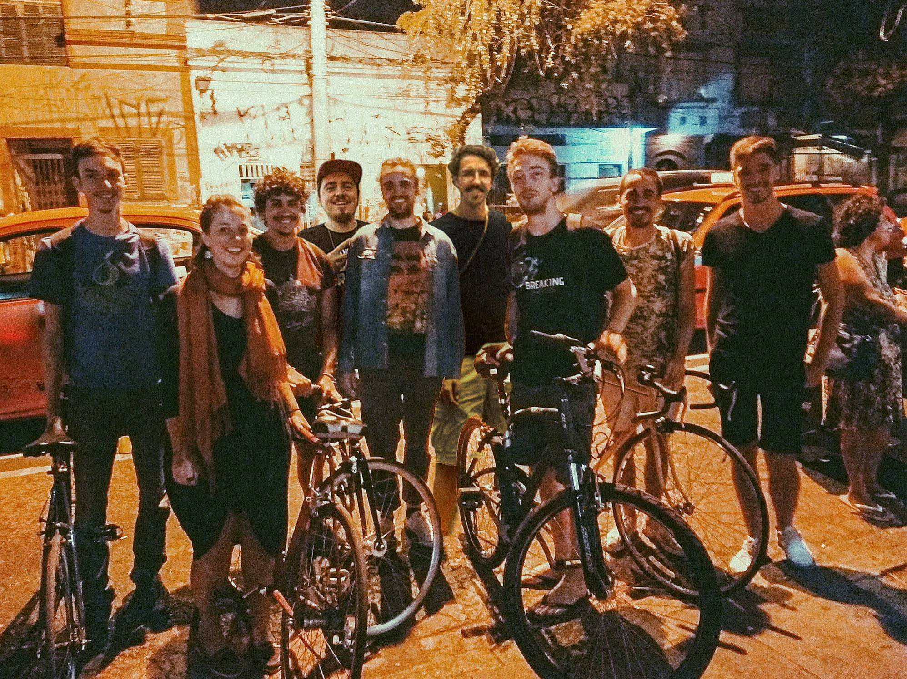
```

```grid|2


```


## Links

<links-list
    items='[
        {
            "label": "Website",
            "url": "https://www.bikedeboa.com.br"
        },
        {
            "label": "Github",
            "url": "https://github.com/bikedeboa"
        },
        {
            "label": "Facebook",
            "url": "https://www.facebook.com/bikedeboaapp/"
        },
        {
            "label": "Instagram",
            "url": "https://www.instagram.com/bikedeboa/"
        }
    ]'>
</links-list>