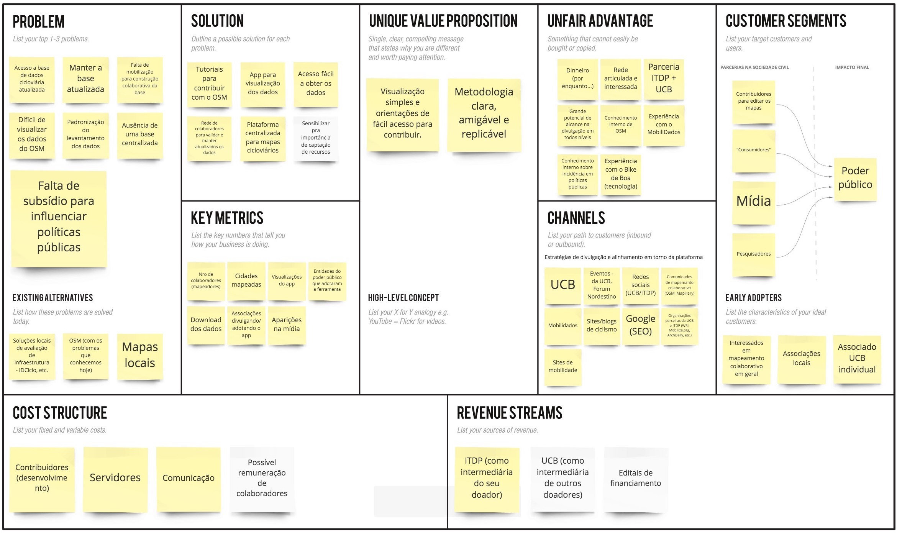
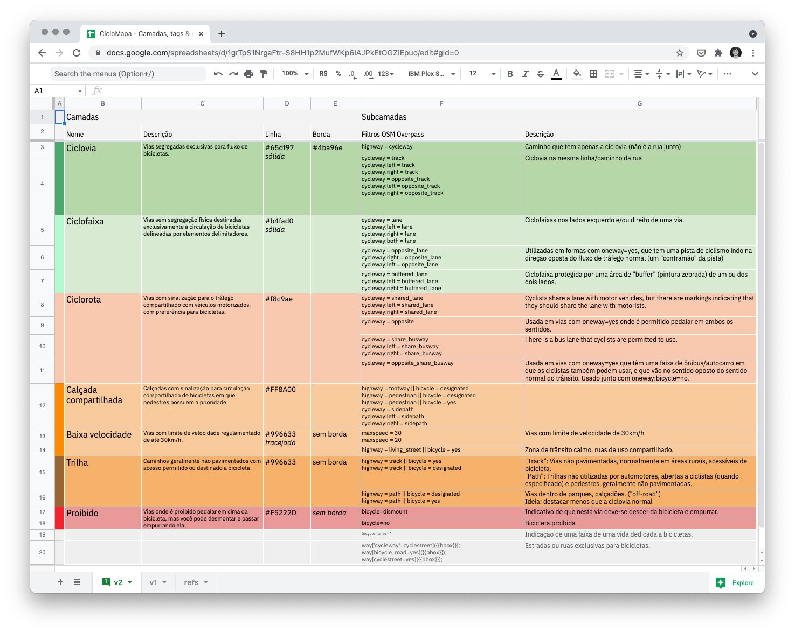
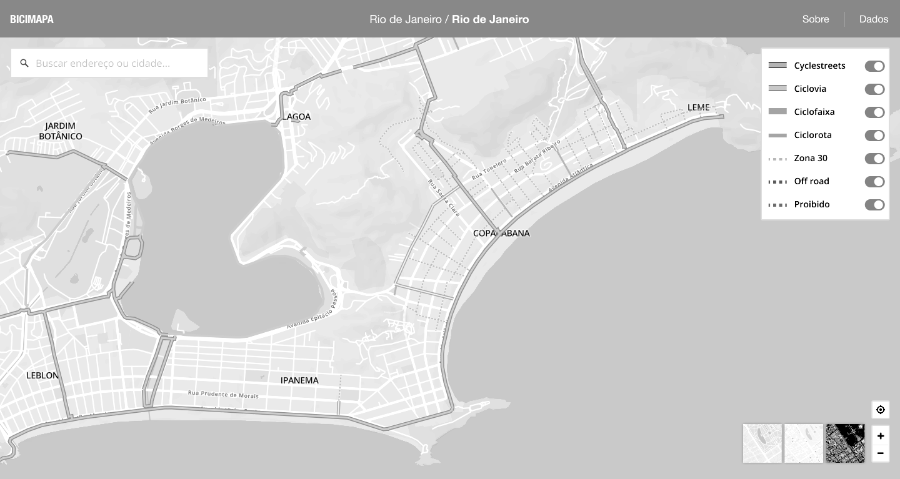
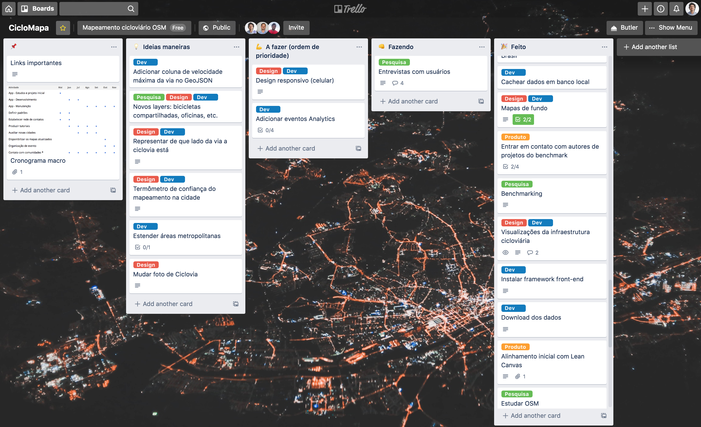
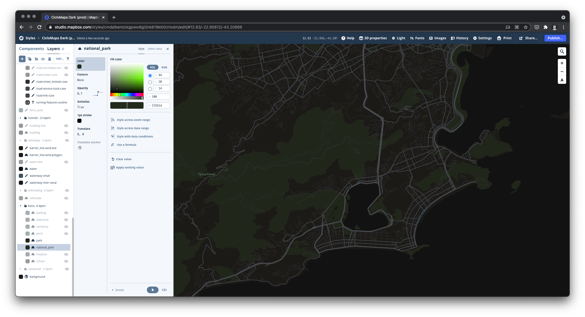
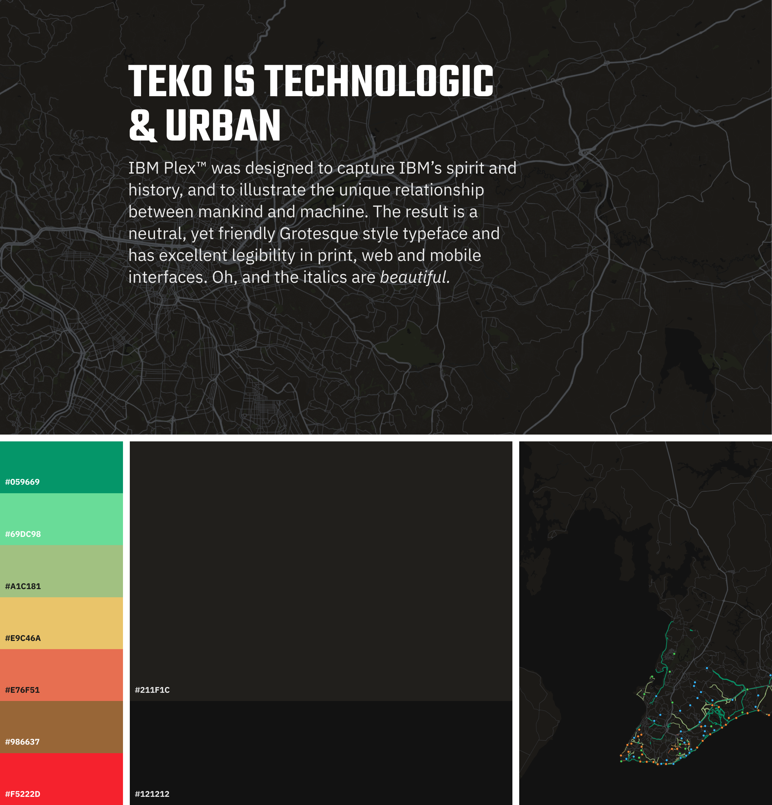
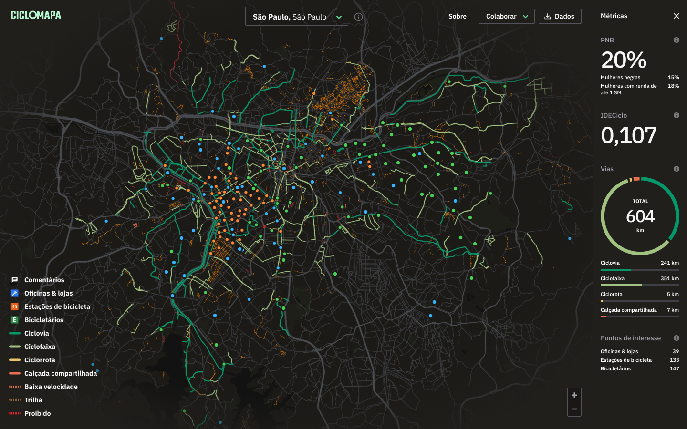
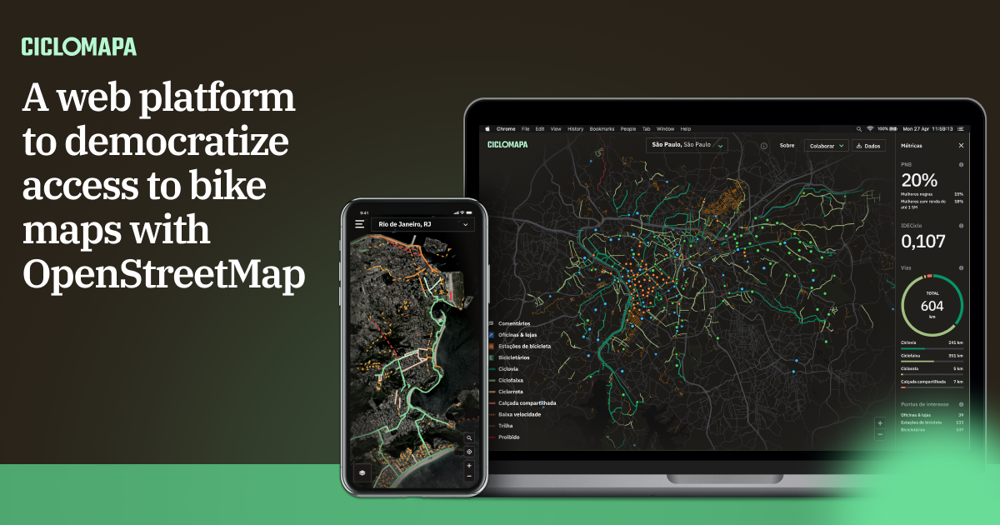

# Overview

Today in Brazil we face a big challenge of not having data on the cycling infrastructure available in our cities. This makes it very hard to paint a clear picture of our reality and measure the opportunities and impacts to society of improving urban mobility.

I've teamed up with two important brazilian civil society organizations on cycling and urban mobility to design and developed the first platform of cycling maps encompassing all Brazilian cities. We've leveraged the data and collaborativeness of OpenStreetMap (OSM), a huge global initiative similar to a Wikipedia of maps. I've created an open-source web application, free and accessible from any computer or smartphone, aimed at both the average citizen that doesn't know her city's bike paths, and researchers, who now have easy access to data to develop further analysis.

The first version of this platform is already on production, but we consider it just the first step, a prototype to validate the concept, and we're undergoing research to understand better and prioritize all the opportunities that lie ahead.


# Understanding the problem

## Kick off

UCB (Brazil Cyclists Union) and ITDP (Transport and Development Policy Institute) are two civil society organizations that have joined forces to solve once and for all the problem of access to data on Brazil's cycling infrastructure. As the main stakeholders of the project my first activity was conducting a workshop using the Lean Canvas framework so we could make sure we were aligned on what we were going to build.


```grid|1

```
 
The main problems we wanted to solve were: 

* The lack of centralized, standardized and updated bike maps of brazilian cities.
* OpenStreetMaps contributors found disencouraging that there wasn't good applications that reuse its data.
* Contributing to OSM demands some technical knowledge, and there isn't good documentation written in Portuguese.

We also found out some of our "unfair" advantages: UCB and ITDP and 2 of the biggest organizations of this kind which could at that time invest in this project and would be able to mobilize the community. Also everyone on the team already had experience with similar projects involving webapps, maps and OSM data.

The most polemic section of the discussion was around the Customer Segments. At this point in the project it was not clear to us who our users were exactly, or what segment we'd lock in, so it raised a yellow flag to me that we should revisit that in the future.


## Research

Our first step was to dive in OSM documentation and learn about cycling infrastructures. Fortunately we had on the team a specialist on OSM, but still we had to go through some wikis and lengthy (but healthy) discussions on how we'd interpret them.

The main challenge is that OSM tags entities in very detailed, granular and often technical ways. We, however, wanted to abstract this complexity to our end users, while at the same time educating on how good the different types of cycling structures are to the cyclists using a colored rank that went from green to red.

```grid|1

```

An important part at this step as well was to understand what other similar tools were available "on the market". I documented this on a simple Google Docs were I included main screenshots, a general rating of the solution and some comments on the positive and negative sides of it.

At this step we validated that our solution seemed to be innovative and unique, since there didn't seem to exist anything exactly like it. Still, we found intersections with existing solutions that gave us inspiration and new ideas on how to solve the problems.

<jumbo caption="Documentation of the benchmark research looking for similar digital tools as well as official bike maps from cities around the world.">
    
</jumbo>
 

Our main insights were:

* Solutions based on OSM are very technical and hard to understand and operate, and none had clear instructions about the collaborative dimension and how to contribute with the mapping.
* Bike maps rarely explain their terminologies which are not very friendly to the broad public.
* When multiple typologies are these are often colored in rather random ways, producing a final result that is not only unappealing but, most importantly, confusing and overwhelming.
* Almost none of them were responsive and accessible via smartphones.
* Several local maps had interesting features but couldn't be easily reused for other cities.


# Prototyping

Extending the benchmarking research now I started looking at more broad inspirations of webapps that were strongly based on maps and data visualisation.

<!-- ```grid|1

``` -->

With the references in mind and the typologies well defined I started sketching different ways we could lay out these feature on the screen. The concept always was to have the map as the main thing. Second came the current city in focus, and third the complementary UI elements to control the map such as typology filters, address search field, "about" link and the small but important data download button.

```grid|1

```


# Implementing

The entire development was done by me. It's always a challenge to separate the engineering and design mindsets in the process, so I forced myself to always ideate on Figma first, validating with the peers and only then creating cards on our [Trello board](https://trello.com/b/qPvH3xbA/ciclomapa) to document the task and prioritize it.

```grid|1
 
```

The overall system architecture passed by 2 iterations. The first one, way simpler, barely did its job but was useful to validate some hypothesis concerning the [OSM Overpass API](https://wiki.openstreetmap.org/wiki/Overpass_API). On the second version I could mitigate some of the problems we've found and improve the user experience.

```grid|1

```

To build the UI I chose the amazing [Ant Design](https://ant.design/) components, which was one of my main inspirations of Design Systems and I always wanted to try it in a real project. Their React components are super high quality and have great documentation.

```grid|1
")
``` 

For this project I also wanted to try out [Mapbox](https://www.mapbox.com/), an open map library which is built on top of OpenStreetMaps. It's also super modern and well done, and offer way more flexibility than any other library I've used before. In addition, it was a pleasure using Mapbox Studio, their interactive map customization tool, which is an awesome product and enabled me lots of controls to be creative designing our base map.
 
```grid|1

``` 

# Branding

With a very functional first version of the system up and running ahead of schedule I found myself with some extra time to _make it pop_. Based on all the process up to now I've devised some brand principles to start thinking on some visual directions:

* It should be **serious**, not playful, since we're dealing with important data that can impact how our cities and built. But we're not formal or academic, we want to be **relatable**, so we can speak to the masses.
* We're **assertive** and **trustworthy**: we're experienced specialists on cycling and technology.
* **Collaborative**, **communal** and **educative**, since it's based on OpenStreetMaps.

The main colors are dark because it gives a "data dashboard" vibe. It also resembles the aerial look of a cityscape at night, with the bike paths lighten up as if they were neon lights, which is pretty cool. The color palette is made of steps in a gradient from green to red representing the safety and "goodness" of the different typologies. These were optimized to the best visibility possible on both the dark map as well as available variation of a satellite map.

<!-- ```grid|1
  
``` -->
 
<jumbo>
    
</jumbo>

<jumbo caption="Final version of the UI and map style, now with a present brand.">
    
</jumbo>

<jumbo caption="The variation with satellite imagery as the base map. It was important that the color palette worked for both scenarios. The images were processed to have reduced brightness and saturation to better keep contrast with the UI.">
    
</jumbo>

<jumbo>
    
</jumbo>

<video-container> 
    <video autoPlay controls loop width="100%" type="video/mp4">
        <source src="./tooltips.mp4" type="video/mp4">
    </video> 
</video-container>


# Promoting

I helped creating some arts to promote the project and our launching webinar in different social media channels.

```grid|1
  
```

Check below our full webinar, in Portuguese, with participation of the entire team as well as some special guests discussing the brazilian scene of urban mobility and usage of data in advocacy.

`youtube: https://www.youtube.com/watch?v=IrPPbCnKPsI` 


# Looking ahead

With the current version in production we wanted to start gathering context to think about its future. We had some ideas in our mind but lots of people also came with others. Although we had a product vision of what the future could look like we didn't have a clear strategy of what should be focused first. So I've planned a research to interview users and other specialists all around Brazil to understand in more depth their needs and also get feedback about the product.

<results-banner
    data='{
        "views since launch": "30,000+",
        "unique users per month": "100+",
        "brazilian cities viewed": "290"
    }'>
</results-banner>

Our main conclusions have been:
* We validated CicloMapa is innovative, i.e. there isn't an alternative tool that does what we do, and that it already brings value to the community by facilitating the visualization and download of OSM data.
* However, the tool is considered to be in an early stage and has a big untapped potential. We gathered several suggestions of little improvements that would "round up the edges" and increase the impact of the product.
* We can improve our advertising of the app and OSM knowledge with tutorials, events and more partnerships with local organizations.
* We still don't have clarity that more costly features, such as in-app Bike Path Editor, have better ROI than the already mentioned low-hanging fruits. Also there's no clear indicative that the product should be pivoted, like changing our Customer Segments or main objectives.

This will help us to plan the next steps, which I'll update here as soon as we have news. :)


## Links

<links-list
    items='[
        {
            "label": "Website",
            "url": "https://ciclomapa.org.br/"
        },
        {
            "label": "Github",
            "url": "https://github.com/cmdalbem/ciclomapa"
        },
        {
            "label": "Launch Webinar video",
            "url": "https://www.youtube.com/watch?v=IrPPbCnKPsI"
        }
    ]'>
</links-list> 
