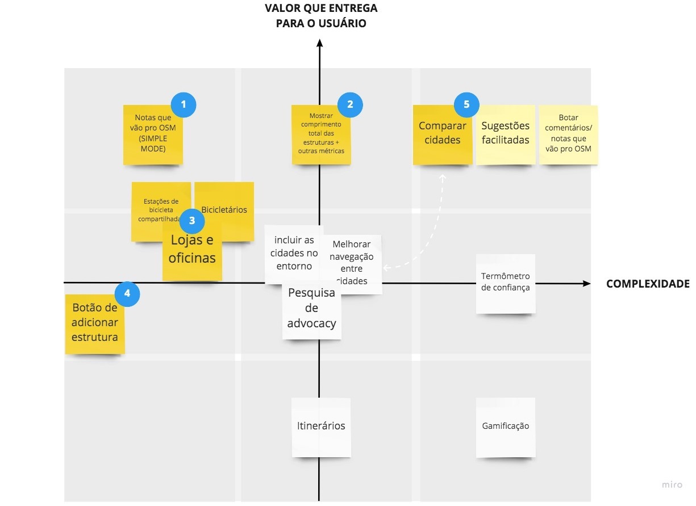
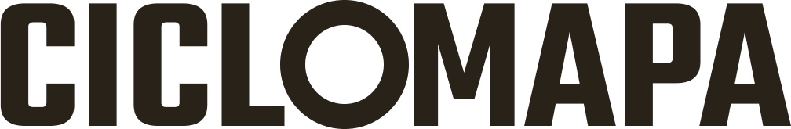
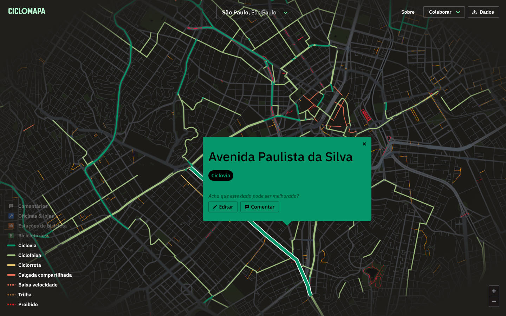
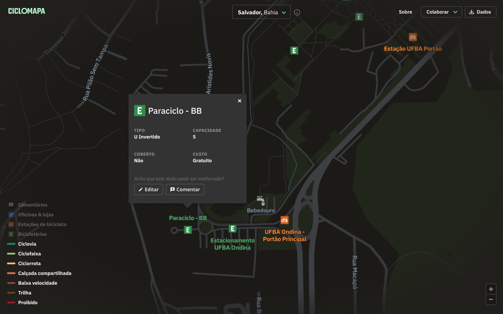
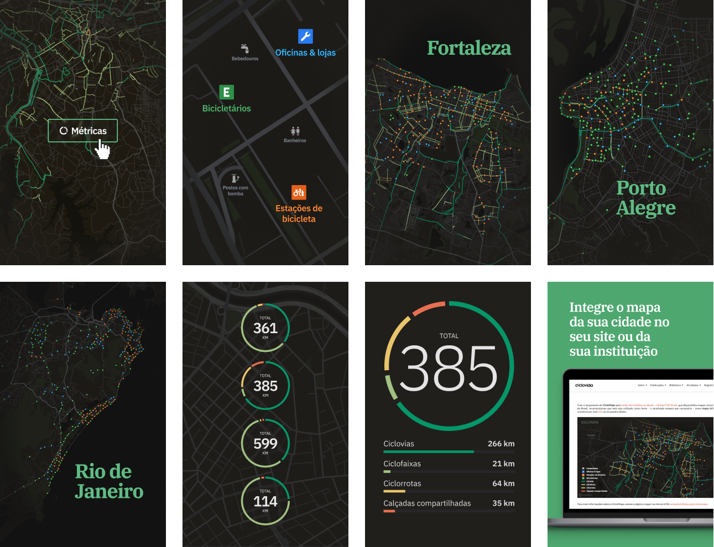

# Overview

Today in Brazil we face a big challenge of not having data on the cycling infrastructure available in our cities. This makes it very hard to paint a clear picture of our reality and measure the opportunities and impacts to society of improving urban mobility.

I've teamed up with [UCB (Brazil Cyclists Union)](https://uniaodeciclistas.org.br/) and [ITDP (Transport and Development Policy Institute)](https://itdpbrasil.org/), two important brazilian civil society organizations on cycling and urban mobility, to design and developed the first platform of cycling maps encompassing all Brazilian cities.

We've leveraged the data and collaborativeness of [OpenStreetMap (OSM)](https://www.openstreetmap.org/), a huge global initiative similar to a Wikipedia of maps. I've created an open-source web application, free and accessible from any computer or smartphone, aimed at both the average citizen that doesn't know her city's bike paths, and researchers, who now have easy access to data to develop further analysis.

<jumbo>
    
</jumbo> 


<results-banner
    data='{
        "brazilian cities": "320+",
        "users / month": "900+",
        "pageviews total": "300,000+"
    }'>
</results-banner>


# Understanding the problem

## Kick off

As the main stakeholders of the project my first activity was conducting a workshop using the Lean Canvas framework so we could make sure we were aligned on what we were going to build.

```grid|1

```
 
The main problems we wanted to solve were: 

* The lack of centralized, standardized and updated bike maps of brazilian cities.
* OpenStreetMap contributors found disencouraging that there wasn't good applications that reuse its data.
* Contributing to OSM demands some technical knowledge, and there isn't good documentation written in Portuguese.

We also found out some of our "unfair" advantages: UCB and ITDP and 2 of the biggest organizations of this kind which could at that time invest in this project and would be able to mobilize the community. Also everyone on the team already had experience with similar projects involving webapps, maps and OSM data.


## Research

Our first step was to dive in OSM documentation and learn about cycling infrastructures. Fortunately we had on the team a specialist on OSM, who helped us abstract the super granular and technical tags into something more accessible.

<jumbo caption="Documenting how the data would be modeled and the information would be shown to the users, including: labels, textual descriptions and visual representations of data. I find spreadsheets to be a very powerful prototyping tool that is often overlooked by designers.">
    
</jumbo>

We also did a deep dive on everything that was available on the market, from other map-based webapps to some PDF cycling-maps from cities around the world. At this step we validated that our solution seemed to be innovative and unique, since there didn't seem to exist anything exactly like it. Still, we found intersections with existing solutions that gave us inspiration and new ideas on how to solve the problems.

<jumbo caption="Benchmark research looking for similar digital tools as well as official bike maps from cities around the world.">
    
</jumbo>
 

Our main insights were:

* Solutions based on OSM are very technical and hard to understand and operate, and none had clear instructions about the collaborative dimension and how to contribute with the mapping.
* Bike maps rarely explain their terminologies which are not very friendly to the broad public.
* When multiple typologies are these are often colored in rather random ways, producing a final result that is not only unappealing but, most importantly, confusing and overwhelming.
* Almost none of them were responsive and accessible via smartphones.
* Several local maps had interesting features but couldn't be easily reused for other cities.

```grid|1

```


# Prototyping

It was important to start off with a very low-fidelity prototype to validate the main features and visual hierarchy, without putting on the table discussions on visuals. Although it *looks* very different than the final version the overall experience didn't change that much!

<!-- ```grid|1

``` -->

<video-container> 
    <video autoPlay controls loop width="100%" type="video/mp4">
        <source src="./prototype.mp4" type="video/mp4">
    </video> 
</video-container>

[Figma interactive prototype](https://www.figma.com/proto/QjH5j2kdQnN1iUZCYxjNsDwt/CicloMapa?node-id=363%3A113&viewport=-3270%2C2793%2C0.45554399490356445&scaling=scale-down-width)

With the references in mind and the typologies well defined I started sketching different ways we could lay out these feature on the screen. The concept always was to have the map as the main thing. Second came the current city in focus, and third the complementary UI elements to control the map such as typology filters, address search field, "about" link and the small but important data download button.


# Implementing

The entire development was done by me. It's always a challenge to separate the engineering and design mindsets in the process, so I forced myself to always ideate on Figma first, validating with the peers and only then creating cards on our Trello board to document the task and prioritize it.
<!-- 
```grid|1
 
``` -->

The overall system architecture passed by many iterations. I started with very simple ones to test concepts concerning the [OSM Overpass API](https://wiki.openstreetmap.org/wiki/Overpass_API) and slowly added more complexity to mitigate the problems we're seeing, getting feedback from the stakeholders and always aiming to improve the user experience.

```grid|1

```

To build the UI I chose [Ant Design](https://ant.design/), which has super high quality React components and have great documentation. All styling was done on [TailwindCSS](https://tailwindcss.com/), an amazing CSS framework.

For this project I also wanted to try out [Mapbox](https://www.mapbox.com/), an open map library which is built on top of OpenStreetMap. It's also super modern and well done, and offer way more flexibility than any other library I've used before. In addition, it was a pleasure using [Mapbox Studio](https://www.mapbox.com/mapbox-studio), their interactive map customization tool, which is an awesome product and enabled me lots of controls to be creative designing our base map.
 
```grid|1

``` 


# Visual design 

<!-- With a very functional first version of the system up and running ahead of schedule I found myself with some extra time to _make it pop_. Based on all the process up to now I've devised some brand principles to start thinking on some visual directions:
 
* **Serious** instead of playful, since we're dealing with important data that can impact how our cities and built. But we're not formal or academic, we want to be **relatable**, so we can speak to the masses.
* **Assertive** and **trustworthy**: we're experienced specialists on cycling and technology.
* **Collaborative**, **communal** and **educative**, since it's based on OpenStreetMap. -->

<!-- The main colors are dark because it gives a "data dashboard" vibe. It also resembles the aerial look of a cityscape at night, with the bike paths lighten up as if they were neon lights, which is pretty cool. The color palette is made of steps in a gradient from green to red representing the safety and "goodness" of the different typologies. These were optimized to the best visibility possible on both the dark map as well as available variation of a satellite map. -->

The visual identity draws inspiration from data dashboards from sci-fi movies, with a dark-themed color palette. The map style is highly subdued, so the bike infraestrucure would look like neon stripes glowing in the dark.

<jumbo>
    
</jumbo>

<!-- ```grid|1
 
``` -->

<jumbo caption="Final version of the UI and map style, now with a present brand.">
    
</jumbo>

```grid|1

```
```grid|1

```

<!-- <jumbo caption="The variation with satellite imagery as the base map. It was important that the color palette worked for both scenarios. The images were processed to have reduced brightness and saturation to better keep contrast with the UI.">
    
</jumbo> -->

<!-- 
<jumbo caption="Some sketches of how the mobile experience could look like. We didn't go much further with this part.">
    
</jumbo> -->

A nice little interaction detail are the tooltips on the layers filters. They help educate the user of what each layer type is about.

<video-container> 
    <video autoPlay controls loop width="100%" type="video/mp4">
        <source src="./tooltips.mp4" type="video/mp4">
    </video> 
</video-container>


# Promoting

I was also responsible for designing social media posts that would highlight the different features. These included posts in Instagram, Facebook, Linkedin, Twitter, etc.

```grid|1

```

```grid|1

```

```grid|1

```

We were glad with the organic coverage from different media channels, mainly with [Mobilize](https://www.mobilize.org.br/noticias/11986/um-mapa-com-quase-todas-as-ciclovias-do-brasil.html) and [ArchDaily](https://www.archdaily.com.br/br/933497/ciclomapa-um-mapa-colaborativo-da-infraestrutura-cicloviaria-das-cidades-brasileiras) which are big portals specialized on mobility.

<jumbo>
    
</jumbo> 


# Results

<results-banner
    data='{
        "brazilian cities": "320+",
        "users / month": "900+",
        "pageviews total": "300,000+"
    }'>
</results-banner>


## Links

<links-list
    items='[
        {
            "label": "Website",
            "url": "https://ciclomapa.org.br/"
        },
        {
            "label": "GitHub",
            "url": "https://github.com/cmdalbem/ciclomapa"
        },
        {
            "label": "Webinar video",
            "url": "https://www.youtube.com/watch?v=IrPPbCnKPsI"
        },
        {
            "label": "How to contribute to OSM (tutorials)",
            "url": "https://uniaodeciclistas.org.br/atuacao/ciclomapa/"
        }
    ]'>
</links-list> 
