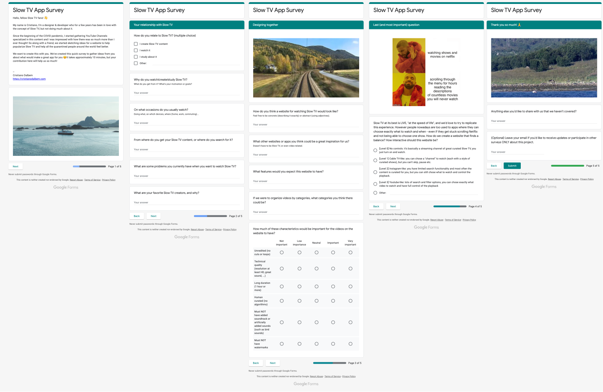

# Overview
 
For a few years, I've been in love with the concept of [Slow TV](https://en.wikipedia.org/wiki/Slow_television), but I haven't done much about it. Then from the beginning of the COVID pandemic I started collecting some YouTube channels, and I was shocked with how much amazing stuff was out there. I started sketching ideas for a website that would help highlight all this amazing content, but with a frictionless experience that attempts to fix once and for all the choice paralysis present in so many video streaming platforms these days.
 
```grid|1 
  
``` 

This project was co-created with [/r/SlowTV, the Reddit Slow TV community](https://www.reddit.com/r/SlowTV/), where we understood the whys and hows of those users. One of the main requests: an interface that would be calming, "playing to the affective experience of watching Slow TV itself". So I designed and implemented an interface inspired by Scandinavian design, well-known for its minimalism and elegance - and also the birthplace of the original Slow TV shows. Those were aired on broadcast TV during days, you couldn't pause or fast-forward - it was "at the speed of life", so my website wouldn't have these controls neither.

For us, Escapista is a heartfelt passion project, and building it brought us much joy in these uncertain times. We deeply hope you feel it too, and share it with your friends that might like it too :)

```grid|1

```


# Research

Our research started diving into the topics of Slow TV, reading all articles, watching all talks and listening to all podcasts we could find on the subject. We also read a lot also current trends for online streaming and a growing trend on transcending the algorithms and bringing human curation back. We found out there's also an interesting discussion boiling up about "the Netflix effect", which is a frustrating but classic "analysis paralysis" that affects video platforms that offer too many options to the user. We documented everything on Notion, as you can see below.

<jumbo>
    
</jumbo>

<!-- ```grid|1

``` -->

This project was co-created with [/r/SlowTV](https://www.reddit.com/r/SlowTV/), the Reddit Slow TV community, where we understood the whys and hows of those users. I [posted a survey](https://www.reddit.com/r/SlowTV/comments/iuuwoo/help_me_design_a_slow_tv_app/g5nfv64/?context=3) asking people to help me build this app and got a very nice engagement. Some of the things we wanted to find out were:
* Why, when and how do people watch Slow TV content?
* What kind of experience or features people miss from the current websites where they get their content?
* What makes for good Slow TV content?
* How much interactivity/control would they want from this experience? (more like YouTube, or more like Cable TV?)

```grid|1

```

After analysing these responses I made sure to [post again on the community](https://www.reddit.com/r/SlowTV/comments/kccdky/presenting_escapista_a_new_experience_of_watching/) thanking for the interest and the great feedback, sharing [a small report of the main findings](https://www.notion.so/Slow-TV-Community-Survey-1c0838bac8c84383b49b8f03eaeed04f) which I summarize below.

<jumbo>
    
</jumbo> 


## Survey learnings

> "It's meditative. It can get my creative juices flowing. The moving picture stimulates my brain, without invading my thoughts. My mind is able to fly free in a state of flow."

Mostly everyone mentioned they watch Slow TV to _relax_, and many mentioned it allows them to _travel and meet new places_ and cultures, something even more important now during the quarantine. Also, some mention helping focus, create a specific atmosphere in the room (either calming or exciting), and even helping to do exercises at home.

> "I suffer from anxiety and this is a method of calming down or remaining calm in times of stress."

Most often people watch at _home_ (which, during the pandemic, is quite obvious), _mainly on TV_ and big screens, secondly on the computer and 2nd monitors. People watch it in _parallel_ with a high variety of activities: _working_, with _friends_, with _music_, _eating_, writing, drawing, knitting, folding laundry, ... Various mentions to smart TV devices and videogames, but no mobile. Most get their content from either _YouTube_ or _Reddit_, in equal proportions.

> "Try to play to the same affective experience of watching slow tv itself"

As for the website experience, almost everyone mentioned the interface should be _minimalistic and calming_. Also very often is the concept of _categories, or themes,_ that organize the main types of videos.

> "Minimal, make a few choices press play and don't touch for as long as possible."

Some people say it should be exactly like other streaming services, with a full catalog where you can browse, search, and filter. Others state the contrary: it should be very simple and minimalistic, with more curated, high-quality content.

> "Not overwhelming or overstimulating. A good recommendation system, but not too many options shown all at once on the landing/home page."


<jumbo>
    
</jumbo>

In terms of content, the most important aspects seem to be _technical quality_ (good resolution, sound, ...) and _unedited_. Last but not least were _long duration_, _human curated_, no soundtrack and no watermarks. Most common requested categories were _nature_, _urban_, _walking, train_, _car, boat_. The most important aspect for categorizing videos seems to be the types of _transportation_ and _location._ Very often people asked for being able to filter by location of the video based on the region of the world, country, city, etc.

> "I like seeing tech used in a way that encourages reflection and calm living."

Several people would like to have a YouTube-like experience, where they can browse and search for the videos they want, build playlists, etc. Still, several also like the idea of a Cable TV-like experience, where you're presented with a few live channels. Some mentioned a combination of both approaches would be cool.

> "What I would not want is to load it and be presented with a busy YouTube-esque interface"


# Visual identity

<!-- <jumbo caption="blablabla">
    
</jumbo> -->

I drew inspiration from an overlap between adventure magazines, Scandinavian and Japanese design, which can be seen from the moodboard below. Scandinavia is the birthplace of the original Slow TV shows, and I've learned they have a design tradition of minimalism, subdued colors, geometric typography and high usage of photography laid out in assymetric grids.

<jumbo>
    
</jumbo>

```grid|1

```

As the scandinavians, japanese culture is also very centered on nature and contemplation. The illustration and logos drawn inspiration from Hanafuda, traditional japanese cards. One that particularly caught my attention was the Full Moon card, which depicts beautiful natural scenery with a big full moon that seems ambiguously seems to be hiding or being revealed from behind a hill.

<jumbo caption=".">
    
</jumbo>

```grid|1

```
 
```grid|1

```


# Prototyping

Before start exploring UI solutions we do a wide benchmark research looking for similar web experiences, as well as TV UI references.

<jumbo>
    
</jumbo>

<!-- <jumbo caption="blablabla">
    
</jumbo> --> 

Some of the many explorations I've played with, searching for something that made sense to my vision.

<jumbo>
    
</jumbo>

<jumbo> 
    
</jumbo>
 

 For my favorite ones I created simple prototypes to see it in action and get feedback from users. Figma doesn't support videos, but converting them to GIFs I managed to create fairly realistic prototypes.
 
<!-- <jumbo>
    
</jumbo> -->

<video-container> 
    <video autoPlay controls loop width="100%" type="video/mp4">
        <source src="./prototype.mp4" type="video/mp4">
    </video> 
</video-container>


# Implementing

Under the hood it's just a YouTube Embedded Player, so all views and ad revenue goes to the original creators. The first proof of concept was a very rough prototype made in Glitch, with a simple YouTube iframe player. Later I started scaffolding a proper webapp stack around it, and linking with Airtable that would be our Database/CMS. 

```grid|1

```

<!-- ```grid|1

``` -->

Since the main website would be super simple a lot of our focus was on creating a system for storing, rating and categorizing the videos, all using the super-friendly Airtable interface.

<jumbo>
    
</jumbo>

The database is comprised of mainly 3 entities: Videos, Channels and Tags, all which can be edited separately and are linked among themselves just like regular Databases would. This is then connected to the website backend, which retrieves, processes and caches this data and build the video "scheduling".

<jumbo>
    
</jumbo>

Although all the scheduling is "live", just like in a regular Cable TV, there's no distributed syncing mechanism. I've developed a simple but elegant algorithm that uses the computer clock as a hash index for the full video sequence, effectively reducing my power in controlling it but rendering a perfectly synced experience in multiple devices and locations at the same time. This enables anyone sharing the link with a friend or family member to watch the same video while chatting on Zoom for example.

```grid|1

```

# Publishing

This was my first time doing a personal project that could be international, so I planned for [a big launch on ProductHunt](https://www.producthunt.com/posts/escapista), one of the biggest communities for tech products. It ended up being a reasanable success, accumulating more than 200 upvotes and ending up in the top products launch and gaining lots of organic traction from posterior blog posts.

```grid|1

```

Later on, with more clarity of what were some questions users were having on the onboarding experience and lack of clarity on the main value propositions, I designed and developed a simple landing page that would explain better the main concepts.

```grid|1

```


# Monitoring

The product metrics were designed inspired by the HEART framework, but instead of using regular dimensions such as Adoption, Engagement, ... we used our own product goals as dimensions for thinking and organizing the different signals and metrics. These were implemented using the new Google Analytics 4, which has a brand new events system.

<jumbo>
    
</jumbo>

```grid|1

``` 

From the qualitative side we also have a Typeform survey embeded on the website that makes it very easy for users to leave feedbacks about their experience.
<!-- It's made up of 4 simple questions:
* What did you like the best?
* What could be better?
* What did you think about the video curation?
* Anything else you'd like to share? -->


# Results

Since the ProductHunt launch we continue being marketed organically by news platformas, blogs, websites and on Social Media in general. For a non-profit project like this one it's great not having to spend any dollar in marketing.

<jumbo>
    
</jumbo> 

Currently we think there's room for improving user stickiness and triggering network effects by encouraging users to share with others. Still, we're quite happy with the amount of hours people have spend on the website, which corresponds to more than 100 entire days watching Slow TV videos.
 
<results-banner
    data='{
        "videos views": "60,000+", 
        "unique users": "15,000+",
        "hours of playback": "2500+",
        "coffees bought": "35"
    }'>
</results-banner>

 
## Links

<links-list
    items='[
        {
            "label": "Website",
            "url": "http://escapista.app/"
        },
        {
            "label": "Buy Me a Coffee",
            "url": "https://www.buymeacoffee.com/cmdalbem"
        },
        {
            "label": "ProductHunt post",
            "url": "https://www.producthunt.com/posts/escapista/"
        },
        {
            "label": "GitHub",
            "url": "https://github.com/cmdalbem/escapista"
        }
    ]'>
</links-list> 
