---
projectType: 'case study'
date: "2020-08"
date2: "Now"
title: "Escapista"
minibio: "A minimalistic webapp for watching curated videos to relax, explore the world & stay home."
description: "Choose a channel and let your mind wander with the continuous stream of great Slow TV and ambient videos we handpicked for you. Relax with the natural images and sounds while you work, put on your TV or invite your friends to watch together."
tags: ['design','front-end','product management']
cover: './cover.png'
hover: '/covers/escapista.gif'
forceOrder: 1
team: "Cristiano Dalbem, Gabriela Catão."
color: '#006E6E'
liveLink: 'http://escapista.app/'
--- 
 
# Overview
 
For a few years, I've been in love with the concept of [Slow TV](https://en.wikipedia.org/wiki/Slow_television), but I haven't done much about it. Then from the beginning of the COVID pandemic I started collecting some YouTube channels, and I was shocked with how much amazing stuff was out there. I started sketching ideas for a webapp that would help highlight all this amazing content, but with a frictionless experience that attempts to fix once and for all the choice paralysis present in so many video streaming platforms these days.
 
<!-- ```grid|1 

```  -->

This project was co-created with [the Reddit Slow TV community](https://www.reddit.com/r/SlowTV/), where we learned about the habits of Slow TV consumption and their desires for a specialized website. One of the main requests: an interface that would be calming, "playing to the affective experience of watching Slow TV itself". The interface design is inspired by Scandinavian design, well-known for its minimalism and elegance - and also the birthplace of the original Slow TV shows.

```grid|1 

```


# Research

Our research started diving into the topics of Slow TV, reading all articles, watching all talks and listening to all podcasts we could find on the subject. We also read a lot also current trends for online streaming and a growing trend on transcending the algorithms and bringing human curation back.
 
We also learned there's also a growing discussion about "the Netflix effect", a frustrating experience of "analysis paralysis" that affects video platforms as well as other products that offer too many options to the user.

We documented everything on Notion, as you can see below.

<jumbo>
    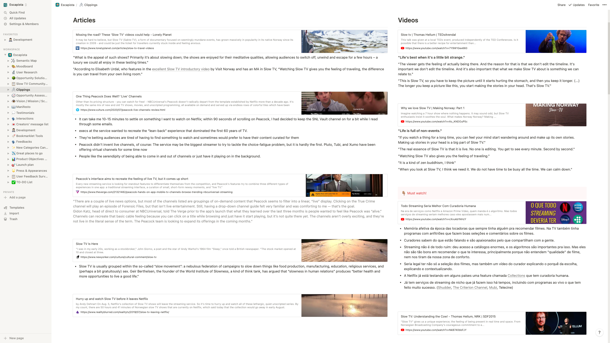
</jumbo> 

This project was co-created with [the Reddit Slow TV community](https://www.reddit.com/r/SlowTV/), where we understood the whys and hows of those users. We [posted a survey](https://www.reddit.com/r/SlowTV/comments/iuuwoo/help_me_design_a_slow_tv_app/g5nfv64/?context=3) asking people to help me build this app and got a very nice engagement. Some of the things we wanted to find out were:
* Why, when and how do people watch Slow TV content?
* What kind of experience or features people miss from the current websites where they get their content?
* What makes for good Slow TV content?
* How much interactivity/control would they want from this experience? (more like YouTube, or more like Cable TV?)

```grid|1
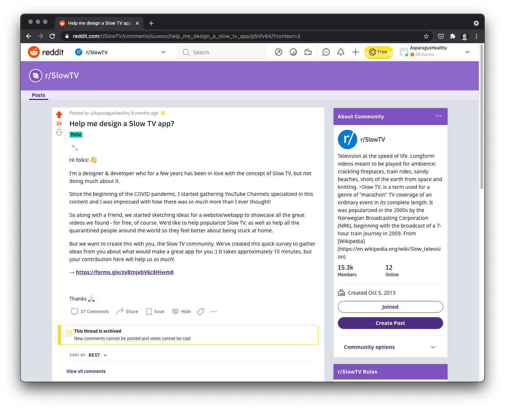
```

After analysing these responses we made sure to [post again on the community](https://www.reddit.com/r/SlowTV/comments/kccdky/presenting_escapista_a_new_experience_of_watching/) thanking for the interest and the great feedback, sharing [a small report of the main findings](https://www.notion.so/Slow-TV-Community-Survey-1c0838bac8c84383b49b8f03eaeed04f) which I summarize below.

<jumbo>
    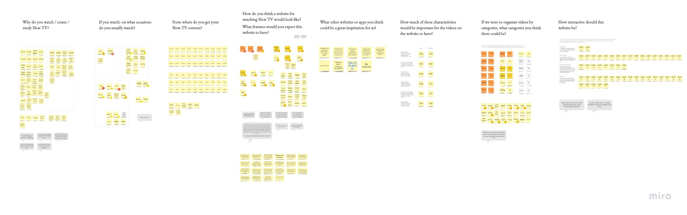
</jumbo> 


## Survey learnings

### Consumption habits

> "It's meditative. It can get my creative juices flowing. The moving picture stimulates my brain, without invading my thoughts. My mind is able to fly free in a state of flow."

We learned that most people watch Slow TV to _relax_, to _travel and meet new places_ and cultures, something even more important now during the quarantine. Also, some mention helping focus, create a specific atmosphere in the room (either calming or exciting), and even helping to do exercises at home.

> "I suffer from anxiety and this is a method of calming down or remaining calm in times of stress."

Most often people watch at _home_, _mainly on TV_ and big screens, secondly on the computer and 2nd monitors. People watch it while doing a high variety of activities: _working_, with _friends_, with _music_, _eating_, writing, drawing, knitting, folding laundry, ... Various mentions to smart TV devices and video-games, but no mobile.


### Product requirements

As for the website experience, almost everyone mentioned the interface should be _minimalist and calming_. Also very often is the concept of _categories, or themes,_ that organize the main types of videos.

> "Try to play to the same affective experience of watching slow tv itself. Minimal, make a few choices press play and don't touch for as long as possible."

<!-- Some people say it should be exactly like other streaming services, with a full catalog where you can browse, search, and filter. Others state the contrary: it should be very simple and minimalist, with more curated, high-quality content. -->

<!-- > "Not overwhelming or overstimulating. A good recommendation system, but not too many options shown all at once on the landing/home page." -->


<jumbo>
    
</jumbo>

> "What I would not want is to load it and be presented with a busy YouTube-esque interface"

In terms of content, the most important aspects seem to be _technical quality_ (good resolution, sound, ...) and _unedited_. Most common requested categories were _nature_, _urban_, _walking, train_, _car, boat_, and the most important aspect for categorizing videos seems to be the types of _transportation_ and _location._

<!-- Several people would like to have a YouTube-like experience, where they can browse and search for the videos they want, build playlists, etc. Still, several also like the idea of a Cable TV-like experience, where you're presented with a few live channels. Some mentioned a combination of both approaches would be cool. -->
[Read the full research report.](https://www.notion.so/Slow-TV-Community-Survey-1c0838bac8c84383b49b8f03eaeed04f) 


# Visual identity

<!-- <jumbo caption="blablabla">
    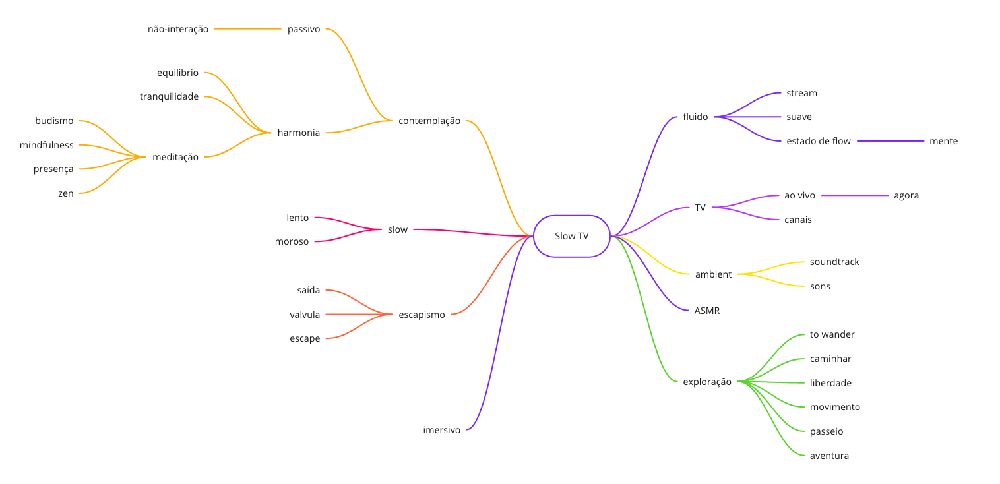
</jumbo> -->

I drew inspiration from an overlap between Scandinavian design and adventure magazines. Scandinavia is the birthplace of the original Slow TV shows, and I've learned they have a design tradition of minimalism, subdued colors, geometric typography and high usage of photography laid out in asymmetric grids.
 
<jumbo>
    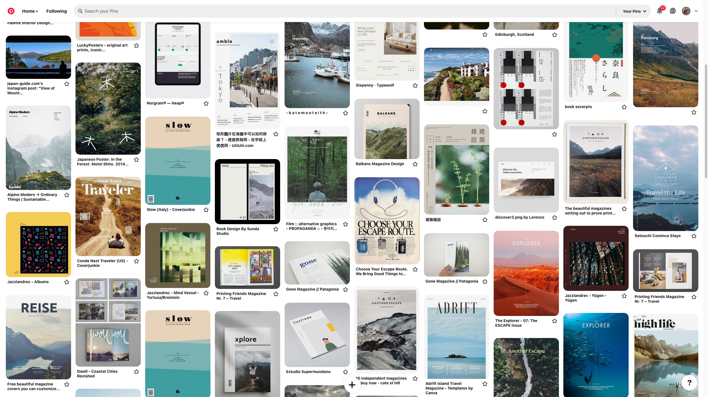
</jumbo>

On the typography studies I explored possibilities for 3 families:
* "Nordic" fonts, to be used in all caps
* Geometric and other swiss-type Sans Serif fonts, very commonly found in the references too
* Didone fonts, which seems to be really popular nowadays and could bring a modern feel

```grid|1
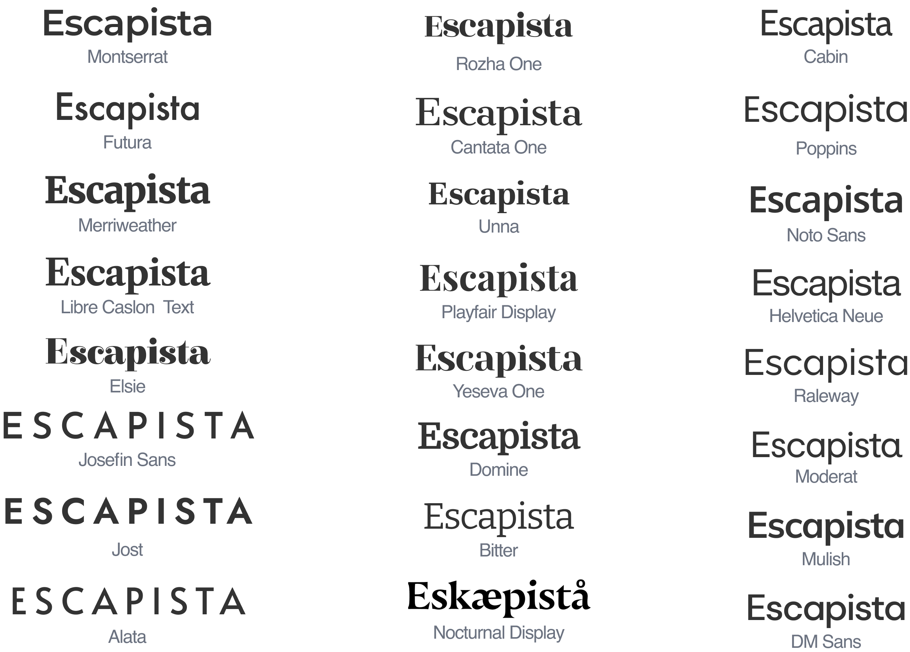
```

As the scandinavians, japanese culture is also very centered on nature and contemplation. The illustration and logos drawn inspiration from Hanafuda, traditional japanese cards. One that particularly caught my attention was the Full Moon card, which depicts beautiful natural scenery with a big full moon that seems ambiguously seems to be hiding or being revealed from behind a hill. I really felt this expressed my feeling of being stuck at home, wanting to go out but at the same time trying to take care of me and others.

<jumbo caption=".">
    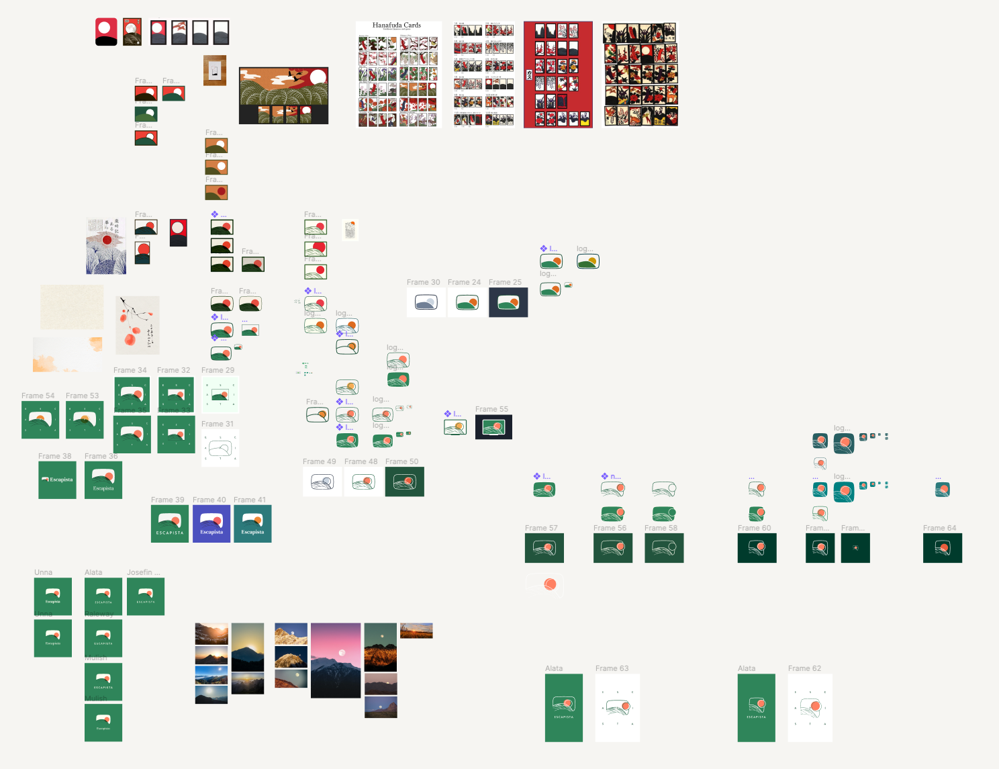
</jumbo>
 

```grid|1

```

```grid|1
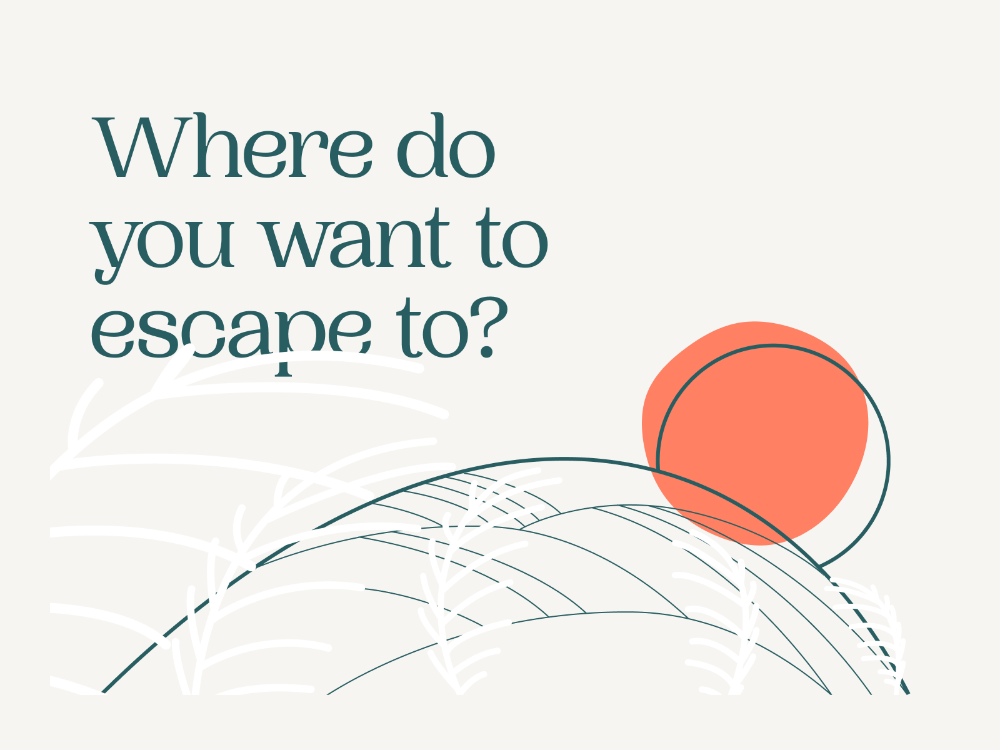
```


# Prototyping

To kick off exploring UI solutions we did some benchmarks, looking for similar immersive web experiences and TV UI references.

<jumbo>
    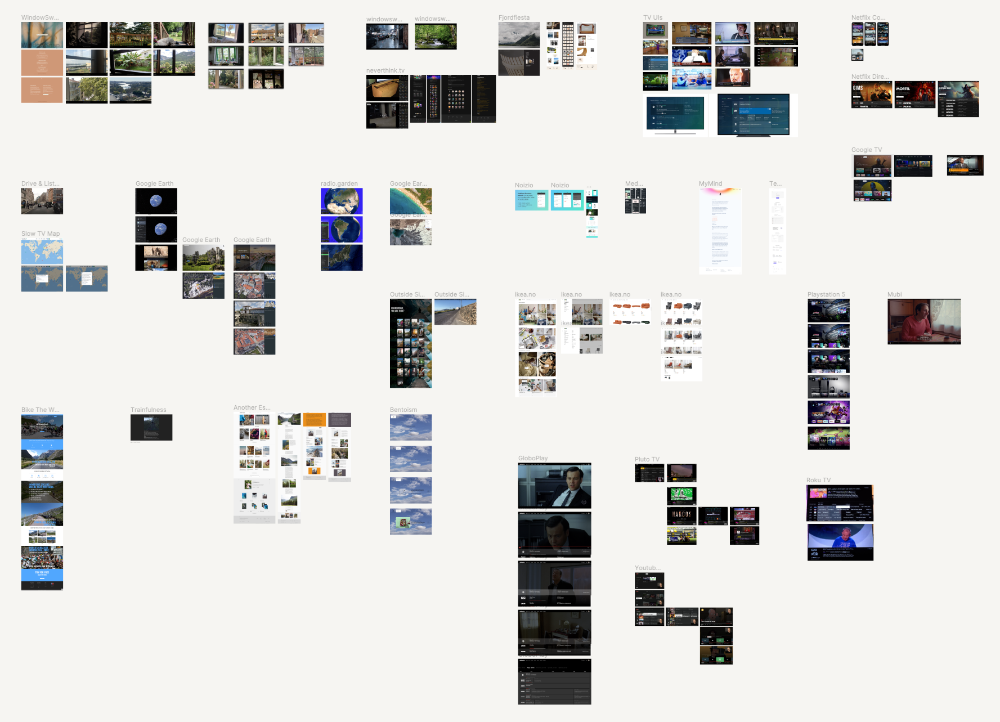
</jumbo> 

<!-- <jumbo caption="blablabla">
    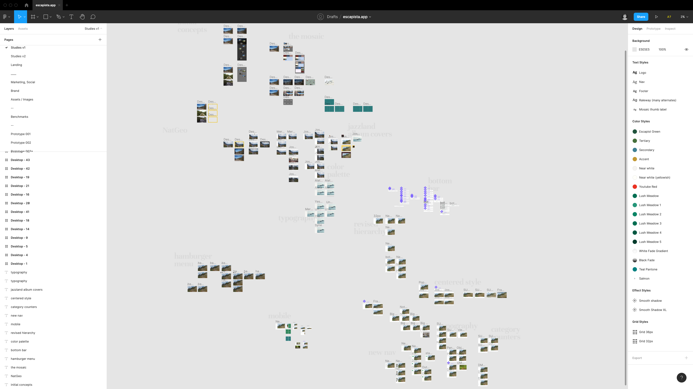 
</jumbo> --> 

I've explored many alternatives, searching for something that made sense to our vision of a UI that "play to the same affective experience of watching Slow TV itself", as one survey respondent said. To guide my explorations I devised 3 design principles for the product:
* Minimalist, calm and focused
* Immersive, meditative
* Less controls, more contemplation


<jumbo>
    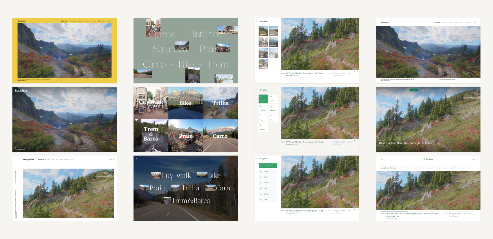
</jumbo>

<jumbo> 
    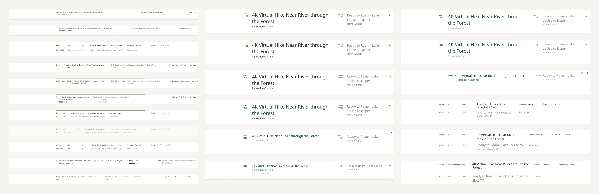
</jumbo>
 

 For my favorite ones I created simple prototypes to see it in action and get feedback from users. Figma doesn't support videos, but by converting them to GIFs I managed to create fairly realistic prototypes.
 
<!-- <jumbo>
    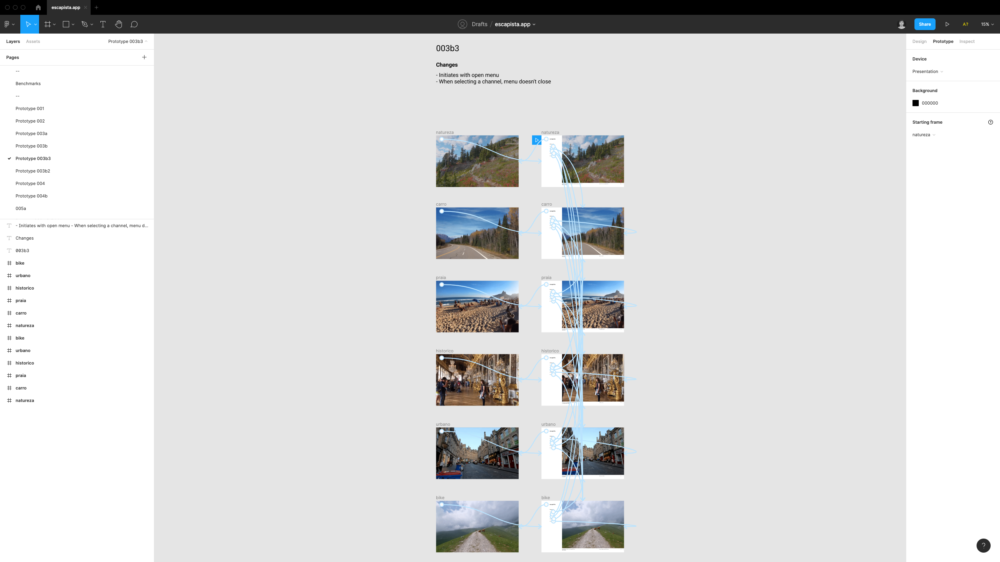
</jumbo> -->

<video-container> 
    <video autoPlay controls loop width="100%" type="video/mp4">
        <source src="./prototype.mp4" type="video/mp4">
    </video> 
</video-container>

We also used it to start contacting our favorite YouTube creators to see what they think. While we didn't get responses from many, everyone that replied was very positive about the idea and some even very excited and thankful, such as [Japan Potato](https://www.youtube.com/channel/UCHG0_GSE0q02ywTfSoq2s3g) and [Chill & Explore](https://www.youtube.com/c/ChillExplore/featured):


```grid|2
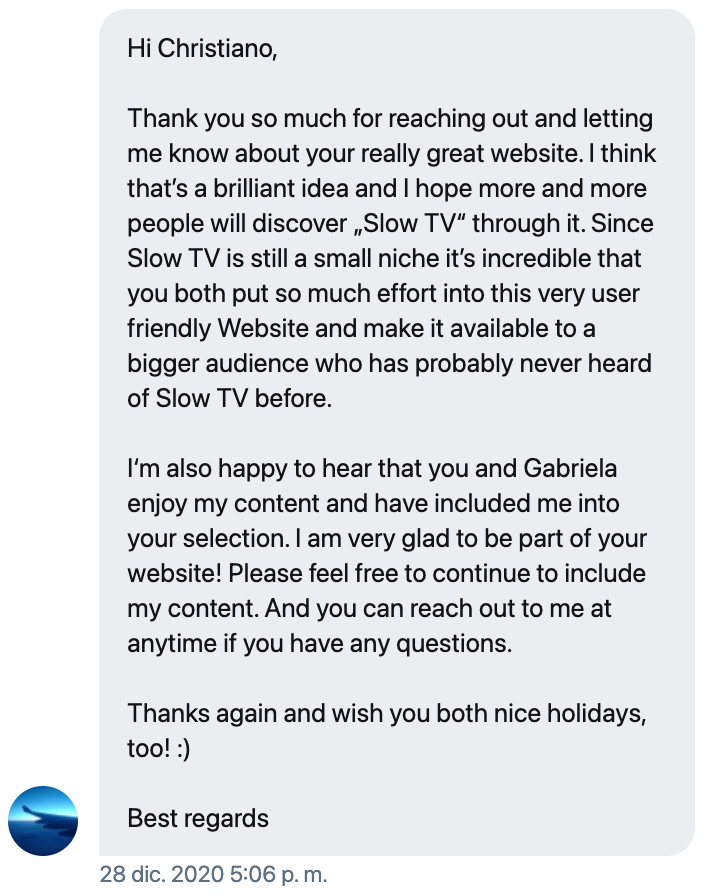

```


<!-- > Thank you so much for reaching out and letting me know about your really great website. I think that’s a brilliant idea and I hope more and more people will discover Slow TV through it. Since Slow TV is still a small niche it’s incredible that you both put so much effort into this very user friendly Website and make it available to a bigger audience who has probably never heard of Slow TV before. I‘m also happy to hear that you and Gabriela enjoy my content and have included me into your selection. I am very glad to be part of your website! -->

<!-- ```grid|1 

``` -->

<!-- > Hi there, thanks for reaching me out and excuse my late reply. I was waiting the right time to check your work properly. Really like the vibes on there. Minimalist style and linked to youtube sounds like a fair win-win collaboration. Definitely support you to go ahead. I noticed you chose all the "big" channels of walking tours and slow tv and honored you noticed my modest contribution as well. Please continue and let's keep in touch if any new idea comes out. best regards Dorian -->

<!-- ```grid|1

``` -->

# Implementing

The first proof of concept was a very rough prototype made in [Glitch.com](https://glitch.com/), with a simple YouTube iframe player. Seeing that it worked, I started scaffolding a proper webapp stack around it, and linking with Airtable that would be our Database/CMS. By using a YouTube Embedded Player under the hood I could simplify any complexity about storing and streaming videos, but also all views and ad revenue would to the original video creators.

```grid|1

```

<!-- ```grid|1
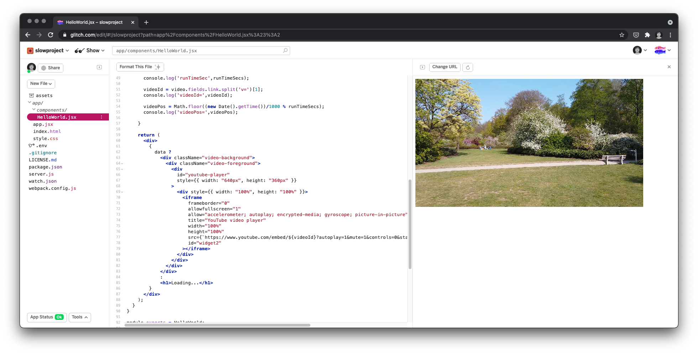
``` -->

A lot of our focus was on creating a system for storing, rating and categorizing the videos, all using the super-friendly Airtable interface.

<jumbo>
    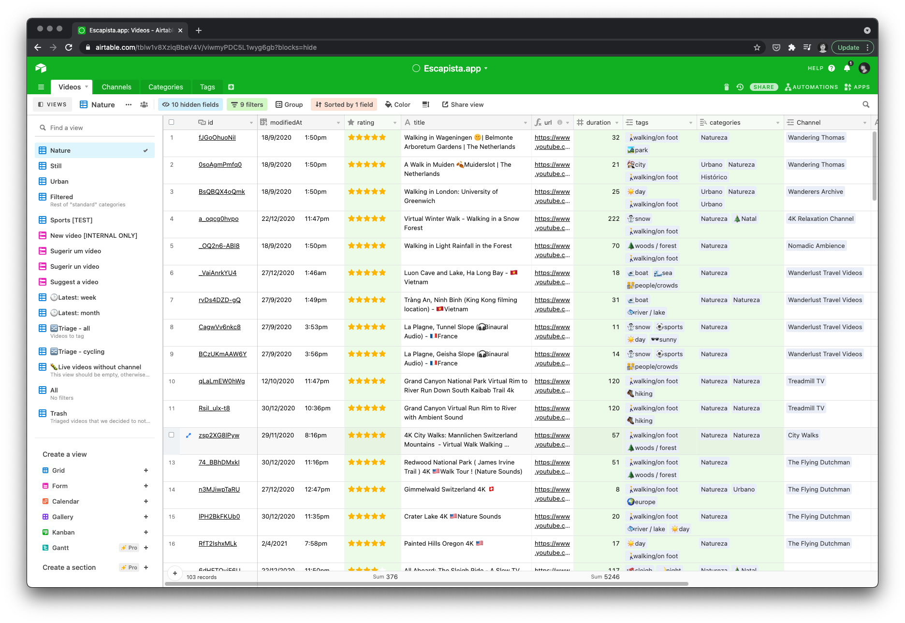
</jumbo>

The database is comprised of mainly 3 entities: Videos, Channels and Tags, all which can be edited separately and are linked among themselves just like regular Databases would. This is then connected to the website backend, which retrieves, processes and caches this data and build the video "scheduling".

```grid|2
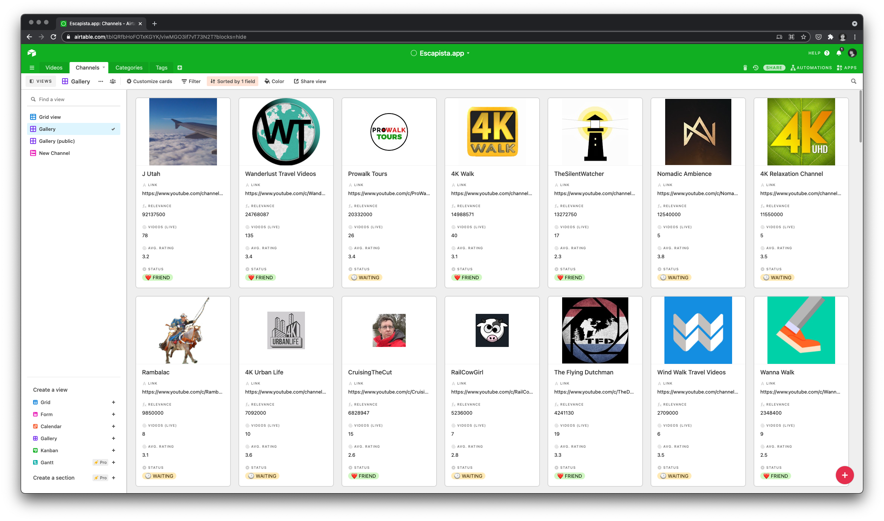 
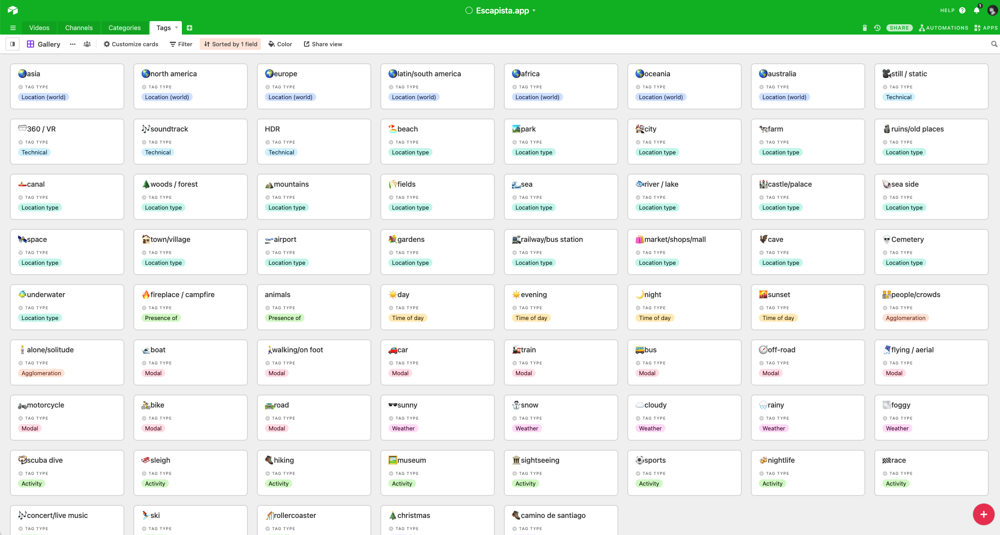  
```

Although all the scheduling is "live", just like in a regular Cable TV, there's no actual syncing mechanism. I've developed a simple algorithm that uses the computer clock (which is automatically synced by the Operational System) as a index for videos. This enables anyone sharing the link with a friend or family member to watch the same video, at the same location, while doing a call for example.

```grid|1  
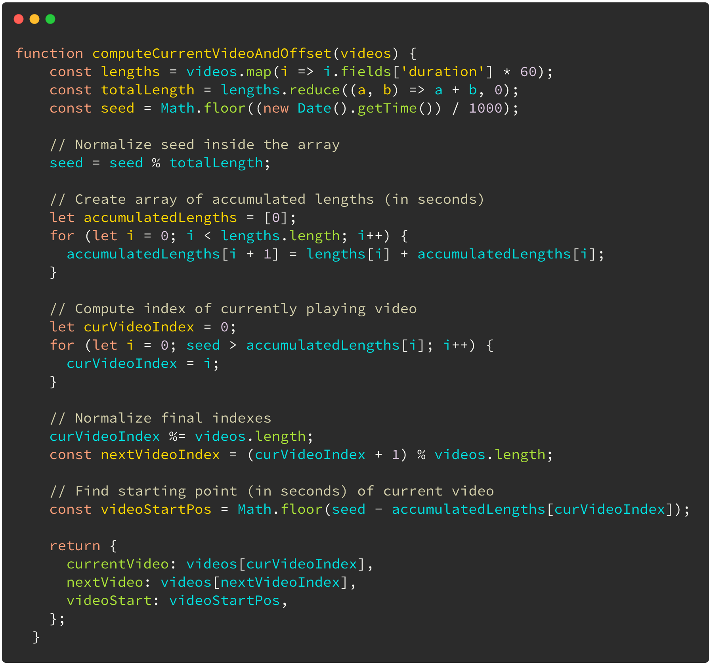
```

# Publishing

We created a launch plan that included [a big launch on ProductHunt](https://www.producthunt.com/posts/escapista), one of the biggest communities for tech products. We were very happy with the result, accumulating more than 270 upvotes and ending up in the top ranked launches for the week and gaining lots of organic traction from posterior blog posts.

```grid|1
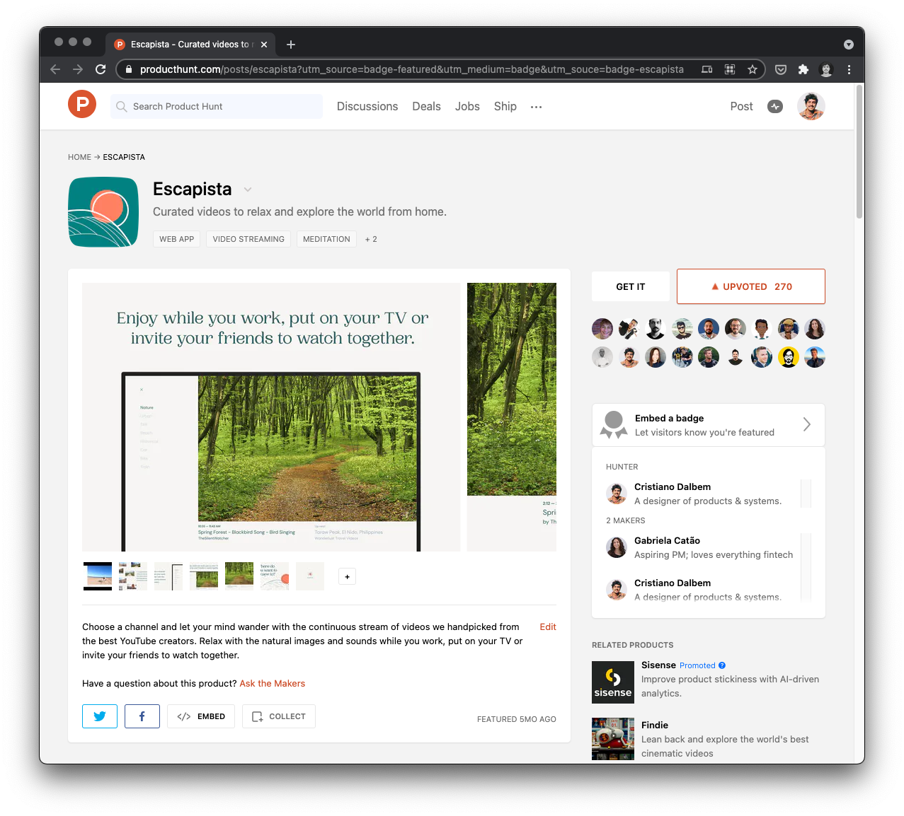
```

Later I created a simple landing page that would explain better the main concepts based on the main questions users were bringing. We wanted to bring more clarity to some of our philosophies that guided our UX decisions, for example explaining why there isn't pause of fast-forward buttons.

<jumbo>
    
</jumbo>


# Monitoring

The product metrics were designed inspired by the HEART framework, but instead of using regular dimensions such as Adoption, Engagement, ... we used our own product goals as dimensions for thinking and organizing the different signals and metrics. These were implemented using the new Google Analytics 4, which has a brand new events system.

<jumbo>
    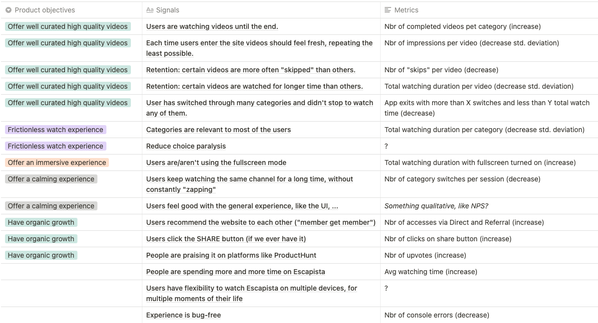
</jumbo>

```grid|1
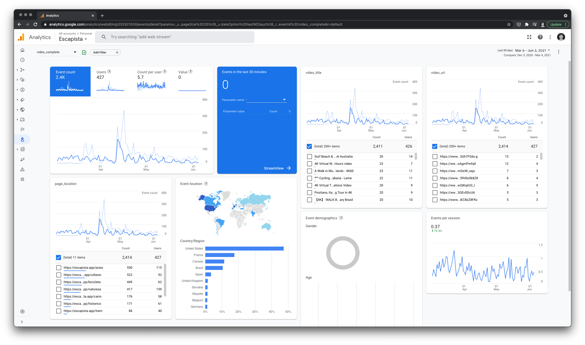
``` 

From the qualitative side we also have a Typeform survey embedded on the website that makes it very easy for users to leave feedbacks about their experience.
<!-- It's made up of 4 simple questions:
* What did you like the best?
* What could be better?
* What did you think about the video curation?
* Anything else you'd like to share? -->

# Results

Since the ProductHunt launch we continue being marketed organically by news platforms, blogs, websites and on Social Media in general. For a non-profit project like this one it's great not having to spend any dollar in marketing. 

<jumbo>
    
</jumbo> 

Currently we think there's room for improving user stickiness and triggering network effects by encouraging users to share with others. Still, we're quite happy with the amount of hours people have spend on the website, which corresponds to more than 100 entire days watching Slow TV videos.
 
<results-banner
    data='{
        "videos views": "60,000+", 
        "unique users": "15,000+",
        "hours of playback": "2500+",
        "coffees bought": "35"
    }'>
</results-banner>

And, of course, we're utterly happy with the several heart-warming user feedbacks we received already:
  
<jumbo>
       
</jumbo>

## Links
 
<links-list
    items='[ 
        {
            "label": "Website",
            "url": "http://escapista.app/"
        },
        {
            "label": "ProductHunt post",
            "url": "https://www.producthunt.com/posts/escapista/"
        },
        {
            "label": "GitHub",
            "url": "https://github.com/cmdalbem/escapista"
        },
        {
            "label": "Buy Me a Coffee",
            "url": "https://www.buymeacoffee.com/cmdalbem"
        }
    ]'>
</links-list> 
