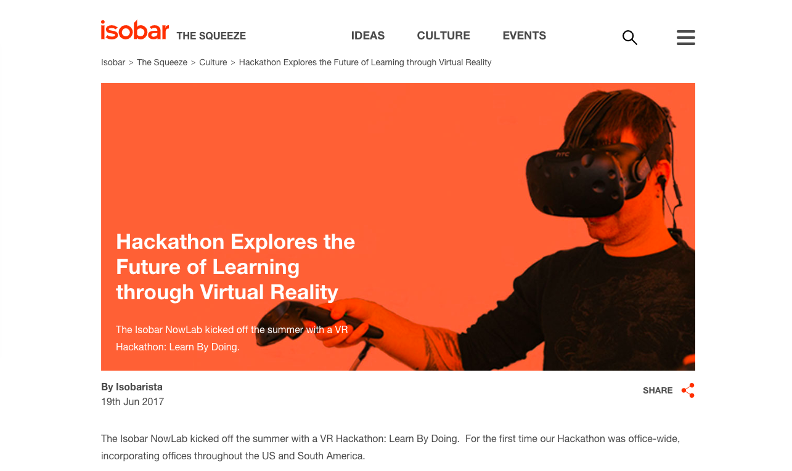

### Overview


Our challenge was to develop a VR experience with the theme “Learn by Doing”. We focused in taking advantage of the platform’s potentials and unique features. We thought that Virtual Reality, being an immersive and interactive media, could be leveraged to foster empathy and social equality.

The concept of the game is to tell a story in 3 chapters. Three times the same game, three times the same routine, but each time from very different perspectives. A story-telling game inspired by the best “walking simulators” that will challenge you to see the world from other people’s eyes.

It works with a minimalistic playability with very simple mechanics. The story is told by a narrator and is permeated in dialogues and interactions with other characters. The ambiance is set from how characters interact with you to subtle details in the soundscape, slight differences in the scenarios and changes to the lightning and color palettes.


---

# Day 1
## Kick off

On friday evening we started brainstorming so on saturday morning, with the official start of the hackathon, we would have some clues already of where to head to.

To really leverage the potentials of the medium we drew a canvas to explore the key values and concepts that Virtual Reality was exceptional at. This led us to understand what would be some interesting contexts and applications where thos values could be best exploited.

We finished the day listing some cool ideas we came up with based on the dynamic.
* Teaching foreign languages for kids using immersive visual effects and speech interaction;
* Visualization of impressive data using real scale on VR, like numbers for poverty in Brasil, or deaths in wars.
* Raising awareness of the role of citizens in the traffic, with a game that would put you in the skin of a bus driver, a car driver, a cyclist and a pedestrian.
* A game where the character should avoid being catcalling on the street.

```grid|2


```

<!-- ```grid|1

``` -->


# Day 2
## Hands On

On the morning of the second day our first objective was to filter out from the list of the previous day what would be our projects. To make that decision we did some quick benchmarking of similar ideas on the market. We also look at what the Unity Assets Store had to offer us, since depending on the idea we would need cool, ready to use assets. We ended up with 2 final ideas that seemed perfect, so a toss of heads or tails was our call. The coin decided we’d be working on The Game of Lives.

```grid|1

``` 

During the rest of the day we finished collecting the perfect assets, we designed the basic mechanics of the game and I started working on the game script. 

Most of us had had some experience with the Unity framework, but not enough to have a smooth experience. This first day of development was full of technical difficulties and hours of video tutorials and articles. 

```grid|3


```


```grid|2

 
```


# Day 3
## A baby was born

We only managed to glue together all the parts in the very end of this day. Most work done this afternoon was merging the work each double had done in parallel. 

There were lots of work that could be only be executed when all parts were brought together. This slowed down a little the development, but the team managed to stay busy the whole time producing lots of content.

I spent the day constantly improving the game script and also creating the characters' voices. We didn't have time nor the proper equipment to record the voices, so I created a command-line script with a text-to-speech tool for generating automatically all sound files. Each character had a distinct voice pitch and intonation to match with its role.

```grid|1

```

```javascript
say 'Good morning. Did you sleep well? You are going to need it. You've got a big day ahead of you. Why don't you start with some breakfast.' -r 200 -v Alex -o narrator1.aiff
say 'Very good! You should be well nourished for today. Time to grab your keys and go.' -r 200 -v Alex -o narrator2_men.aiff
say 'Be careful how much you eat. That should be enough. Time to grab your keys and get going.' -r 200 -v Alex -o narrator2_girl.aiff
say 'Um um. You should ration. Paycheck doesn` come in another 2 weeks. Time to grab your keys and get going.' -r 200 -v Alex -o narrator2_minority_poor.aiff
say 'That should do it. You should find your keys and get going.' -r 200 -v Alex -o narrator3_men.aiff
say 'Your schoffer is already waiting for you. Get in the car and youll be at work in no time. ' -r 200 -v Alex -o narrator4_men.aiff
say 'Just another day of walking to work. Hurry up or you are going to be late. ' -r 200 -v Alex -o narrator4.aiff
say 'Clock is ticking…' -r 200 -v Alex  -o narrator5a.aiff
say 'You really dont want to be late…' -r 200 -v Alex -o narrator5b.aiff
say 'Today is the big day. Today is the day you will finally launch the rocket. You should find your manager to get the access card.' -r 200 -v Alex -o narrator6.aiff
say 'Just another regular day ends. Pretty easy, wasnt it? But life is very different for some groups of people. And the more privileges you have, the less you understand about those who dont. Now, what about trying it again, but from a different perspective…?' -r 200 -v Alex -o narrator_end_men.aiff
say 'All around the world, 52% of economically active women have already been victims of sexual harassment in their workplace. Meanwhile, in the streets of Brazil, 97% of women have already been catcalled. And contrary to what offenders might think, it does not brighten up their day, its quite the opposite. Now, what about trying it again, but from a different perspective…?' -r 200 -v Alex -o narrator_end_girl.aiff
say 'Racism and xenophobia are very real problems. Despite the fact that some people think it does not exist anymore, in Brazil and around the world we still elect politicians and give audience to TV shows that perpetuate this kind of thinking. Bolsonaro, a popular politician that will run for Brazils presidency in 2018, has recently appeared in a video declaring politics should be done for the majorities, not the minorities.' -r 200 -v Alex -o narrator_end_minority.aiff
say 'Thanks for playing The Game of Lives. We hope you liked it, and it touched you somehow. This game was made with love by the Isobar Brazil Team. We are: André Trevisani, Diego Cunha, Diego Tomasi, Cristiano Medeiros Dalbem, Leonardo Schenfeld, Victoria Aiello. See you next time.' -r 200 -v Alex -o narrator_credits.aiff
```

Our past experience with Hackathons taught us the importance of prioritizing and cutting out ideas to make sure we deliver in time. We ended up cutting out some characters which we wanted to design levels for, which were: the elderly, people with physical disabilities, people in poverty.

In the middle of the morning we managed to have all the 3 chapters working together, and we had some time to polish the experience and the final presentation.

In the spare time I designed a simple visual identity for the project to use in the presentation and a simple logo. The identity was inspired by the Minecraft-like world we created using the great assets by Synty Studios, purchased from the Unity Assets Store.

```grid|2


```


# Result

The full gameplay which we presented to the Hackathon judges can be seen in the video below.

```grid|1
[](http://www.youtube.com/watch?v=g-JqXQhAk78)
```

# Recognition

This project was developed during the first Isobar Virtual Reality International Hackathon, a 3-day contest which we were very happy to get the first place. This recognition was certainly the result of a great team work, where everyone contributed with its own skills and previous experiences.

> "This group took VR to a new place by telling a story and making social commentary in a way that provided humor while also tackling a very serious and important subject. This was not just an application, it was art. [(source)](https://squeeze.isobar.com/2017/06/19/hackathon-virtual-reality/)"
 

```grid|1

```