# Overview

Our challenge was to develop a Virtual Reality experience with the theme “Learn by Doing”. We thought that Virtual Reality, being an immersive and interactive media, could be leveraged to foster empathy and social equality.

The concept of the game is to tell a story in 3 chapters. Three times the same game, three times the same routine, but each time from very different perspectives. Game of Lives is a story-telling VR game inspired by the best “walking simulators” challenges the player to see the world from other people’s eyes.

It works with a minimalistic game mechanic. The story is told by a narrator and is permeated in dialogues and interactions with other characters. The ambiance is set from how characters interact with you to subtle details in the soundscape, slight differences in the ambientation and changes to the lightning and color palettes.
 

# Process

## Kick off

The night before the official Hackathon beggining I started facilitating a workshop with the team members. My idea was to exercise with them what are the advantages of Virtual Reality that makes it a different medium than others. We drew a canvas to explore the key values and context applications that VR was exceptional at.

We finished the day doing a brainstorm of ideas leveraging the results of the workshop. We'd sleep on them, so next day we chose one to go.

```grid|2


```
<!-- 
```grid|1

``` -->


## Day 1/2 - Getting our hands dirty

On the morning of the second day we started doing some quick benchmarking of similar ideas that were already existing game. We were given free access to the [Unity Assets Store](https://assetstore.unity.com/), so we also started looking at what assets we'd have to help us.

We ended up with 2 final ideas that seemed perfect, so a toss of heads or tails was our call. The coin decided we’d be working on The Game of Lives, so we could start collecting the perfect assets and designing the basic mechanics of the game.

At this point I already started working on the story script, which is crucial to get right for this kind of storytelling game.

```grid|1

``` 

Most of us had had some experience with the Unity framework, but not enough to have a smooth experience. This first day of development was full of technical difficulties and hours of watching tutorials and drinking coffee.

```grid|3

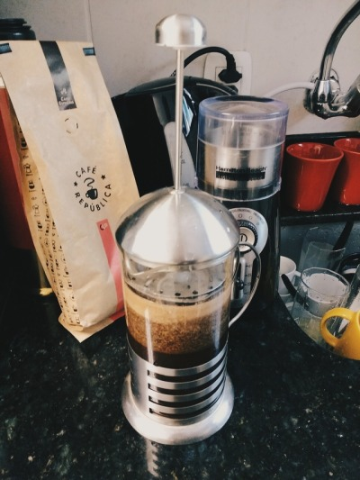

```

<!-- ```grid|2

 
``` -->


## Day 2/2 - A baby was born

We only managed to glue together all the parts in the very end of this day. There were lots of work that could be only be executed when all parts were brought together. This slowed down a little the development, but the team managed to stay busy the whole time producing lots of content.

I spent the day iterating on the script and procedurally generating the characters' voices. We didn't have time nor the equipment to record actual voices, so I created a command-line script with a text-to-speech tool for generating automatically all sound files.

```grid|1 
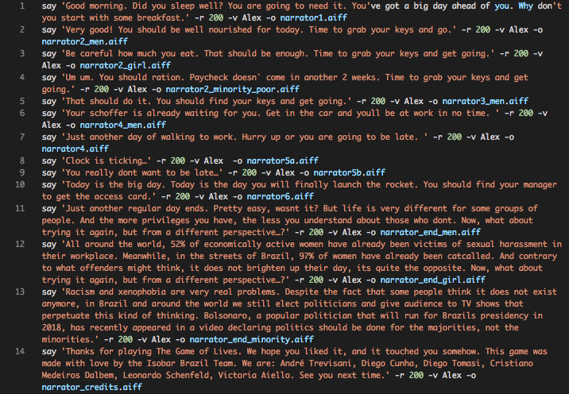
```

I decided to use the native Mac command-line tool `say` for that. It was very easy to use and offered some paramters with which I could create distinct voice pitches and intonations to match with each characters role.

```grid|1

```

Our past experience with Hackathons taught us the importance of relentlesly prioritizing tasks and controlling the scope to make sure we deliver in time. It meant making the final game have half of the content we originally planned for.

In the middle of the morning we managed to have all the 3 chapters working together, and we had some time to polish the experience and the final presentation.

```grid|1

```

In the spare time I designed a simple visual identity for the project to use in the presentation and a simple logo. The identity was inspired by the Minecraft-like world we created using the great assets by [Synty Studios](https://assetstore.unity.com/publishers/5217), purchased from the Unity Assets Store.

```grid|2


```

The 2nd and final day ended in a victory vibe: we finished the game in time! We managed to get a complete run of it without any bugs, and we were very happy with the result.


# The game

You always start waking up in your bed, at your house. A voice says you have a long day ahead.

```grid|1
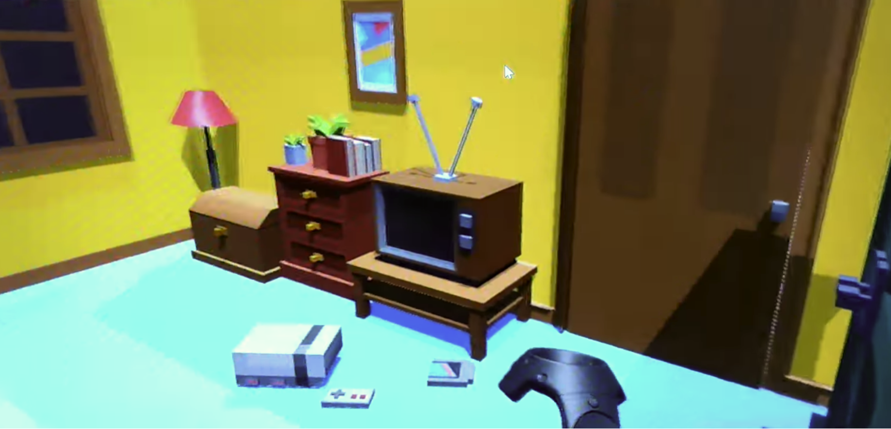
```

You may explore the house and eat breakfast before leaving to work. Each time you play the house will be different. The first time it's a pretty fancy house. It's a game of observation.

```grid|1
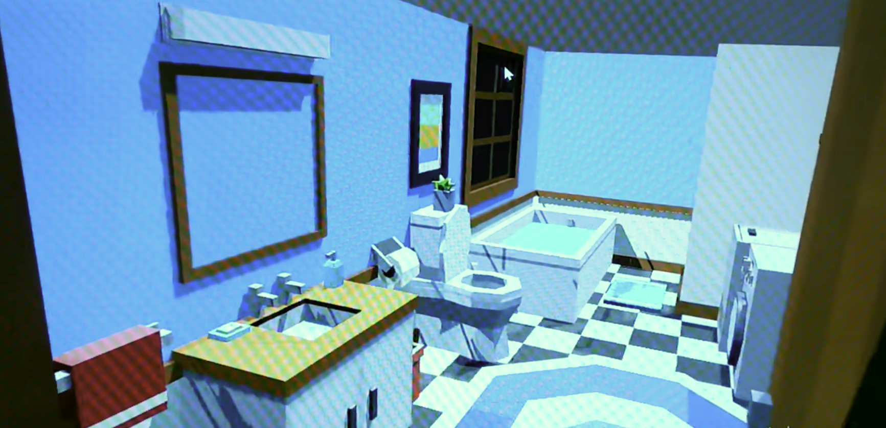 
```

A taxi takes you to work. Everyone that interacts with you treats you with utter politeness and respect.

```grid|1
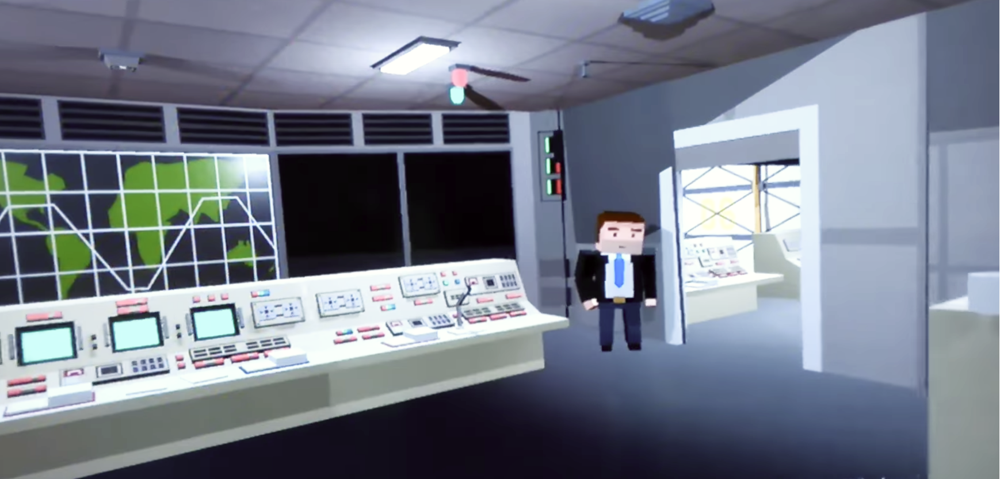 
```

Your day ends completing your task at work. You have to solve a little puzzle, but each time its difficulty will be different. This time you don't even have to solve it, they got everything ready for you"

```grid|1
 
```

At the end of the day you're revealed your character: you are a wealthy white man, and the narrator invites you to think about the priviledges you have in your rotine.

```grid|1
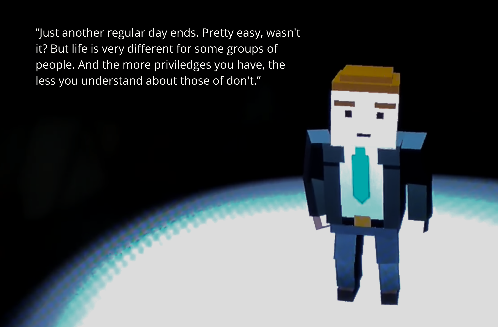 
```

On the second day you will have to walk from your house to the office. On the way you encounter other characters who whistle, catcall and disrespect you in many ways. When you arrive at work you also notice you're been treated very differently from the previous character.

```grid|1
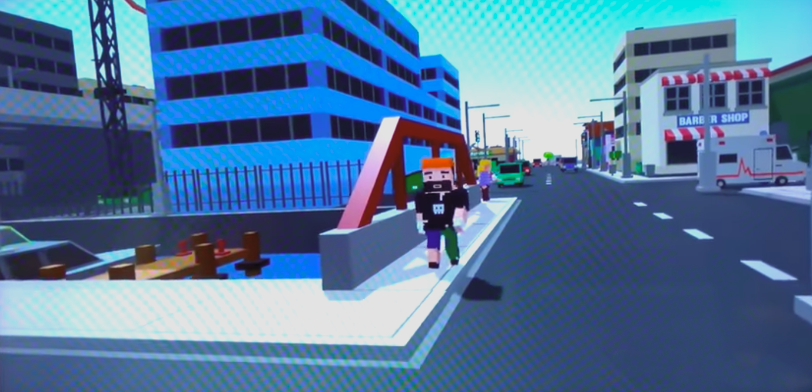 
```

This time you were a woman. The narrator tells you about statistics on sexual harassment, both at the streets and the work place.

```grid|1
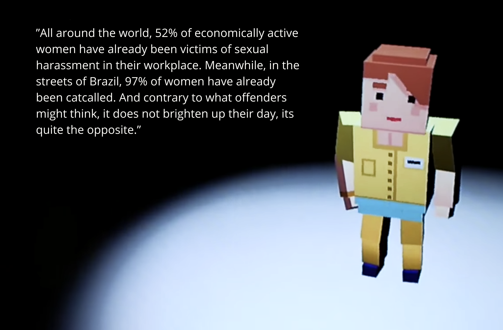 
```

The third and last time you wake up in the game your bedroom looks very different: it's almost empty, and furniture is very simple.

```grid|1
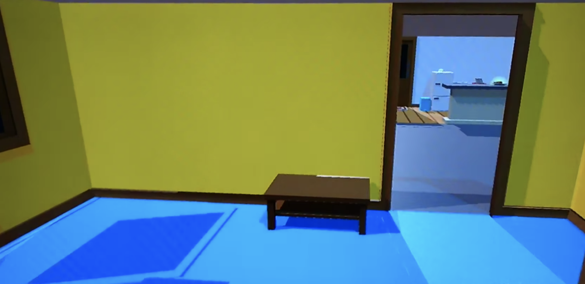 
```

You'll have to walk to work again, but now you notice your starting point is different: you're on a different, poorer neighborhood, and further away from the office.

```grid|1 
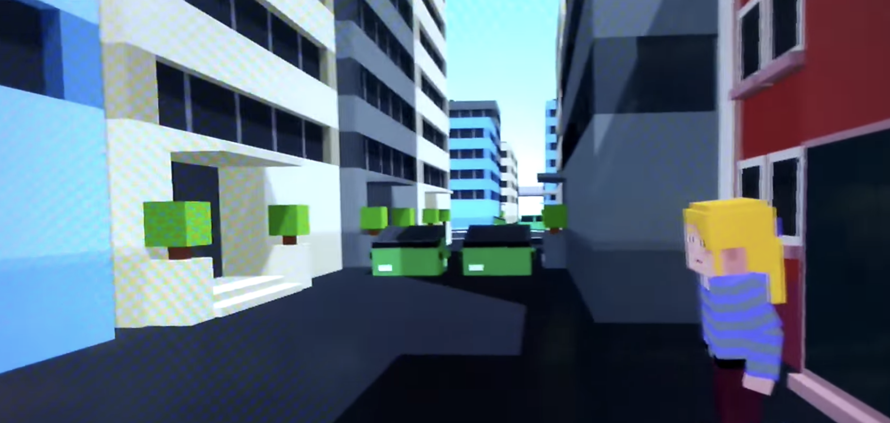 
``` 


The third character is a black, punky guy. The narrator tells you about the hassles of being a minority in a country like Brazil, mentioning a recent case of hate speech from Bolsonaro, at the time running for president.

```grid|1
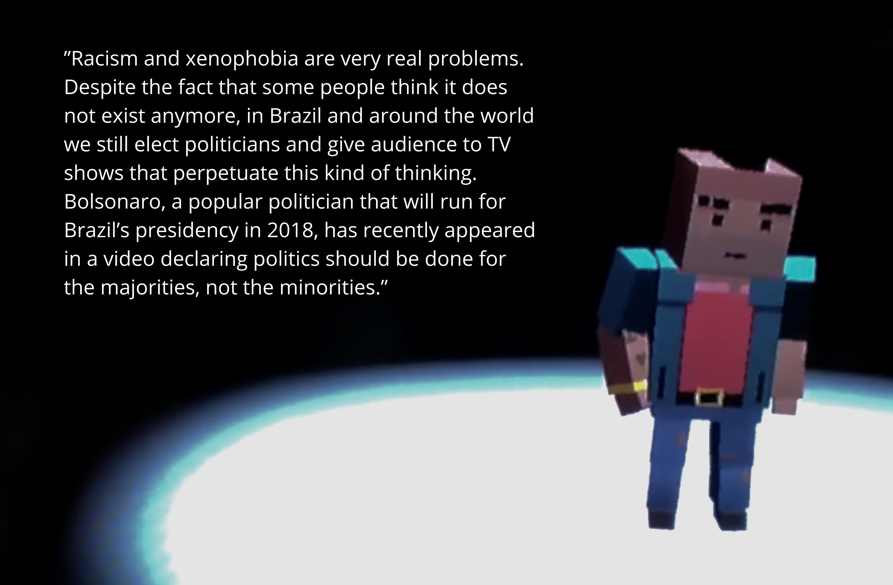 
```


The full gameplay which we presented to the Hackathon judges can be seen in the video below. Footage quality is not the best, sorry for that. I never managed to get a better shot at the final version.

<br>

`youtube: http://www.youtube.com/watch?v=g-JqXQhAk78` 
 

# Recognition

This project was developed during the first Isobar Virtual Reality International Hackathon, a 3-day contest which we were very happy to get the first place. This recognition was certainly the result of a great team work, where everyone contributed with its own skills and previous experiences.

> "This group took VR to a new place by telling a story and making social commentary in a way that provided humor while also tackling a very serious and important subject. This was not just an application, it was art." [(Source)](https://squeeze.isobar.com/2017/06/19/hackathon-virtual-reality/)
 

```grid|1
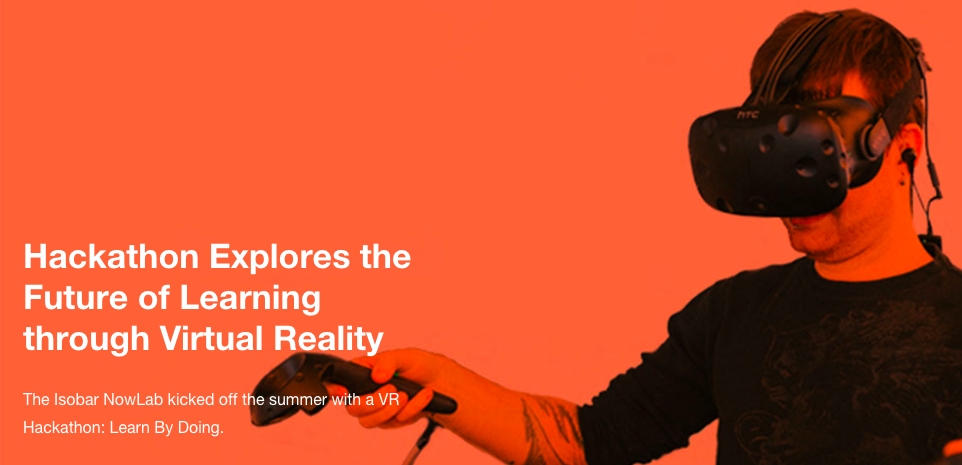 
```