Final project for the course on Advanced Human Computer Interaction.

What if we could plot a guitar song in one single image? And what if it could at the same time be beautiful and generate interesting insights about the performer's style?

Made with web technology, including the D3.js dataviz library, and some basic music theory.
 

#Inspiration

### Visualizing Chess moves on board.

```grid|2
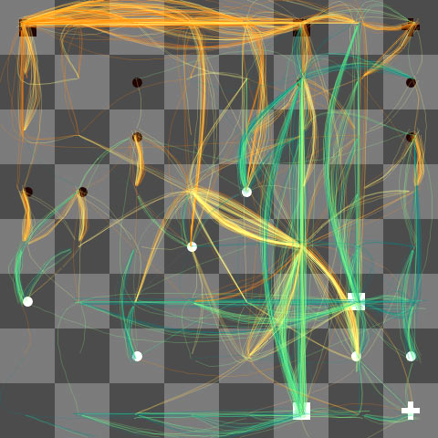
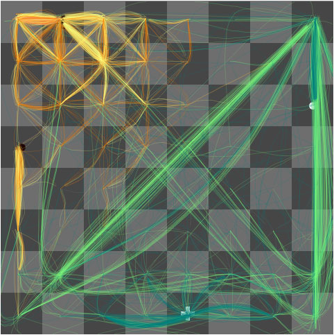
```

### Static visualization of patterns in music

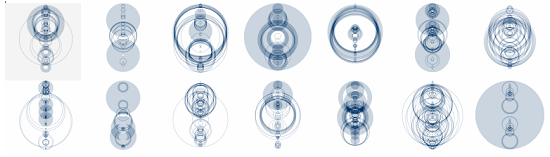

### Global flight patterns


#Music theory


#Technology

- GuitarPro -> MusicXML  -  Input of the songs
- D3  -  Data Visualization library
- HTML, CSS, Javascript
 
```grid|1

```

D3 is a Javascript library oriented to Data Visualization. Isn’t a graphics library, but helps managing SVGs and DOMs. It has hundreds of samples online, good documentation, several books published.


#Results


###Neck position

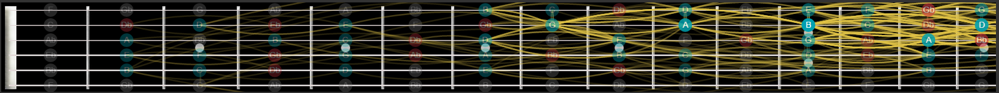
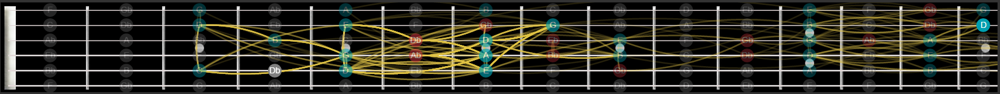
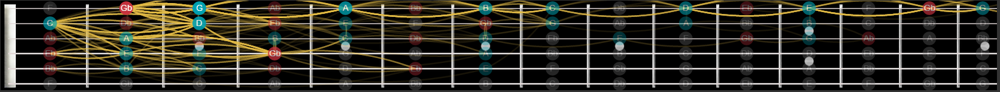

###Scale

We can very easily recognize the scale used. The most probable scales used are automatically calculated.


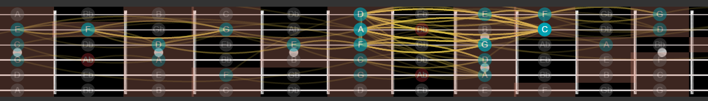

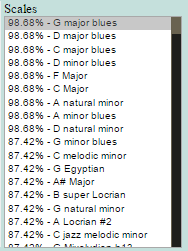

###Complexity
You can get impressed by something so simple can be so beautiful

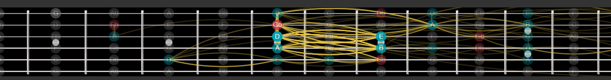

...and yet something that seemed simple aren’t that much

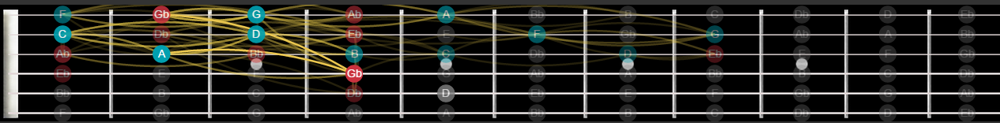

Some music styles are more complex than others. Let's compare, for example, the performance of two acclaimed artists of different styles: a classic Rock band, and a legendary Jazz guitar player.

")

")

###Indian classical music

Identifies:
Mukhya swar (Prominent note)
Samvadi (2nd most Prominent note)
Varjit swar (Prohibited note)

Path Identifies Pakad.

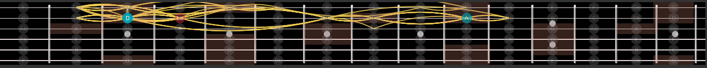


##Further work

- Extend the concept to other instruments
- Study the most common sequences of notes used
- Add support for Chords
- Apply machine learning techniques to identify prominent paths
- Experiment with colours to put more visual information
- Dynamically select the part of song to be visualized 
- Add support for special notes like bends, tremolos, open strings, etc.
