---
projectType: 'project'
date: "2007"
date2: "Now"
title: "Photography"
tags: []
cover: "./cover.png"
minibio: "An overview of my photography work since 2007."
description: "Photography has been for many years the main way in which I try to express my views. I try to see the world from different perspectives, looking for beauty in the most ordinary places."
--- 

Since 2007 I’ve been managing a digital portfolio of digital and analogic photography that has been viewed more than 250,000 times on Flickr.
I love all aspects of the photographic process. From connecting with moments and capturing it with sensibility and precision. To spending hours perfecting the post-production and curating a collection. To live in a constant search for the perfect match between technical quality and meaningful content.

<results-banner
    data='{
        "photos uploaded to Flickr": "1,300+",
        "photos total views": "325,000+",
        "gallery views": "20,000+"
    }'/>


Below is a collection of the pictures I hold nearest to my heart.

 
```grid|1
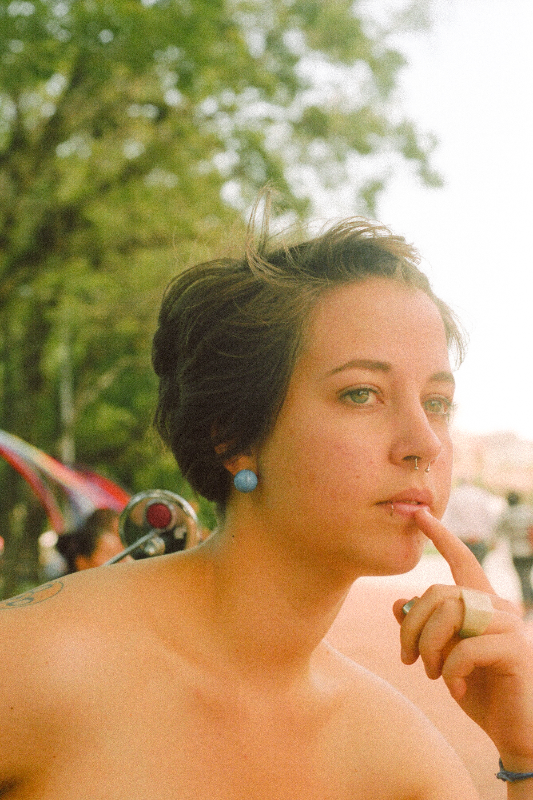
```


 
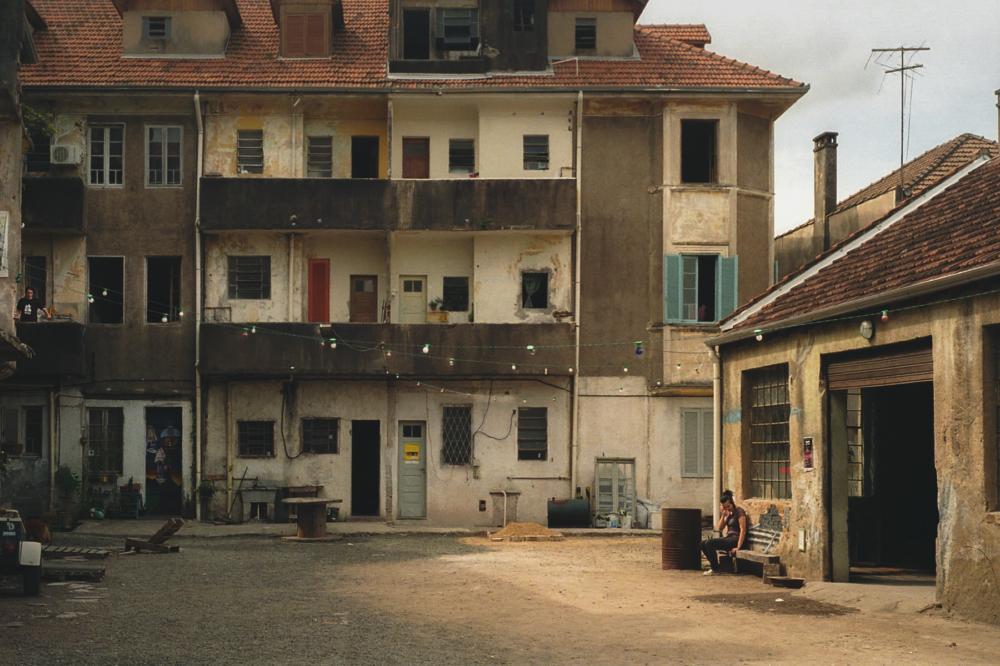

 


 


```grid|1
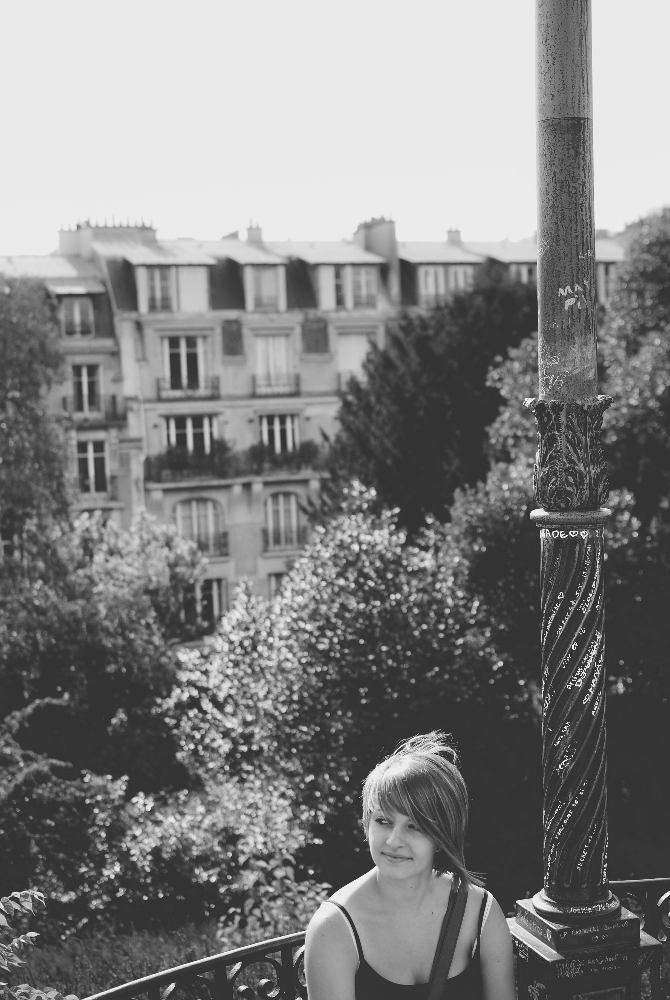
``` 

```grid|1
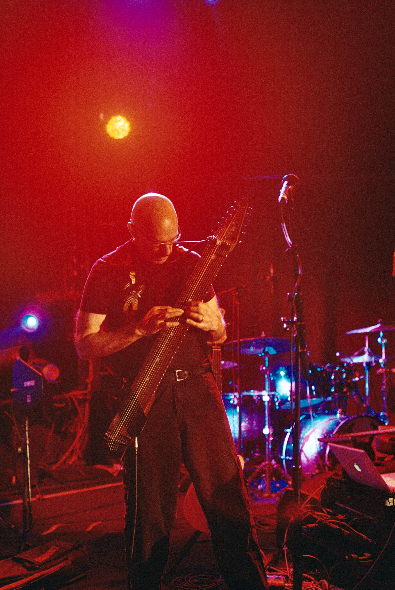
```

```grid|1
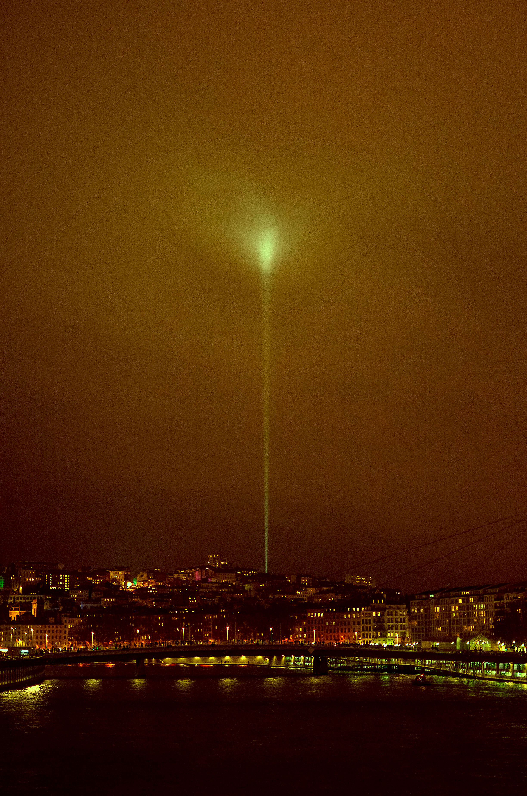
``` 


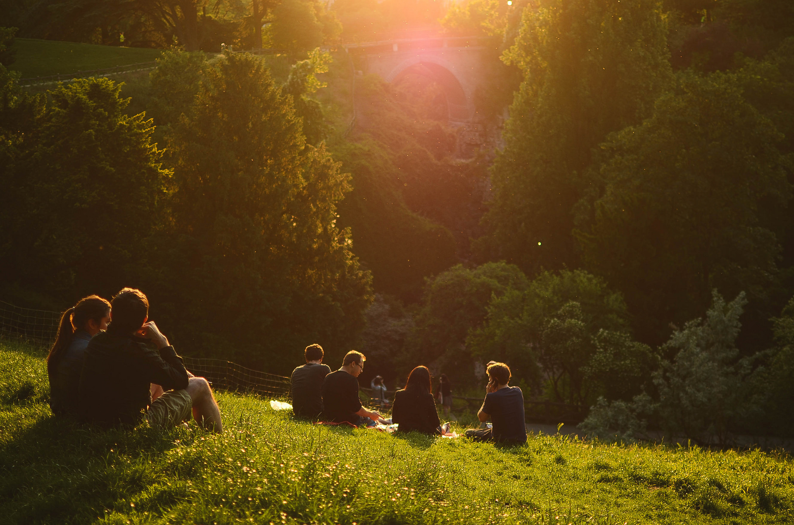


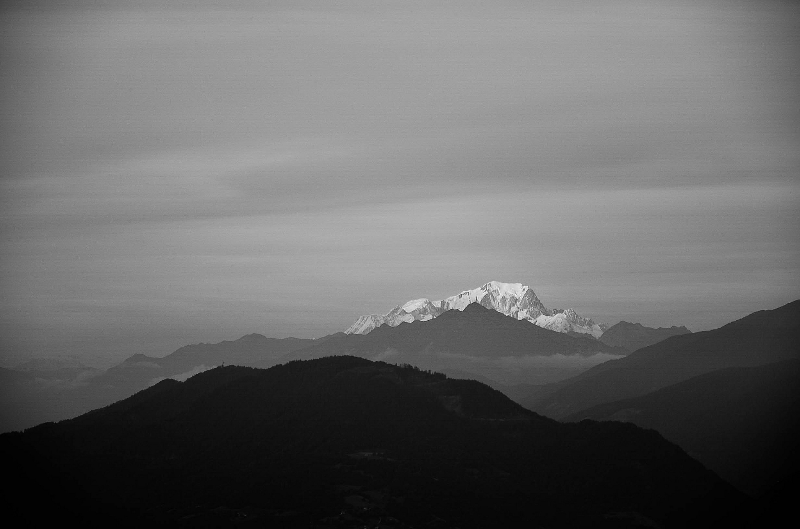


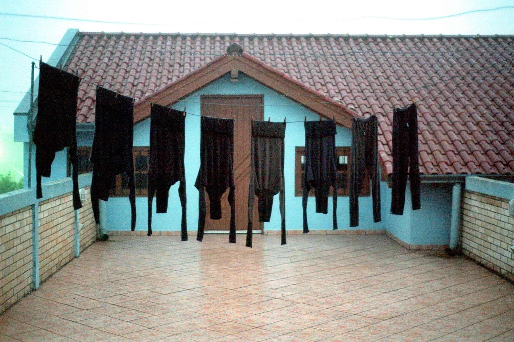

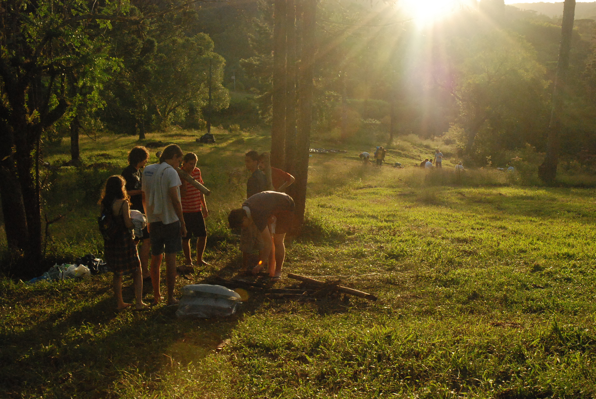

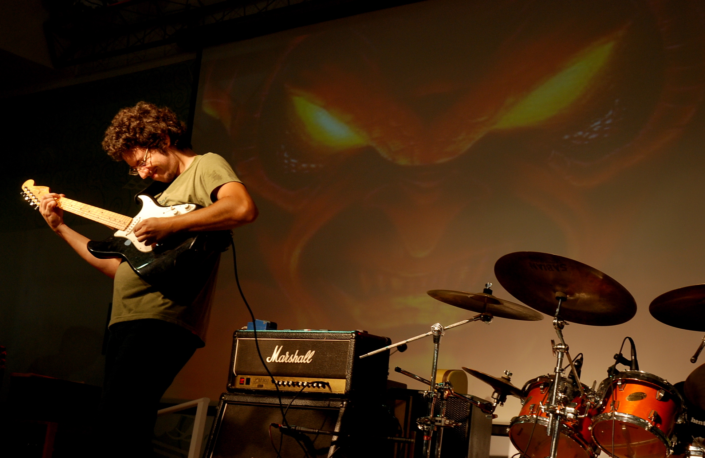


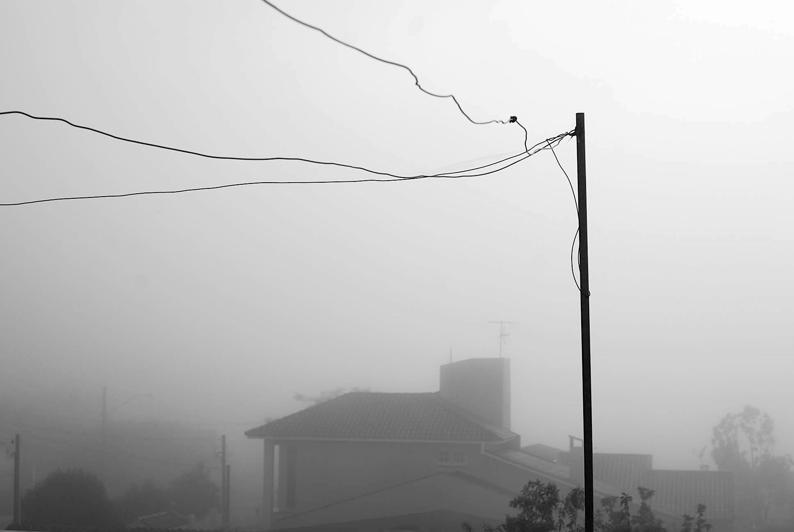


 


## Links

<links-list
    items='[
        {
            "label": "Flickr",
            "url": "https://www.flickr.com/photos/helloninja"
        },
        {
            "label": "Instagram",
            "url": "https://instagram.com/cmdalbem"
        }
    ]'>
</links-list>