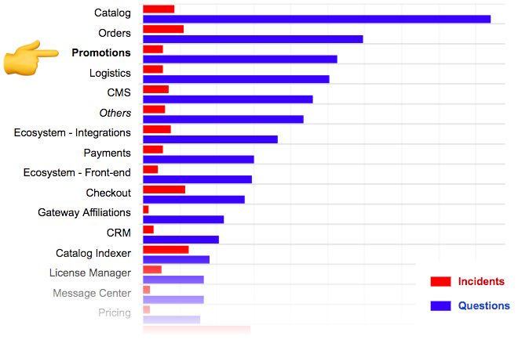
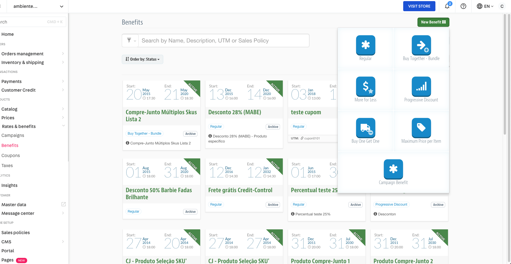
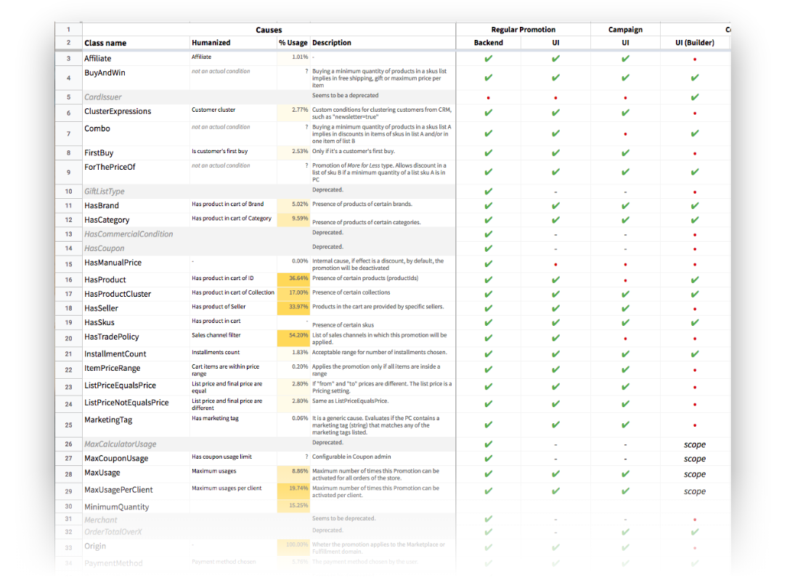
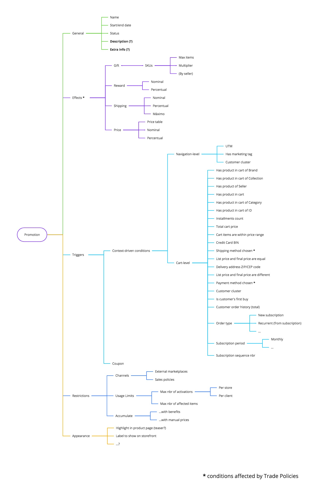
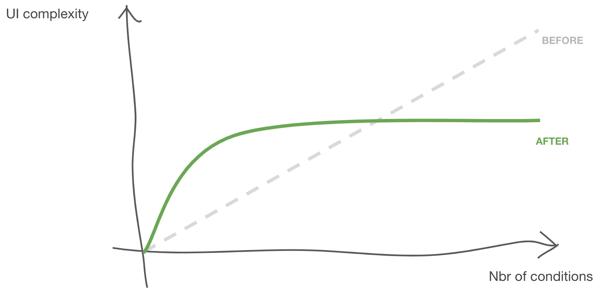
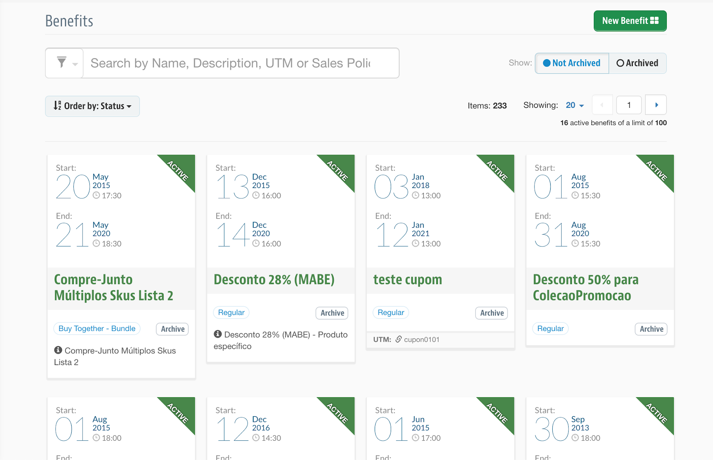
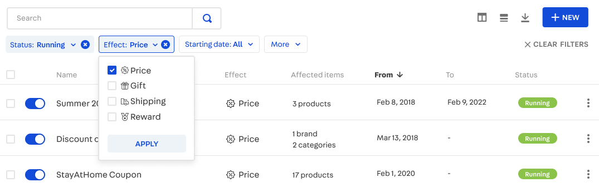
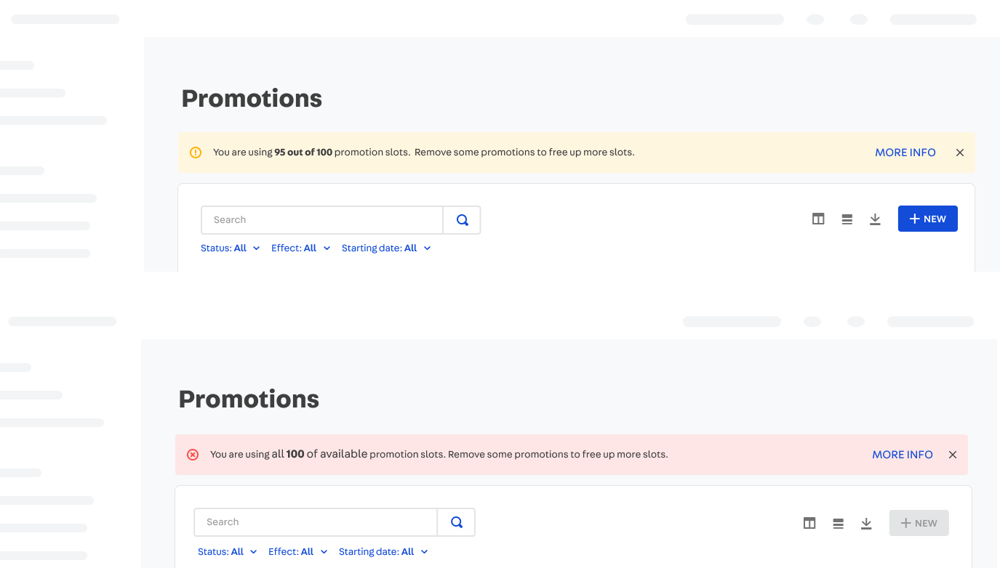
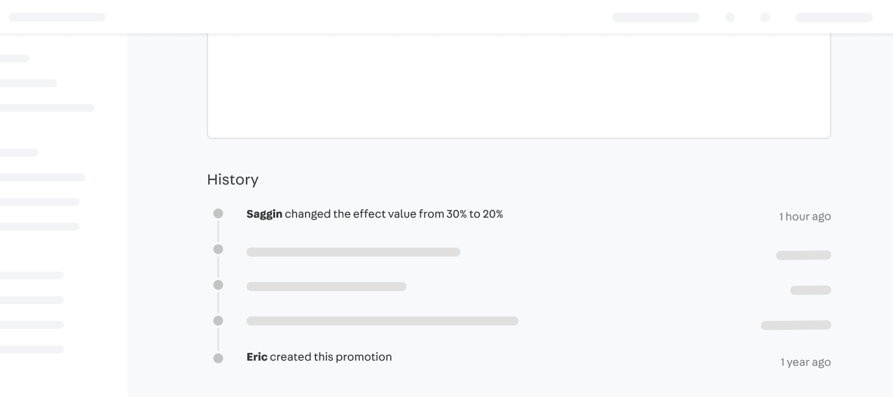
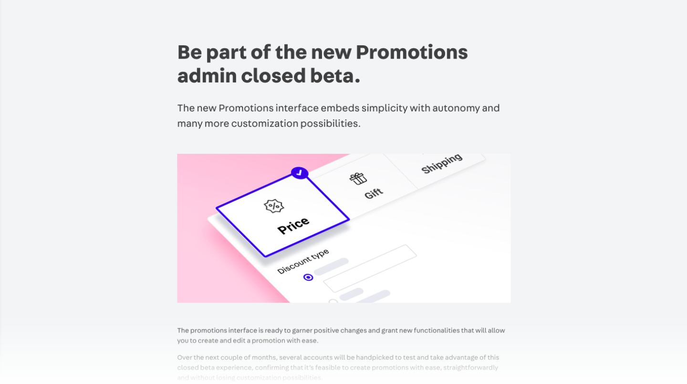

# Context
VTEX is a global SaaS technology company focused on ecommerce solutions that have a daily impact on the work of thousands of people around the world. More than 2500 leading brands of varying sizes and segments, with operations in 26 countries and in global expansion, rely on VTEX for the online sales of their products.

The main challenge of working in such environment is that the product is the same whether you're a small store or a huge commerce operation. So every solution we design has to leverage a huge diversity of user needs, and build something that works for everybody.
 
The main touchpoint of our product with the merchants is the Admin. It's where our clients configure and manage everything related to their commerce operations. It's also where most of our design efforts go into.


## The challenge
This is the main interface where merchants create and manage all kinds of promotions of their e-commerce. It's used by almost 100% of VTEX clients in a daily basis, which results in more than 5000 sessios per day by more than 2000 users. Its users vary, but often they're from Marketing and Commercial teams.

During this project's research we found out it's one of the main strenghts of the platform, offering a lot of flexibity and power that other platforms don't. The result is that more than 50% of all sales have some kind of promotion.

Despite its power and proven relevance to our customers' business, the product evolution accross more than 7 years have made its concepts and UI a little odd. This was made very clear in a chat with Soncini, who brought a new perspective of customers from a very new and much more demanding market to VTEX: the United States.

We found that of all VTEX modules, promotions was the 3rd with the most customer questions - almost 400 tickets were opened in the last 3 months. More than improving the efficiency of our Support team to answer tickets, we always ask ourselves: what could we do to prevent the ticket from being created in the first place? It was the UX could be improved a lot.
  
```grid|1

``` 

Historically the company's products have been led by the engineers themselves, who usually care more about the product's functionality than other more subjective dimensions such as ease of use. With the recent growth of the Design team at VTEX, the concern with bringing balance to these different dimensions that form the experience of a product has grown. A notable initiative is our Design System that offers components ready to create quality interfaces and consistent with each other as well as guidelines for creating new admins.

```grid|1

```


# Process 

## Discovery

With some main stakeholder's vision at hand and having understood this was a project worth working on I started devising a research plan to validate some assumptions and understand in more depth where we were getting into. 

we went after other stakeholders in the company to enrich our vision of how the product was perceived by customers and what improvements we could make. Our focus was on Account Managers who, with their own words, "defend customers within VTEX and defend VTEX within customers". My objectives were:
- Understand the importance of the product to VTEX 
- How it's perceived by our customers 
- How it compares with the competition
- Understand the use cases and business needs

```grid|1

```

After 10 interviews with internal stakeholders and 8 interviews with customers we concluded that:
- In fact the module is already quite complete in features, standing out from the competition and being one of the "flagships" in the platform's sales pitches.
- There were some functionality improvements that could be done, but...
- The amount of functionality, however, negatively impacts its ease of use. It's not considered intuitive, generate many doubts sometimes even leading the user to make mistakes that can be financially disastrous.

<jumbo caption="The research generated lots of insights, which I summarized in a Miro presentation that was a great reference that we would go back several times during the design and development of this project.">
    
</jumbo>

Other important findings were concerning other recent team initiatives such as the new Conditions Builder and the Campaigns system are poorly understood both internally and externally and are thus underused. We understood that as an opportunity to rethink these features with the safety of not impacting too many customers.


## Delving deeper with data

With a bunch of insights, impressions and assumptions at hand we turned to looking at how users actually used promotions at VTEX. In December 2018 alone there were more than 60,000 promotions running on the platform, which is a rich source of data on how users actually the system in real life.

```grid|1

```

Our first step was to validate the hypothesis that the interviewees brought us that Regular Promotions were much more used than the others. This hypothesis was not only confirmed, but the result was shocking because most of the recent team's efforts were focused in a feature very few customers were using.

<!-- ```grid|2


``` -->

Another very important information for us was to understand the real use of the dozens of special conditions that the system works.

This discovery inspired us to better detail the functionality of conditions that we already supported and to rethink which ones we would continue to support. In addition, this helped us to prioritize which would be the first to be worked on in creating the new admin.

```grid|1

```

<!-- Quando olhamos para a distribuição de quantidade de Produtos que eram listados na parte de escopo de promoção tomamos um susto: alguns clientes chegam a fazer promoções com 999 produtos selecionados MANUALMENTE! Outros números impressionantes também foram encontrados na quantidade de categorias, coleções e marcas usados nos filtros das promoções.

```grid|1

```

```grid|1

``` 

Abrir algumas dessas promoções que usavam listas infindáveis de itens foi um banho de água fria no time que entendeu a importância de estar mais próximo das necessidades reais dos nossos clientes! -->


## Looking around

In the research process we also learned a lot by looking carefully at other market solutions. We really understood how the experience we offered could be better, we saw many cool ideas to inspire us and we managed to design a new experience with the clarity and certainty that we were designing something as good as or better than what the market already offered.

We look at other ecommerce platforms, from the giants to the small ones. We looked at the apps offered on some of these platforms, for external tools that are possible to be integrated with them and even for other tools not related to ecommerce but that brought similar concepts of Campaigns and Promotions.


# Exploring solutions

## Promotion creation form

The first and most notable problem was the different types of Promotion, the differences of which were not always clear either conceptually or visually. When we put together the screens for creating and editing the different types of promotion, it is very clear that the differences are very small, and are always based on the effect of that promotion. Our solution was to create a unique type of promotion.
  
<jumbo>
    
</jumbo>

```grid|1

```

<jumbo>
    
</jumbo>
 

Added to this is the Campaign and Campaign Promotion system, which, as mentioned above, causes many doubts for users of the platform, since the name Campaign refers to them a concept very different from the meaning adopted by VTEX. In addition, this system brought even more complexity to the admin, as it added an additional configuration outside the promotions module, so that afterwards a new type of promotion specific to this scenario could be created, which works in a similar way to regular promotion.


## Conditions builder

The context-driven conditions system which is where our engine shines. It's very flexible, offering thousands of possible combinations for creating customized promotions.

However we believe that the interaction paradigm was not the best: simply by listing all the options, the complexity of the screen is proportional to the flexibility of the system, which ends up undermining our intentions to keep evolving this system. 

```grid|1

```

In our new solution, the initial complexity of the screen is always the same regardless of the number of options we offer, and it grows linearly as the user demands greater complexity of business rules. In short, in the new paradigm, complexity grows with user demand, not with the power of the system.

<video-container> 
    <video autoPlay controls loop width="100%" type="video/mp4">
        <source src="./conditions.mp4" type="video/mp4">
    </video> 
</video-container>

The Conditions component resembles natural language, enabling the user to progressively build their conditional "statements" leveraging a common interface for all filters. It also accepts a global selector for changing the boolean operation, making the system even more powerful than the previous.

<jumbo caption="All the conditions the new system could support.">
    
</jumbo>


## Dashboard

The list of promotions was also mentioned by some as excessively confusing. It uses a content diagramming paradigm popularly known as "card", which is quite visual but when compared to a simple table it makes comparing data between entities much more difficult. Our solution was to leverage and evolve the Table component of Styleguide, developed especially for building complex and powerful admins without giving up the clarity of information and intuitiveness.

Before:
```grid|1

```
 
After:
```grid|1

```

```grid|1

``` 


## Simulator

Another common cause of misunderstanding of the system comes from the way promotions accumulate and accumulate an compete with each other. This means that, given a scenario with sufficiently complex business rules, the operation of the system becomes more unpredictable, and interrelationships between dozens of promotions can have undesirable effects.

For tackling this issue we started a side project that will be a new admin inside the Promotions Admin. This new Promotions Simulator will, given a purchase context (a shopping cart) we simulate which promotions would be activated, why this they were activated or not and what the final effects are for the products in that cart.

```grid|1

```

We imagine that this in the future will not only facilitate debugging unwanted scenarios but empower the merchants to design new business rules with much more assertiveness.
 

<!-- ## Visualização em Gantt

Para os clientes que costumam se planejar e agendar várias promoções, o novo visualizador em Gantt permitirá facilmente identificar as promoções ao longo do tempo. Ah, e também removemos a necessidade de definir uma data limite - convenhamos, nunca fez sentido obrigar isso.

```grid|1

``` -->


## Little big details

As of a work tool that people might have to be using everyday, the small almost forgetable details in the UI that sometimes improve the best the productivity. Here's a couple of these.

First off, we heard some users create a bunch of promotions in sequence. In the sticky footer component of our admin, aside from the `SAVE` button, we added a conveninent `SAVE & ADD NEW` for optimizing this flow.

```grid|1
 
```

Another very common action the users needed was to duplicate existing promotions since very often their commercial campaigns would repeat seasonaly but with important modifications. Other than handy actions that now were available directly from the dashboard, we created the duplicate feature.

```grid|1
 
```

Some merchants want to create a promotion starting of now and just end it when they feel like. Others want it to start next week, last for the whole month and only go live on mondays through fridays from 7:15 to 11:20 and from 14:00 to 18:00.

<video-container> 
    <video autoPlay controls loop width="100%" type="video/mp4">
        <source src="./advancedscheduling.mp4" type="video/mp4">
    </video> 
</video-container>

A pressing concern for some users is the limit - and for others, not. That's why in the new Admin instead of always showing the current usage of limit in the UI we have contextual messages that appear when needed.

```grid|1
 
```
 
Given the internal structure of companies it was very common to have problems with multiple people editing the same promotions, either because of internal miscomunication problems or something. We found out it was very common for the Support team to help out clients going through our internal system logs, so our idea was to expose this in an easy-to-use way so clients could self-serve themselves on finding out who edited what and when.

```grid|1
 
```


<!-- ## Roll out strategy

```grid|1
 
``` -->


<!-- ## Other improvements

A recurring request from customers was to optimize the reuse of promotions settings. For that, we implemented some very simple little features, but we believe that they will speed up the daily lives of some users a lot: the possibility of duplicating promotions and creating one after another.

For the common activity of turning promotions on and off, these actions can be done directly from the listing.

With smart filters, we make it clear to retailers which data can be used to filter the promotions table and which filters are currently active. -->
 

<!-- # Measuring success

```grid|1

``` -->


 
<!-- # Further work

Of the main problems that we had identified in the initial stages of research, some have already been thought of and have solutions that are under development. Others, we haven't even started to look at them yet, so there is still a lot of work ahead of us.

In addition to improvements to the promotions system, there are other projects related to our Merchandising & Marketing experience that relate to the module:

- **Audiences**: a new system that encapsulates the capabilities of RnB to create target audiences, now serving any other VTEX module that wants to segment users.
- **Coupons**: rethink the connection of coupons with promotions coming from UTM, more flexibility in controlling the conditions of use and mass management.
- **Collections**: complete redesign of this old module, bringing much more efficiency in creating product assortments and facilitating their reuse in other modules.
- **Performance metrics / KPIs**: find out if your promotions are helping you sell more and control your budget directly from the platform, without having to export WHO spreadsheets and use external tools to analyze this data.
- **Nested Conditions**: an improvement to the "Conditions inline" component that will allow the creation of complex Boolean logic.
- **Clusters**: creating clusters today requires technical knowledge in one of the most legacy modules of VTEX, Masterdata. It is equally complicated to use these clusters in other modules, such as Promotions. -->
