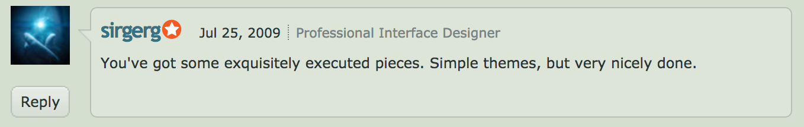

From 2004 to 2007 I was an active member of DeviantArt, one of the biggest online communities for digital artists. There I learned and taught from digital art creation to digital design tools and the basics of visual design. I used to heavily interact with artists from all around the world, exchanging knowledge and learning about the importance of receiving and giving feedback to become better.

I value this experience for I see it as the building block of my creative confidence and the cornerstone of my career as in the creativity world.

Although it was not the objective, my intense contributions over the years made my gallery become rather among other "space artists". I even got a compliment of Greg Martin, a legend of this field, which totally freaked me out at the time haha

```grid|1

``` 
<!--  
<results-banner
    data='{
        "pageviews": "32,000+",
        "comments made": "4,263",
        "experience": "3 years"
    }'>
</results-banner> -->

```grid|1

``` 

```grid|1

```

```grid|1

```

```grid|1
 
```

```grid|1

```