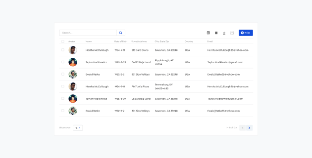
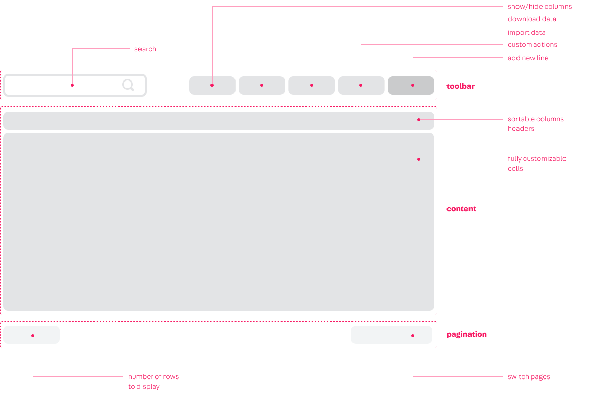
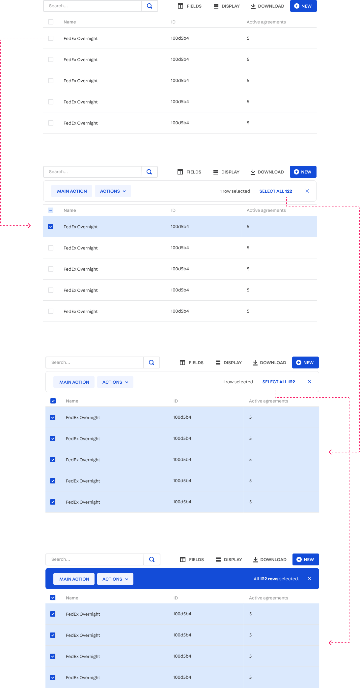
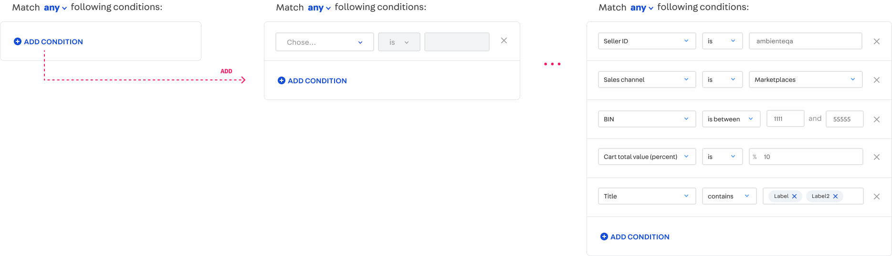
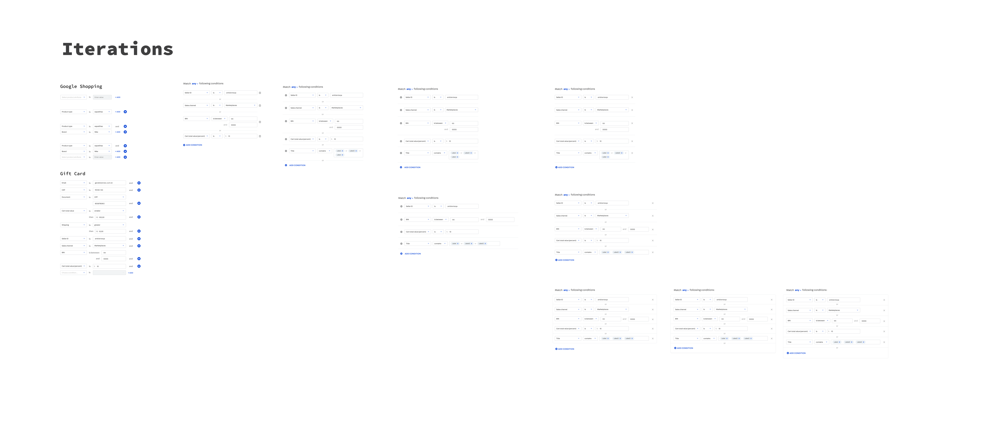
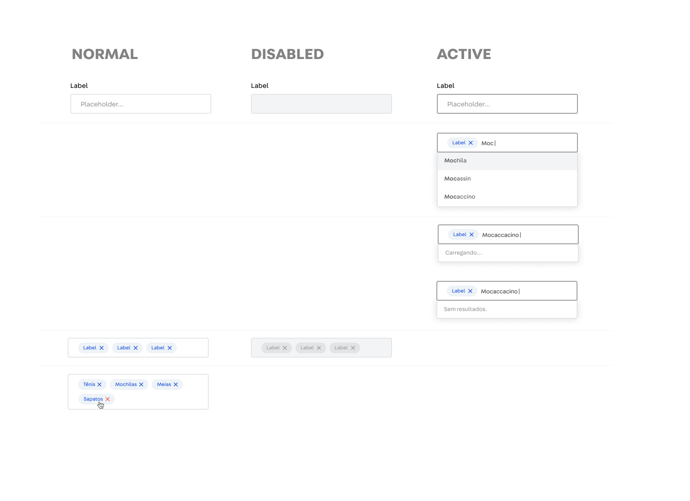
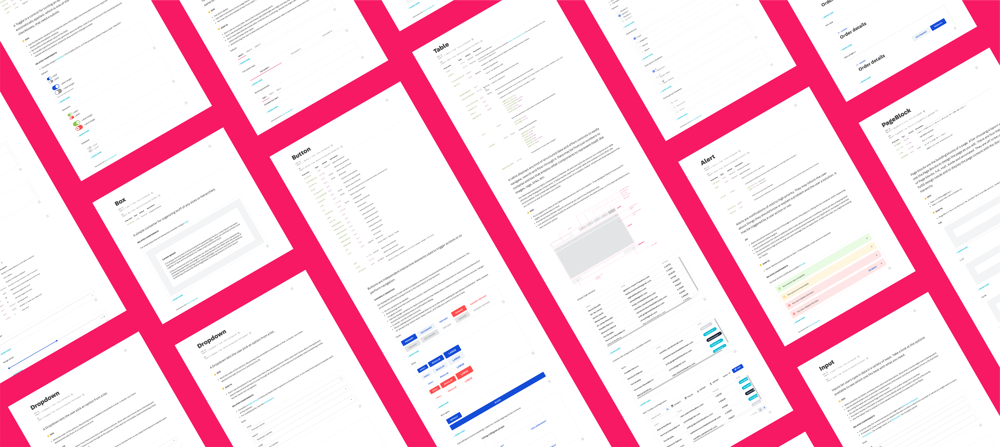

 

## Context
VTEX is a global SaaS technology company focused on ecommerce solutions that have a daily impact on the work of thousands of people around the world. More than 2500 leading brands of varying sizes and segments, with operations in 26 countries and in global expansion, rely on VTEX for the online sales of their products.

The main challenge of working in such environment is that the product is the same whether you're a small store or a huge commerce operation. So every solution we design has to leverage a huge diversity of user needs, and build something that works for everybody.
 
The main touchpoint of our product with the merchants is the Admin. It's where our clients configure and manage everything related to their commerce operations. It's also where most of our design efforts go into.

## The problem


## Process


## Components

I've been contributing with a variety of components. Everything that is added to the System is presented in our weekly meetings, where Designers and Developers give their feedbacks and make sure we only put in production something that makes sense for us.

Here are some details about some of my favorite components that I've helped design, and sometimes even develop.

### Table


```grid|1

``` 

```grid|1

```

```grid|1

```


### Conditions builder

```grid|1

```
```grid|1

```
```grid|1

```
```grid|1

``` 

### Single & multi select


```grid|1

```

```grid|1

```


### System documentation

```grid|1

```

<links-list
    items='[
        {
            "label": "Website",
            "url": "https://styleguide.vtex.com"
        },
        {
            "label": "Github",
            "url": "https://github.com/vtex/styleguide/"
        }
    ]'>
</links-list>