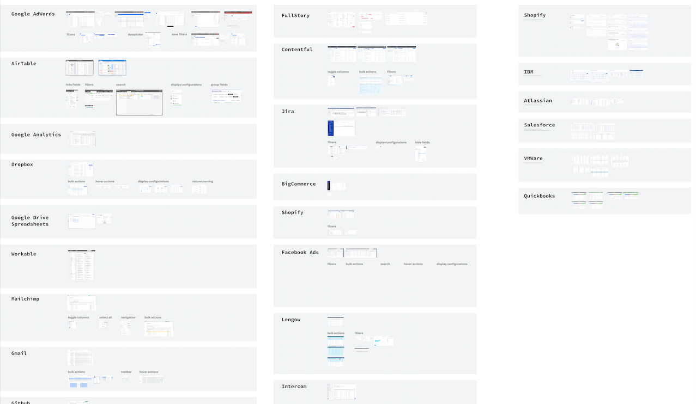
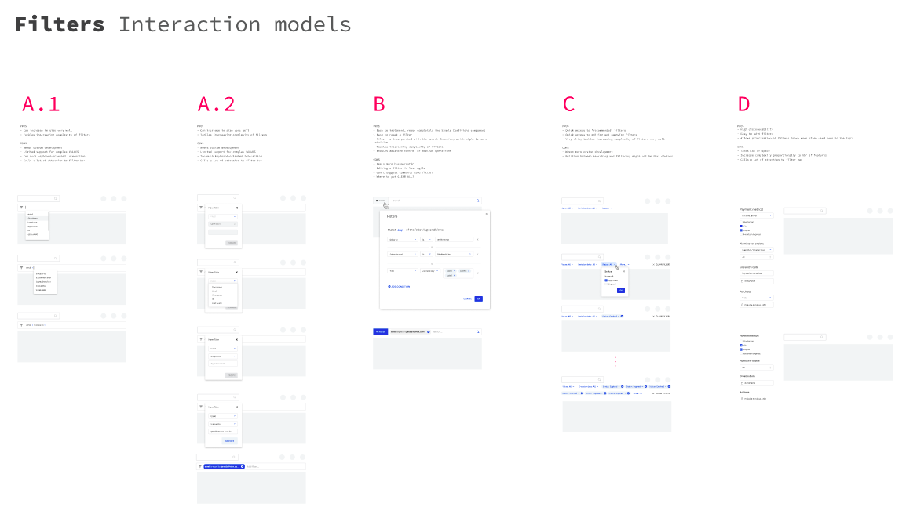
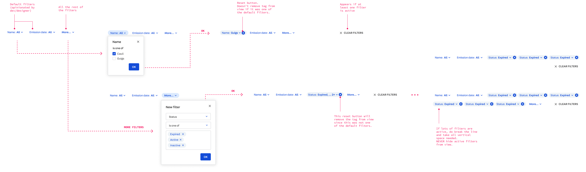

 

## Context
VTEX is a global SaaS technology company focused on ecommerce solutions that have a daily impact on the work of thousands of people around the world. More than 2500 leading brands of varying sizes and segments, with operations in 26 countries and in global expansion, rely on VTEX for the online sales of their products.

The main challenge of working in such environment is that the product is the same whether you're a small store or a huge commerce operation. So every solution we design has to leverage a huge diversity of user needs, and build something that works for everybody.
 
The main touchpoint of our product with the merchants is the Admin. It's where our clients configure and manage everything related to their commerce operations. It's also where most of our design efforts go into.

## The problem

- lack of consistency due to highly autonomous company culture
- scaling design/frontend
- upcoming app store and lack of expertise from partners

## Process

- books, articles
- benchmarks of all other design systems
- understanding the past experience and building on top of it


## Components

Among other stuff related to Design Systems I've been contributing with a variety of components. Everything that is added to the System is presented in our weekly meetings, where Designers and Developers give their feedbacks and make sure we only include something that makes sense for the teams in general.

Here are some details about some of my favorite components that I've helped design - and sometimes even code :)


### Table

After basic atomic components such as buttons and inputs, tables are the most used components in Admin screens in almost every digital product. Going through the legacy Admin screens it was clear it wasn't different for us. Most of them were mainly based on a main table, often with common features such as column sorting, search, filtering, importing and exporting. So  we started gathering forces from designers and developers of different teams to create our own, awesome Table component.

```grid|1

``` 

```grid|1

```

```grid|1

``` 

```grid|1

```

```grid|1
 
```

```grid|1
 
``` 


### Conditions builder

```grid|1

```
```grid|1

```
```grid|1

```
```grid|1

``` 

### Single & multi select


```grid|1

```

```grid|1

```


### Admin layout components


## Documentation

I'm always a big main advocate for the need of documentation and guidelines with every tool we provide. With the Styleguide components it wouldn't be different. Even if they were designed for their specific usage, and not for generic purpose (like Bootstrap), it was thought to limit usages that we though wouldn't be desirable. However there's a limit of the things we can test automatically in the form of React PropTypes, and the rest, like good copy, depends on some guidance.

```grid|1

```

<links-list
    items='[
        {
            "label": "Website",
            "url": "https://styleguide.vtex.com"
        },
        {
            "label": "Github",
            "url": "https://github.com/vtex/styleguide/"
        }
    ]'>
</links-list>