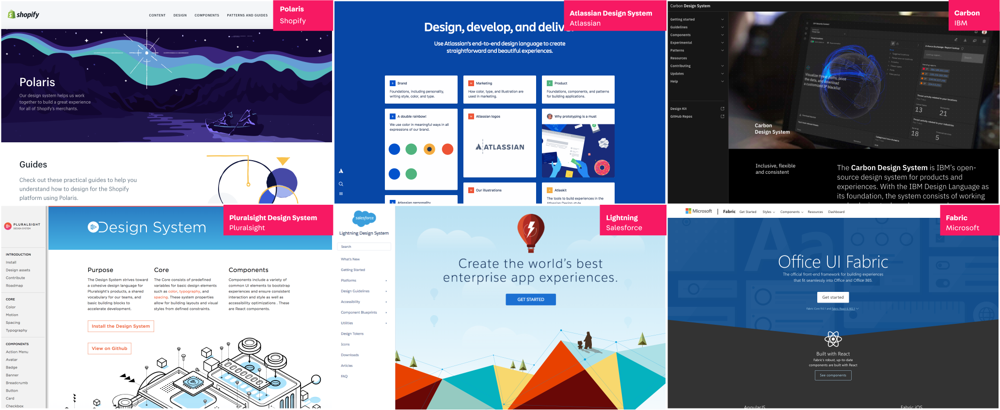
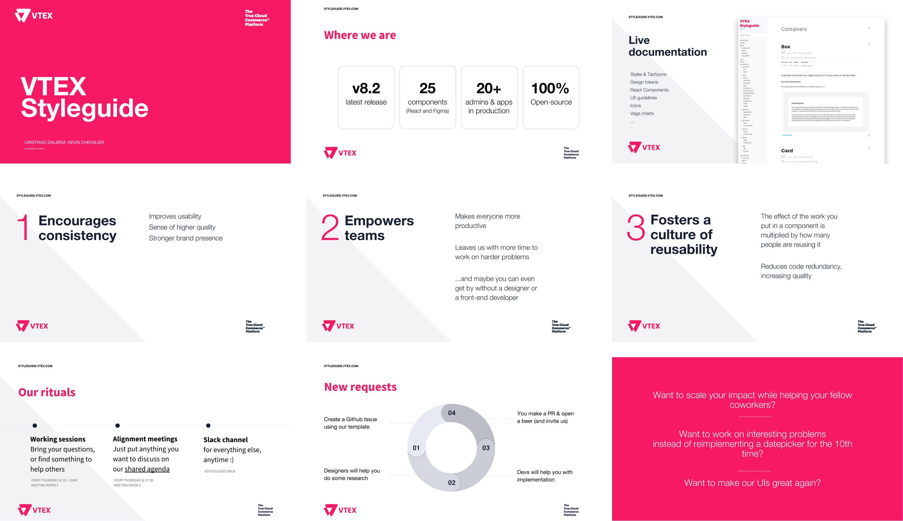
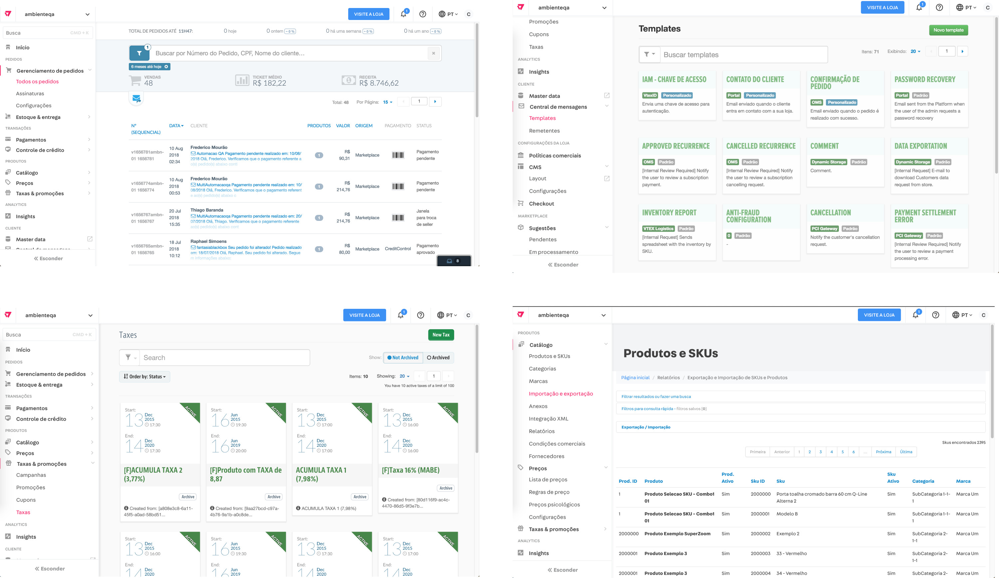
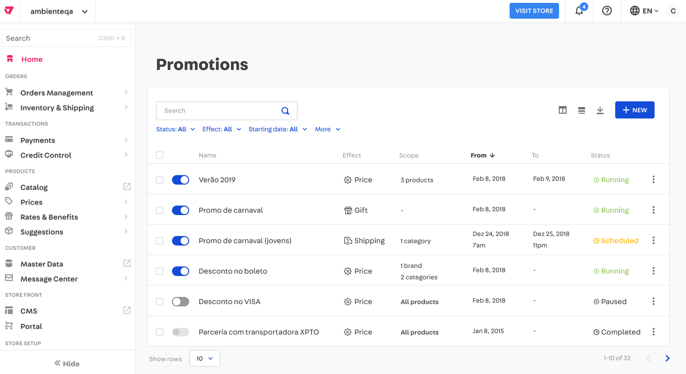
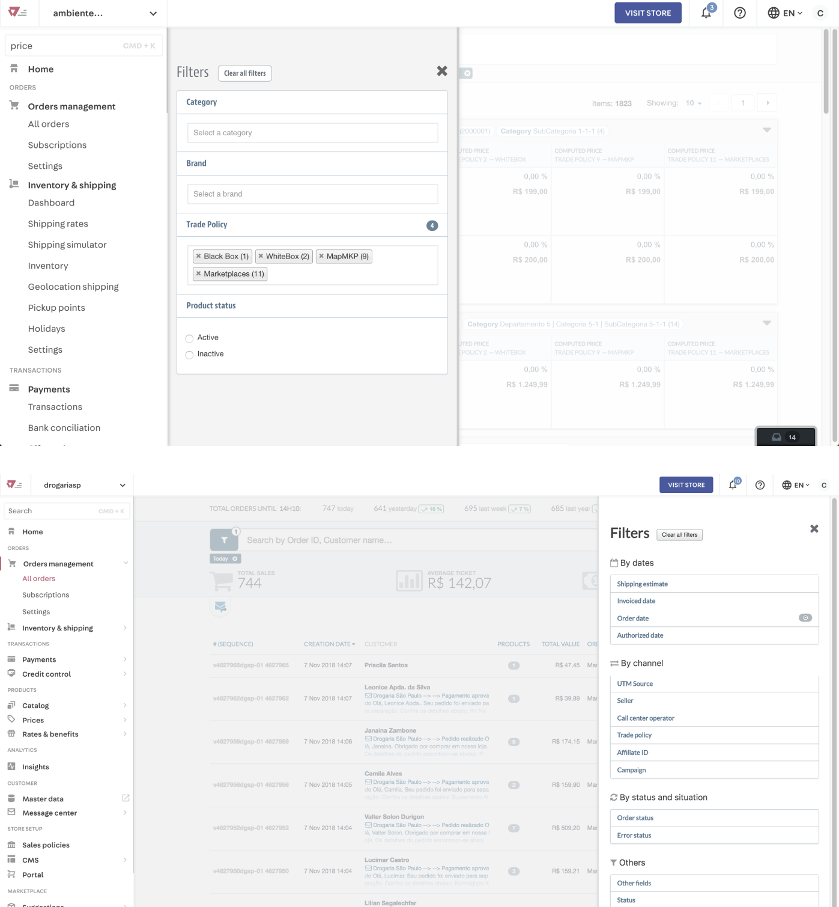
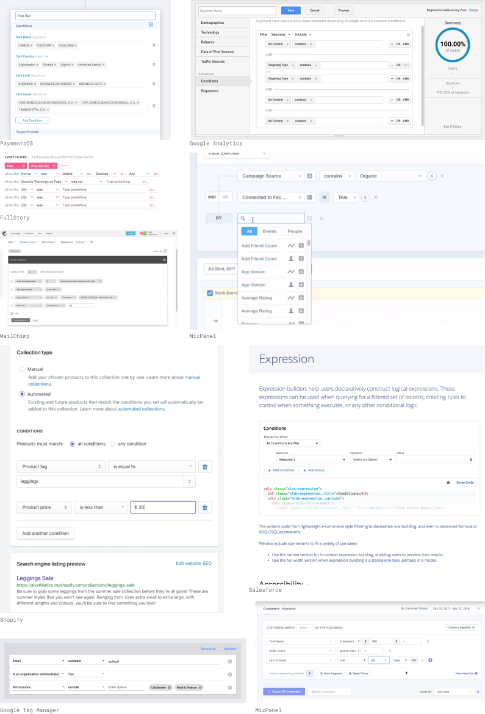

 

## Context
[VTEX](https://vtex.com/) is a brazilian SaaS technology company focused on ecommerce solutions that have a daily impact on the work of thousands of people around the world. More than 2500 leading brands of varying sizes and segments, with operations in 26 countries and in global expansion, rely on VTEX for the online sales of their products.
 
The main touchpoint of our product with the store owners is the Admin. It's where our clients configure and manage everything related to their operations, and where they'll spend most of their days.

### The problem

The birth of this project was only possible because of the confluence of several conditions.

* The company was growing super fast (40% per year, to be exact), and so were the teams. New designers and developers were joining every day, thus sharing knowledge in a structured and scalable way was starting to be obligatory if we wanted to keep going fast.

* There was also the coming of age of [VTEX IO](https://vtex.io/), our serverless service for hosting e-commerce applications that was being developed for 4 years already. We were for the first time ready to start dogfooding and using it to host our own Admins, while we matured to host full ecommerce websites and third-party apps.

* We were starting to draw what one day would become our App Store, a place for our wide ecosystem of partners could easily develop, spread and monetize extensions - all powered by IO.

With all this momentum we starting seeing lots of legacy systems being rewritten to work with the new opinionated tech stacks. For the growing Product Design team it was an awesome opportunity to improve UX across the admins, but the team was still small for the demand and we needed to scale our design solutions.

## Process

### We know what you did last Design System

The first thing that called my attention when we started discussing this project was the fact that something similar had already existed in the company. A few years ago some Designers that were not working with us anymore started a similar initiative which clearly did not work out, so we started looking back at that moment with a critical and open-minded view to make sure we wouldn't repeat the errors of the past.

Building on top of those insights we agreed on some important working principles:

* To quickstart we would use the same tech stack as VTEX IO, and we would bootstrap our system with [Tachyons](https://tachyons.io/), a CSS Framework that already had a Design System-like structure.

* We chose [Styleguidist](https://react-styleguidist.js.org/) to be the tool for building our component library and documentations automatically. In the past the team had started developing their own tool in house, but we didn't have time for that.

* The current Design Principles were mostly unknown in the company, which was a sign that they weren't very representative. Part of creating this new design system would be to revise them.

* Building a glossary of all components and variations being used in the platform is cool, but it's just too much work for all the hundreds of screen we had. Most importantly, we didn't feel it was so important being retrocompatible in that sense, and looking ahead was more important than looking back.
  
* References should go beyond general-purpose systems like Material, or plain component libraries like Bootstrap. We need to look at references that were more contextualized, and closest to what we needed to build. 

```grid|1 

```


### Rituals & team building

*Coming soon*

```grid|1 

```

### Documentation

I'm always a big advocate for the need of documentation and guidelines with every tool we provide. With the Styleguide components it wouldn't be different. Even if they were designed for their specific usage, and not for generic purpose (like Bootstrap), it was thought to limit usages that we though wouldn't be desirable. However there's a limit of the things we can test automatically in the form of React PropTypes, and the rest, like good copy, depends on some guidance.

<!-- ```grid|1 

``` -->

<video-container> 
    <video autoPlay controls loop width="100%" type="video/mp4">
        <source src="./styleguide.mp4" type="video/mp4">
    </video> 
</video-container>


# Components

```grid|1

```

Everything that was added to the component library was presented in our weekly meetings, where Designers and Developers gave their feedbacks and made sure we only include something that makes sense for everyone and feels like part of our identity.

I contributed closely with the design and event the development of several of Styleguide components. Here are some further details about my favorite ones: the **Table**, the **Filters** and the **Conditions Builder**.


## Table

After basic atomic components such as buttons and inputs, tables are the most used components in Admin screens in almost every digital product. Going through the legacy Admin screens it was clear it wasn't different for us. Most of them were mainly based on a main table, often with common features such as column sorting, search, filtering, importing and exporting. So  we started gathering forces from designers and developers of different teams to create our own, awesome Table component.

```grid|1
 
```

We did an extensive benchmark research in digital products and found out that powerful table components were ubiquitous, either in B2C as B2B products.

```grid|1

```  

We split the component in subcomponents that we would address one by one, making sure we were intentional in every design detail even for such a complex component.

<!-- ```grid|1

```  -->

```grid|1

```

As with everything about Styleguide, the development was totally guided by demands in our projects, to make sure we only designed and implemented things that were really necessary. Because of that the development had to be halted a priorities changed a few times, which is fairly natural to any project like this.

After a few months we had a working, feature-full version that was already being used by several projects in the company. At the time of this writing at least 10 projects are already reusing it, and more are certainly to come.

```grid|1

``` 

## Filters

Along with tables, another very important part of any admin are filters. We wanted to design  a standard filter solution for VTEX that would be powerful enough to work for all filtering needs. 

```grid|1

```

A quick look around the platform revealed we had half a dozen different variations of filters. Even worst, all of them revolved around the same drawer-like interaction that in our studies we found out not to be the most adequate for our needs.

```grid|1

```

We studied a couple of different interaction modes for filters and analyzed the pros and cons of each one.

```grid|1

```  

Our solution focused in solving the following problems:
* Screen real-estate: some of our products offered dozens of different filters, and we couldn't try to fit them all in the screen.
* Live preview: solutions with drawers made it hard to see the result of filtering directly along with the changing data, which made it harder to use.
* Discoverability: we designed a simple Select component that had search and categories built-in to make it really easy to find filters.
* Flexibility: we designed the Statement component to be a standard protocol for the most diverse filters.

```grid|1

```

One way of using our filters system is by using the Filter Bar component, which already solves common interactions like turning filters on and off, creating new filters and clearing.

```grid|1
 
``` 


## Conditions builder

More complex than tables but yet a very common pattern on admin systems are Conditions. They are seen from simple filters to creating complex IF-THEN logics and boolean relationships.

Looking at other digital products we found out a conditions builder is a common pattern, especially on the more advanced products. Some were truly inspiring, while others not that much. One common pitfall was giving control to each boolean operator individually, which can lead the user into creating unintentional precedence mistakes (e.g. in `a OR b AND c` the `AND` has precedence, but the user might not know that). Others had poor visual design, which  made it look overwhelming and more complex it actually was.

```grid|1  

``` 

We designed a Conditions Builder to be a common pattern of adding multiple conditions with simple boolean relationships. To chose the boolean operator there's a single global control. It also helps users that are not used with boolean logic: either you chose that *all* conditions should be met or that *any* condition should be met.

Each line is made of a Statement, that same component used in the Filter component.

```grid|1

```
 
It can also be extended to allow nesting of conditions, enabling the user to express complex booleans equations in an intuitive way.

```grid|1

``` 

# Links

<links-list
    items='[
        {
            "label": "Styleguide website",
            "url": "https://styleguide.vtex.com"
        },
        {
            "label": "Github",
            "url": "https://github.com/vtex/styleguide/"
        }
    ]'>
</links-list>