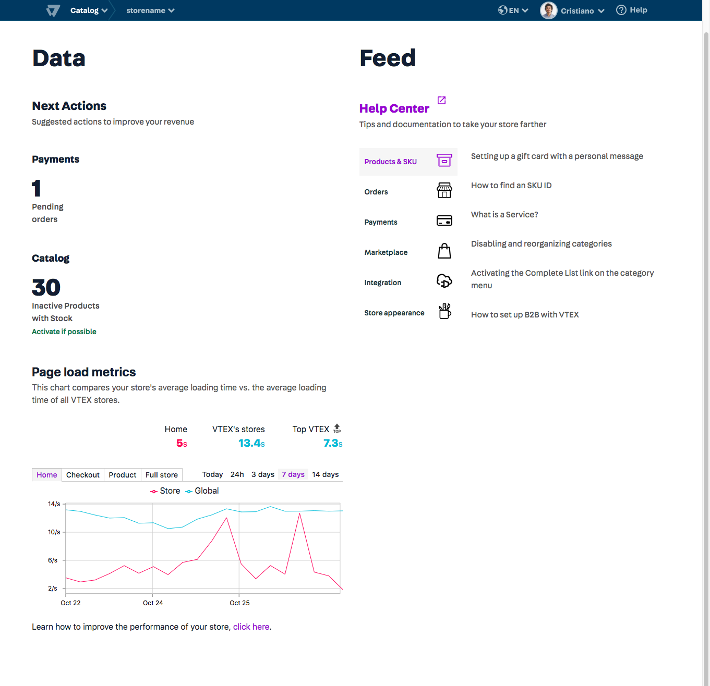
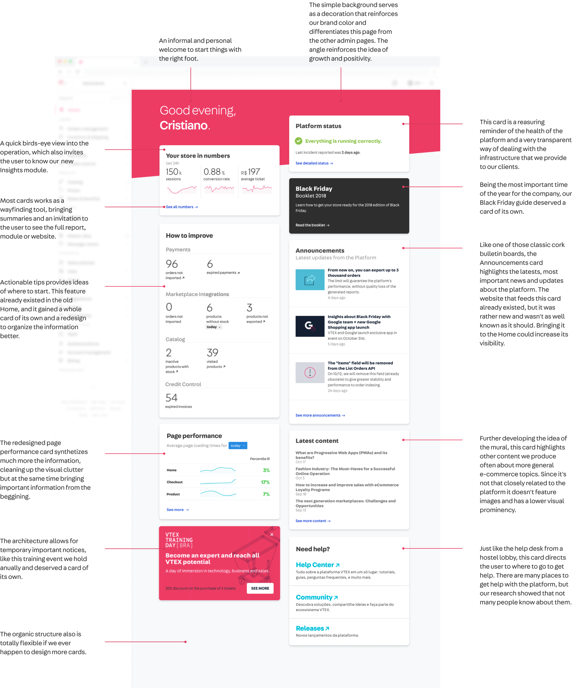

## Context
VTEX is a global SaaS technology company focused on ecommerce solutions that have a daily impact on the work of thousands of people around the world. More than 2500 leading brands of varying sizes and segments, with operations in 26 countries and in global expansion, rely on VTEX for the online sales of their products. 

## Problem 
The main challenge of working in such environment is that the product is the same whether you're a small store or a huge commerce operation. So every solution we design has to leverage a huge diversity of user needs, and build something that works for everybody.
 
The main touchpoint of our product with the merchants is the Admin. It's where our clients configure and manage everything related to their commerce operations. With the maturity of [VTEX IO](https://vtex.io/), our serverless service for hosting e-commerce applications, we were ready to start using it to host our own Admin. 

This was much more than just [dogfooding](https://en.wikipedia.org/wiki/Eating_your_own_dog_food). We knew the "new platform" was more modern, robust and easier to use than anything we ever had before. A new navigation shell and routing system for the new admin was ready for use, now we needed to start replacing the iframes of the old admins with fresh, first-citizen reimplementations of them.

```grid|1 
 
```

This project was the first section of the Admin that was rewritten using all the newest technologies we had, and was a great way of showcasing the our users that a new generation of technologies and admin panels was coming.
 

## Process 

With so much important stuff to build in the platform designing a new Home was definitely not one of the priorities. This project was made possible only because of an internal Hackathon. We had 48h to create something interesting, in a team of half a dozen developers. Our main objective was to create that which would be the first admin module built on IO, and since we had very limited time we though that old ugly Home could be a perfect fit.

Because of the mentioned project constraints we didn't have time to interview lots of users, so we leveraged the internal knowledge that our Product team and Customer Care teams had about the platform.


## The concept

As with many projects in VTEX benchmarking was a big challenge. How many big e-commerce SaaS platforms do we know? A few. How many of them have really great design to be inspired by? Even fewer. Even more, each one is so different than others that I though I'd have to draw inspiration from something completely different.

VTEX is a tool people use to work almost every day, and they spend almost the entire day in it. What other services work like that? It's similar to a Hotel, where people pay use so we offer them comfort as a service, as well as fulfill specific needs such as food, entertainment, etc. Just like a Hotel we're also big and have complex innerworkings, which have to be invisible to the final user.

OK, nice, we're Hotel. Or maybe a Hostel? From the great work our Culture team has done in the recent years we learned a couple of things:

* Exclusivity is not one of our strengths. The platform is multinenant, which means we prioritize offering a simple, single solution to all of our clients and updating in despite of offering exclusive solutions tailored specifically to each user need. It's like if people had to eat sharing the table. Hum
* We strive to be horizontal, both internally and externally. Our clients are super diverse, but all solutions we design have to work well for everyone.
* And internally we have no managers or bosses: hierarchy is organic, and most of the time decisions are taken horizontally, which demands lots of communication and empathy.
* Our main value is not our features, but the ecosystem, the community, and lots of other stuff.
* We're definetely not classic or traditional, just look at our main brand color: pink (most of other platforms and IT companies are blue).


## Designing with values

### The hypothesis: the home of VTEX Admin should feel like the lobby of a Hostel.

A lobby is where the mood is set. It's in the beggining of the journey of using the product, probably the first thing someone sees when starting their working hours. So it should feel welcoming. Sometimes it's calming, sometimes it isn't, but it's always pleasant.

I started building a moodboard of pictures of the coolest Hostel lobbies I could find, to see if there were other patterns I could identify. 

```grid|1
 
```

* Shared, communal spaces and visual permeability encourage people to make eye contact.
* It might be visually noisy, but it's always harmonious, beautiful, with welcoming warm colors and textures
* Informal and playful furniture and perks, invite for both relaxing and leasure activities.
* It simplifies the inner complexities and helps with the wayfinding.
* Horizontal (não se importam de os faxineiros estarem ali no meio, eles são gente. O * hotel por outro lado tem mais hierarquia.
* It's customizable, people feel part of it and are often encourage to leave their marks.
* Decoration foster cultural diversity
* There's always a help desk with someone ready to answer your questions.

From these observations we ended up with 7 values:

* Diverse
* Communal
* Beautiful
* Welcoming 
* Informal
* Objective
* Transparent

<!-- ```grid|1
 
```  -->

### Looks familiar?

Here's a good surprise: looking around at our office we see the very same values, materialized in our working space.

```grid|1

```


## The components

Materializing the values into actual UI was done in both a top-down and bottom-up approaches:

* Top-down: we used the values as a "healthcheck" to filter ideas the team and the stakeholders had of what we could have in our home.
* Bottom-up: the values themselves helped us imagine new features and we didn't think of before.

```grid|1

```

```grid|1

```

### Iterations

```grid|1
 
```

```grid|1

```

```grid|1

```

<!-- ### Before

```grid|1

```

### After
 
```grid|1

```   -->


## Further work

* Usar uma analogia melhor (usar analogia de uma loja de verdade?)
* Pesquisa: entrevistar usuários da VTEX, o que eles esperam da Home.
* Desenvolver novos cards

```grid|1

```